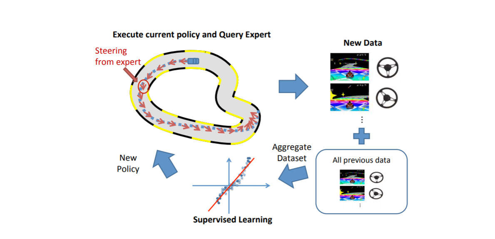

# 模仿学习(Imitation Learning)入门指南

## Imitation Learning: An Introduction

模仿学习在机器人学习(Robot Learning)中扮演了比较重要的角色。这其实在之前的paper reading中已经涉及过了:

模仿学习的思想很直观(intuitive)。我们在前面所介绍的Model-free, Model-based强化学习方法都是**从零开始(from scratch)**探索并学习一个使累计回报最大的策略(policy) $\pi_\theta(a_t|s_t)$ 。

Imitation Learning的想法是，借助人类给出的示范(demonstration)，可以快速地达到这个目的。这个示范是多组trajectory轨迹数据 $\left\{\tau_{1}, \tau_{2}, \ldots, \tau_{m}\right\}$， 每条轨迹包含$\tau_{i}=<s_{1}^{i}, a_{1}^{i}, s_{2}^{i}, a_{2}^{i}, \ldots, s_{n_{n} i+1}^{i}>$。类比一下人类的例子：

> 学车，你需要一个暴躁（可能）的教练；
>
> 健身，你需要一个动作标准且壮实的私教；
>
> 读研，你需要一个老师(?)。

那么平时人(human)在得到以上的指导、示范(demonstration)之后会怎么做呢？

**记住并试着模仿着做**。

模型的训练目标就是使模型生成的状态-动作轨迹分布 $p_{\pi_{\theta}}\left(o_{t}\right)$ 和输入的轨迹分布 $p_{\text {data}}\left(o_{t}\right)$ 相匹配。这种方式叫做**行为克隆(Behavior Cloning)**。

这听起来不就是监督学习或者GAN嘛？还要啥Imitation Learning？名字一个比一个响。进度条告诉我们事情没那么简单。

### Challenge

Challenge出在两个地方：

- collection expect demonstrations：费时费力，还需要大量数据样本进行监督学习训练。此外，只能收集到好的示范，会导致事故的示范很难收集。
- Error accumulates: 模仿不可能精确地复制示范地动作。**又由于强化学习是序列决策问题，这跟普通的mnist图像分类不同，误差是会累积的！**以自动驾驶为例，会有下图的问题：

### 一个简易的解决方案

2016 | [Paper](https://arxiv.org/pdf/1604.07316.pdf) | Nvidia | *End to End Learning for Self-Driving Cars*

**引入简单的反馈控制。**实际上，强化学习的即时reward相当于一个反射弧长一点的反馈控制，这在长远决策上是有效的，但在实时的安全性考量上是有欠缺的。然而这里提到的反馈控制，更多地是**辅助传感器（extra sensors）**给出的。还是以自动驾驶为例：

这种方法还是有一定成本的，并且适用范围受限，另外看着也不高大上。

### 高大上的方法 DAgger (Dataset Aggregation)

2010 | [Paper](https://www.cs.cmu.edu/~sross1/publications/Ross-AIStats11-NoRegret.pdf)

*Stéphane Ross, Geoffrey J. Gordon, J. Andrew Bagnell*

实际上也不高大上，真的都很朴素。Dataset Aggregation（数据集集成？）其实就是**不懂就问**，不信你看pseudocode:

人为地打标记的成本也太高，如何自动地代替人完成这个工作呢？

在不引入extra传感器的前提下，就是一个典型的POMDP问题，我们可以利用历史轨迹信息来解决：

- 将现在的observation与之前的一些历史obs连接(concat)在一起，经过CNN提取特征
- 用RNN记录历史信息

### 强化学习中的模仿学习

RL 的 reward func designing 一直备受诟病，而模仿学习似乎提供了解决方案。通过expert data构造这个reward func就是IL+RL的思路。

#### Model-Free Imitation Learning with Policy Optimization

2016 | [Paper](https://arxiv.org/abs/1605.08478) | OpenAI

这篇文章是在吴恩达提出的学徒学习Apprenticeship Learning的基础上进行神经网络化，从而使用Policy Gradient方法来更新网络，基本思想是利用当前策略的样本和专家样本估计出一个Reward函数，然后利用这个Reward进行DRL。然而很多实际场景中的动作好坏与否即使人也很难界定，所以这个方法在复杂场景难以work。

#### Generative Adversarial Imitation Learning (GAIL)

2016 | [Paper](https://papers.nips.cc/paper/6391-generative-adversarial-imitation-learning.pdf) | OpenAI

将GAN引入到Imitation Learning：

- Generator用于生成动作序列，可以使用一些model-free方法；
- Discriminator则用于区分这个动作序列是否属于expert动作，其输出就可以作为reward使用。

GAIL的目标是使生成的动作和专家动作越来越接近。虽然看起来很新颖，但是也不过是沿用了行为克隆的思想，只是没那么直接了而已。

#### One-Shot Imitation Learning

2017 | [Paper](http://papers.nips.cc/paper/6709-one-shot-imitation-learning.pdf) | OpenAI | [Blog](https://openai.com/blog/robots-that-learn/)

*Yan Duan, Marcin Andrychowicz, Bradly C. Stadie, Jonathan Ho, Jonas Schneider, Ilya Sutskever, Pieter Abbeel, Wojciech Zaremba*

One-Shot这个词不出所料地出自Abbeel组，之前的Meta-Learning：An Introduction系列涉及了一些。

依旧是meta的思想，训练集是demonstration数据+当前state，输出是action。

#### Third-Person Imitation Learning, 

2017 | [Paper](https://arxiv.org/abs/1703.01703) | OpenAI | 

这个工作的重点在于**使agent可以通过第三视角学习demonstration**，这就可以让它看视频学习了。

思路也很简单，在之前GAIL的基础上又加入了一个GAN，用于判断视角并使其能够在不同视角下提取出相同的feature。

#### **Learning human behaviors from motion capture by adversarial imitation**

2017 | [Paper](https://arxiv.org/pdf/1707.02201.pdf) | Deepmind | [Blog](https://deepmind.com/blog/article/producing-flexible-behaviours-simulated-environments)

通过motion capture(动作捕捉)获取expert数据，依然是GAIL的结构，只是Discriminator不需要输入action，只需要state即可

#### **Robust Imitation of Diverse Behaviors**

2017 | [Paper](https://arxiv.org/abs/1707.02747) | Deepmind

上一个工作的延续，不只局限于行走，而是希望模仿多种行为。

思路：仍然是在GAIL基础上，添加了一个VAE encoder从而更好的提取图像特征信息，大幅度提升了信息量，对于一个全新的动作，也能够直接模仿。且不同行为的模仿都只使用同一个Policy 网络。

#### **Unsupervised Perceptual Rewards for Imitation Learning**

2017 | [Paper](https://arxiv.org/pdf/1612.06699.pdf) | Google Brain

通过使用pretrain的Inception模型来提取示范数据，再使用IRL计算reward。这样可以无监督地找出**倒水**这个过程中的关键动作。

#### **Imitation from Observation：Learning to Imitate Behaviors from Raw Video via Context Translation**

2017 | [Paper](https://arxiv.org/abs/1707.03374) | OpenAI

Third Person Imitation Learning的延续，直接将第三人称的demo转成第一人称。方法也很简单：

- 构造一个带condition的Encoder-Decoder；
- MSELoss计算预测图像与真实图像的偏差；
- 为保证特征一直，加入了特征的MSE。

### 总结

这些非数学性的思想真的真的很naive。归根结底就是那句话：**圣人之道，在于百姓日用**。

### Reference

1. [RL — Imitation Learning - Medium](https://medium.com/@jonathan_hui/rl-imitation-learning-ac28116c02fc)
2. [DAgger - Berkeley](http://rail.eecs.berkeley.edu/deeprlcourse-fa15/docs/2015.10.5.dagger.pdf)
3. [最前沿：机器人学习Robot Learning之模仿学习Imitation Learning的发展](https://zhuanlan.zhihu.com/p/27935902)

