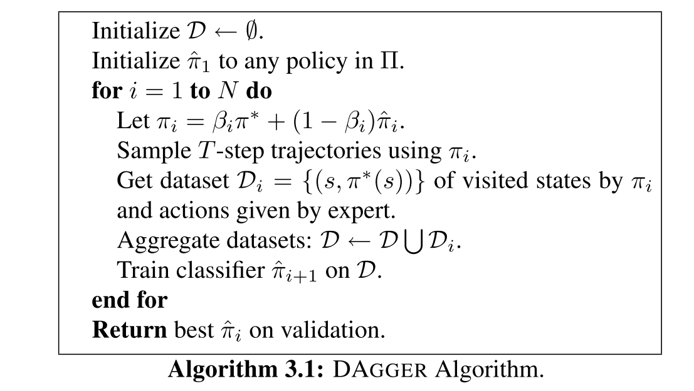

## Imitation Learning Ⅱ: DAgger透彻理论分析

**A Reduction of Imitation Learning and Structured Prediction to No-Regret Online Learning**

2010 | [Paper](https://www.cs.cmu.edu/~sross1/publications/Ross-AIStats11-NoRegret.pdf) | CMU

*Stéphane Ross, Geoffrey J. Gordon, J. Andrew Bagnell*

承接上文 [Imitation Learning: An Introduction](https://zhuanlan.zhihu.com/p/140348314)，我们详细地看一下提出DAgger的paper。**本post主要讨论为什么这样的非独立同分布的在线学习思想是可以work并收敛的。**

DAgger旨在解决模仿学习的两个问题：

1. 传统的学习一个classifier或regressor的方式，不适用于序列决策过程。因为t时刻的预测会影响t+1, ...,  t+n时刻的状态，这违背了统计学中的 iid(独立同分布假设)；
2. 误差累积。

### DATASET AGGREGATION Algorithm

简而言之，**DAgger在每一次迭代中利用当前的policy收集数据，然后利用所有的数据集训练下一次的policy**。

先设 $\beta_1=1$，即用expert policy获取初始数据。然后再随着训练过程指数级衰减这个系数 $\beta_i=p^{i-1}$，

### 理论分析

DAgger是一种增量学习(Incremental learning)/在线学习(Online learning)的思想。

#### No-regret Algorithm

**no-regret是啥？**这篇paper是这么写的：

如果一个算法，其产生的一系列策略 $\pi_{1}, \pi_{2}, \ldots, \pi_{N}$，当N变为无穷时，对事后(hindsight)最佳策略的平均后悔(regret)变为0：
$$
\frac{1}{N} \sum_{i=1}^{N} \ell_{i}\left(\pi_{i}\right)-\min _{\pi \in \Pi} \frac{1}{N} \sum_{i=1}^{N} \ell_{i}(\pi) \leq \gamma_{N}
$$
其中，$\lim _{N \rightarrow \infty} \gamma_{N}=0$

Well，没懂。所幸我在reddit上找到了答案，参照 [Prediction, Learning, and Games](http://www.ii.uni.wroc.pl/~lukstafi/pmwiki/uploads/AGT/Prediction_Learning_and_Games.pdf) 这本教材的11页，16-17页，给出如下定义：

***regret* 指预测者(forecaster)的累计损失与专家(expert)之间的差，其用于度量预测者在事后有多后悔没有跟随专家的指导。**

很显然，DAgger这里把最佳策略 $\pi$ 是为了expert策略，no-regret 代表着随着训练地迭代，我们可以让这个差趋近于0。

也可以看看 [在线学习](http://wxwidget.github.io/blog/2014/01/24/online-learning-survey/) 这篇博客。

#### DAgger 的 no-regret guarantees

DAgger是否符合我们上面提到的No-regret Algorithm呢？

**引理 4.1**：$\left\|d_{\pi_{i}}-d_{\hat{\pi}_{i}}\right\|_{1} \leq 2 T \beta_{i}$

> d代表状态分布。由于伪码中，$\pi_{i}=\beta_{i} \pi^{*}+\left(1-\beta_{i}\right) \hat{\pi}_{i}$
>
> 故有，$d_{\pi_{i}}=\left(1-\beta_{i}\right)^{T} d_{\hat{\pi}_{i}}+\left(1-\left(1-\beta_{i}\right)^{T}\right) d$
>
> $$
\begin{array}{l}
\left\|d_{\pi_{i}}-d_{\hat{\pi}_{i}}\right\|_{1} \\
=\left(1-\left(1-\beta_{i}\right)^{T}\right)\left\|d-d_{\hat{\pi}_{i}}\right\|_{1} \\
\leq 2\left(1-\left(1-\beta_{i}\right)^{T}\right) \\
\leq 2 T \beta_{i}
\end{array}
> $$

**Theorem 4.1**: For DAGGER, 存在一个策略 $\hat{\pi} \in\hat{\pi}_{1: N}$ ，使 $\mathbb{E}_{s \sim d_{\widehat{\pi}}}[\ell(s, \hat{\pi})] \leq \epsilon_{N}+\gamma_{N}+\frac{2 \ell_{\max }}{N}\left[n_{\beta}+\right.\left.T \sum_{i=n_{\beta}+1}^{N} \beta_{i}\right],$ for $\gamma_{N}$ the average regret of $\hat{\pi}_{1: N}$

> 假设 $\beta_i$非增，定义$n_{\beta}$ the largest $n \leq N$ such that $\beta_{n}>\frac{1}{T} .$ 
>
> - 让 $\epsilon_{N}=$ $\min _{\pi \in \Pi} \frac{1}{N} \sum_{i=1}^{N} \mathbb{E}_{s \sim d_{\pi_{i}}}[\ell(s, \pi)]$ 表示在N步后来看最好的policy的loss
>- 让 $\ell_{\max }$ 作为loss的上限，例如， $\ell_{i}\left(s, \hat{\pi}_{i}\right) \leq \ell_{\max }$ for all policies $\hat{\pi}_{i}$ and state $s$ such that $d_{\hat{\pi}_{i}}(s)>0 .$ 
> - 替代损失函数 $\ell$ 是凸函数
>
> 由引理可知， $\mathbb{E}_{s \sim d_{\hat{\pi}_{i}}}\left(\ell_{i}\left(s, \hat{\pi}_{i}\right)\right) \leq\mathbb{E}_{s \sim d_{\pi_{i}}}\left(\ell_{i}\left(s, \hat{\pi}_{i}\right)\right)+2 \ell_{\max } \min \left(1, T \beta_{i}\right)$
> 然后：
> $$
> \begin{array}{l}
> \min _{\hat{\pi} \in \hat{\pi}_{1: N}} \mathbb{E}_{s \sim d_{\hat{\pi}}}[\ell(s, \hat{\pi})] \\
> \leq \frac{1}{N} \sum_{i=1}^{N} \mathbb{E}_{s \sim d_{\hat{\pi}_{i}}}\left(\ell\left(s, \hat{\pi}_{i}\right)\right) \\
> \leq \frac{1}{N} \sum_{i=1}^{N}\left[\mathbb{E}_{s \sim d_{\pi_{i}}}\left(\ell\left(s, \hat{\pi}_{i}\right)\right)+2 \ell_{\max } \min \left(1, T \beta_{i}\right)\right] \\
> \leq \gamma_{N}+\frac{2 \ell_{\max }}{N}\left[n_{\beta}+T \sum_{i=n_{\beta}+1}^{N} \beta_{i}\right]+\min _{\pi \in \Pi} \frac{1}{N} \sum_{i=1}^{N} \ell_{i}(\pi) \\
> =\gamma_{N}+\epsilon_{N}+\frac{2 \ell_{\max }}{N}\left[n_{\beta}+T \sum_{i=n_{\beta}+1}^{N} \beta_{i}\right]
> \end{array}
> $$
> 
> 这个定理告诉我们，在error reduction的假设下，存在这样一个策略，能够使loss降到 $\epsilon$

上面的定理保证了这样一个online learning方法在infinite sample上可以做到no-regret。然而实际中我们只能有限采样(finite sample)。

**Theorem 4.2**: For DAGGER, 有至少 $1-\delta$ 的概率存在这样一个策略 $\hat{\pi} \in \hat{\pi}_{1: N}$，使 $\mathbb{E}_{s \sim d_{\widehat{\pi}}}[\ell(s, \hat{\pi})] \leq \hat{\epsilon}_{N}+\gamma_{N}+\frac{2 \ell_{\max }}{N}\left[n_{\beta}+T \sum_{i=n_{\beta}+1}^{N} \beta_{i}\right]+\ell_{\max } \sqrt{\frac{2 \log (1 / \delta)}{m N}},$ for $\gamma_{N}$ the average regret of $\hat{\pi}_{1: N}$

> 在每一个timestep i，我们采样m条trajectories。
>
> 并在这m条轨迹的数据集中求得损失 $ \ell_{i}(\pi)=\mathbb{E}_{s \sim D_{i}}(\ell(s, \pi))$
>
> The online learner 保证了 $\frac{1}{N} \sum_{i=1}^{N} \mathbb{E}_{s \sim D_{i}}\left(\ell\left(s, \pi_{i}\right)\right)-\min _{\pi \in \Pi} \frac{1}{N} \sum_{i=1}^{N} \mathbb{E}_{s \sim D_{i}}(\ell(s, \pi)) \leq \gamma_{N} . \quad$
>
> - 让 $\hat{\epsilon}_{N}=\min _{\pi \in \Pi} \frac{1}{N} \sum_{i=1}^{N} \mathbb{E}_{s \sim D_{i}}[\ell(s, \pi)]$ the training loss of the best policy in hindsight.
>
> Proof. Let $Y_{i j}$ be the difference between the expected per step loss of $\hat{\pi}_{i}$ under state distribution $d_{\pi_{i}}$ and the average per step loss of $\hat{\pi}_{i}$ under the $j^{t h}$ sample trajectory with $\pi_{i}$ at iteration $i .$ The random variables $Y_{i j}$ over all $i \in\{1,2, \ldots, N\}$ and $j \in\{1,2, \ldots, m\}$ are all zero mean, bounded in $\left[-\ell_{\max }, \ell_{\max }\right]$ and form a martingale (considering the order $\left.Y_{11}, Y_{12}, \ldots, Y_{1 m}, Y_{21}, \ldots, Y_{N m}\right)$
> By **Azuma-Hoeffding's** inequality $\frac{1}{m N} \sum_{i=1}^{N} \sum_{j=1}^{m} Y_{i j} \leq\ell_{\max } \sqrt{\frac{2 \log (1 / \delta)}{m N}}$ with probability at least $1-\delta .$ Hence, we obtain that with probability at least $1-\delta$:
> $$
> \begin{array}{l}
> \min _{\hat{\pi} \in \hat{\pi}_{1: N}} \mathbb{E}_{s \sim d_{\hat{\pi}}}[\ell(s, \hat{\pi})] \\
> \leq \frac{1}{N} \sum_{i=1}^{N} \mathbb{E}_{s \sim d_{\hat{\pi}_{i}}}\left[\ell\left(s, \hat{\pi}_{i}\right)\right] \\
> \leq \frac{1}{N} \sum_{i=1}^{N} \mathbb{E}_{s \sim d_{\pi_{i}}}\left[\ell\left(s, \hat{\pi}_{i}\right)\right]+\frac{2 \ell_{\mathrm{max}}}{N}\left[n_{\beta}+T \sum_{i=n_{\beta}+1}^{N} \beta_{i}\right] \\
> =\frac{1}{N} \sum_{i=1}^{N} \mathbb{E}_{s \sim D_{i}}\left[\ell\left(s, \hat{\pi}_{i}\right)\right]+\frac{1}{m N} \sum_{i=1}^{N} \sum_{j=1}^{m} Y_{i j} \\
> \quad+\frac{2 \ell_{\mathrm{max}}}{N}\left[n_{\beta}+T \sum_{i=n_{\beta}+1}^{N} \beta_{i}\right] \\
> \leq \frac{1}{N} \sum_{i=1}^{N} \mathbb{E}_{s \sim D_{i}}\left[\ell\left(s, \hat{\pi}_{i}\right)\right]+\ell_{\max } \sqrt{\frac{2 \log (1 / \delta)}{m N}} \\
> \quad+\frac{2 \ell_{\max }}{N}\left[n_{\beta}+T \sum_{i=n_{\beta}+1}^{N} \beta_{i}\right] \\
> \leq \hat{\epsilon}_{N}+\gamma_{N}+\ell_{\max } \sqrt{\frac{2 \log (1 / \delta)}{m N}}+\frac{2 \ell_{\max }}{N}\left[n_{\beta}+T \sum_{i=n_{\beta}+1}^{N} \beta_{i}\right]
> \end{array}
> $$

