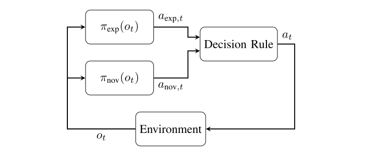
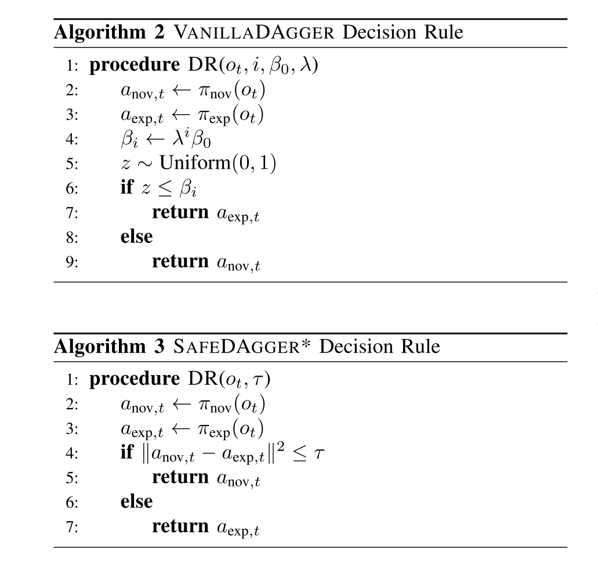
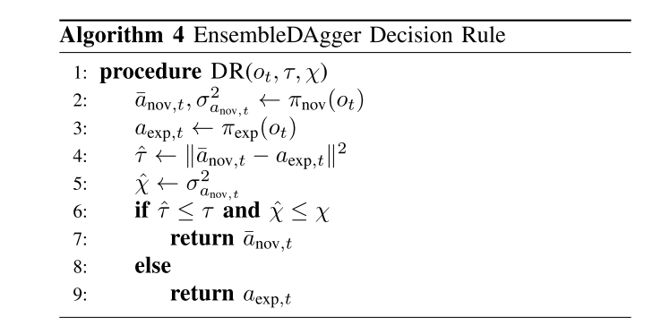

## Imitation Learning Ⅲ: EnsembleDAgger 

**EnsembleDAgger: A Bayesian Approach to Safe Imitation Learning**

2019 | Paper | Stanford & UIUC

*Kunal Menda, Katherine Driggs-Campbell, and Mykel J. Kochenderfer*

Imitation Learning (IL) 使用 expert demonstration 来引导探索，正如第一章所介绍的，IL在遇到数据集不包含的情况时会出现严重的后果，这在真实机器人上是致命的，也是DAgger算法的缺点。因此，本文基于贝叶斯方法提出了一种**安全的**模仿学习方法。

### Preliminary

Imitation Learning & DAgger

https://zhuanlan.zhihu.com/p/140348314

https://zhuanlan.zhihu.com/p/140939491

Bayesian Methods

https://zhuanlan.zhihu.com/p/139478368

https://zhuanlan.zhihu.com/p/139523520

*p.s. 构建自己的知识体系真是件有意思的事*

### DAgger & SafeDAgger

我们把上一章讲到的DAgger算法的结构看成下图（实际上思路是一样的），这样我们可以发现接下来的几个算法不同点就在**Decision Rule**上：

最近已经有paper提出了SafeDAgger的概念，使用 expert 与 novice 之间的差距作为判断safe与否的标准。

### EnsembleDAgger

本文将DAgger扩展到了**概率空间**，旨在最大程度地减少专家干预，同时限制失败的可能性。**通过量化不确定性和置信度来度量*doubt*(质疑），以此来judge safe明显比SafeDAgger更合理一些。**为了量化这种doubt，本文使用神经网络的集成来估计特定状态下新手动作的**方差**，这表明即使在复杂的高维空间中，它也可以有效地逼近高斯过程（GPs）。至于为什么用GP和Bayesian，详见Preliminary。

EnsembleDAgger在Decision rule里多了一个方差的判断，这被称作Doubt rule。

**这样为什么就safe了呢？看看文中给出的论点：**

1. The expert prefers trajectories that avoid failure states, and rarely visits near failure states, implying that states dissimilar to those in expert trajectories (or states unfamiliar to the novice) are likely to be in closer proximity to failure states.
2. Following from (1), and by capturing epistemic uncer- tainty, or lack of familiarity with states in the training dataset, the novice’s doubt provides a model-free proxy for proximity to failure states.
3. In order to constrain the probability of encountering a failure state, the discrepancy between the action taken and the expert’s action is less than some bound.
4. The ideal bounds should be state-dependent, such that the bound is tighter in close proximity to failure states.
5. Following from (2, 4), the bound on discrepancy should decrease as the novice’s doubt increases.

Emmm，听起来不怎么让人信服。。。

### 结语

这篇paper的数学性不强，没有理论论证，而且似乎这个思想有些过于简单且生硬。把一个超参变成两个超参的创新有些奇怪。既然已经概率化了，为什么不更近一步做混合控制，岂不是更safe？当然如果在读这篇文章的小伙伴也有这个想法，抱歉，那你们来晚了，因为这个idea我写过paper了。

