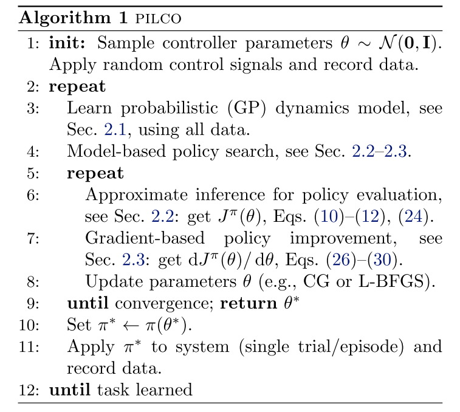

## Model-Based RL Ⅲ: 从源码读懂PILCO

### PILCO: A Model-Based and Data-Efficient Approach to Policy Search

[Paper](https://www.researchgate.net/publication/221345233_PILCO_A_Model-Based_and_Data-Efficient_Approach_to_Policy_Search) | [Code](https://github.com/nrontsis/PILCO)

*Marc Peter Deisenroth, Carl Edward Rasmussen*

**Probabilistic Inference for Learning COntrol (PILCO)**

这系列的文章顺序有些错误，PILCO是2011年针对**机器人控制**提出的基于模型的强化学习算法，理应在Dyna之后、MVE之前，因为PILCO的创新是**引入了对于model bias的考虑**，文中**用高斯过程(Gaussian Processes)学习一个概率动力学模型(probabilistic dynamics model)**。这也是后面 MBPO 所采用的，不过 MBPO 在此基础上做了 **model ensemble** 并且使用了 **Bayesian Neural Network**，这其中经历了多篇paper的迭代: 

1. [PILCO](https://www.researchgate.net/publication/221345233_PILCO_A_Model-Based_and_Data-Efficient_Approach_to_Policy_Search) (GP)

2. [Efficient Reinforcement Learning using Gaussian
   Processes](http://mlg.eng.cam.ac.uk/yarin/PDFs/DeepPILCO.pdf) (PILCO一作的博士论文)
3. [Improving PILCO with Bayesian neural network dynamics models](http://mlg.eng.cam.ac.uk/yarin/PDFs/DeepPILCO.pdf) (Bayesian Neural Network & GMM)
4. [Data-Efficient Reinforcement Learning with Probabilistic Model Predictive Control](https://arxiv.org/pdf/1706.06491.pdf) (GP-MM)
5. [Deep Reinforcement Learning in a Handful of Trials using Probabilistic Dynamics Models](https://papers.nips.cc/paper/7725-deep-reinforcement-learning-in-a-handful-of-trials-using-probabilistic-dynamics-models.pdf) (Probabilistic ensemble NN)
6. [MBPO](https://arxiv.org/abs/1906.08253)  

----

正文开始

### Principle

PILCO就是包含三部分：


- **底层：**学习一个状态转移的概率动力学模型 $f = p(s_{t+1}|s_t,a_t)$

- **中层：**利用概率动力学模型，对策略 $\pi$ 下的值函数 $V^{\pi}(x_0)$ 进行策略评估的近似推断
- **顶层：**利用基于梯度的方法对策略 $\pi$ 进行参数更新

#### Pseudocode




建立如下的动力学系统
$$
\bold x_t=f(\bold x_{t-1},\bold{u}_{t-1})
$$
这是根据控制问题的习惯命名的，$\bold x_t$ 就是 state $s_t$，$\bold u_{t-1}$是控制量也是action $a_{t-1}$ 

我们的目标呢？是找到最优policy $\mathbf{x} \mapsto \pi(\mathbf{x})=\mathbf{u}$，使**累计损失 $c$** (与其他RL的reward相反，这里是**负奖励**)**最小**：
$$
J^{\pi}(\theta)=\sum_{t=0}^{T} \mathbb{E}_{\mathbf{x}_{t}}\left[c\left(\mathbf{x}_{t}\right)\right], \quad \mathbf{x}_{0} \sim \mathcal{N}\left(\mu_{0}, \mathbf{\Sigma}_{0}\right)
$$
其中，policy $\pi$ 是以 $\theta$ 为参数。

#### 2.1 Bottom Layer

PILCO使用**高斯过程GP**来建模上述动力学模型：
$$
\begin{aligned}
p\left(\mathbf{x}_{t} | \mathbf{x}_{t-1}, \mathbf{u}_{t-1}\right) &=\mathcal{N}\left(\mathbf{x}_{t} | \mu_{t}, \mathbf{\Sigma}_{t}\right) \\
\mu_{t} &=\mathbf{x}_{t-1}+\mathbb{E}_{f}\left[\Delta_{t}\right] \\
\boldsymbol{\Sigma}_{t} &=\operatorname{var}_{f}\left[\Delta_{t}\right]
\end{aligned}
$$

- 以状态-动作对 $(\mathbf x_{t-1},\mathbf u_{t-1})$ 为 training input
- 以**差分变量** $\Delta_t=\mathbf x_t-\mathbf x_{t-1}+\varepsilon, \varepsilon \in \mathbb{R}^{D}, \varepsilon \sim \mathcal{N}\left(0, \boldsymbol{\Sigma}_{\varepsilon}\right), \boldsymbol{\Sigma}_{\varepsilon}=\operatorname{diag}\left(\left[\sigma_{\varepsilon_{1}}, \ldots, \sigma_{\varepsilon_{D}}\right]\right)$ 为 training output

这个概率动力学模型就是从 $\tilde  x_{t-1} =(\mathbf x_{t-1},\mathbf u_{t-1}) $ 到 $\Delta_t$ 的映射。

**为什么用差分来代替 $\mathbf x_t$ 呢？**

跟直接学习函数值相比，学习差分更有优势。因为相比于原来的函数，它们的变化很少。学习差分![[公式]](https://www.zhihu.com/equation?tex=%5CDelta+x)近似于学习函数的梯度。

**训练之后，如何用GP表示新的状态-动作对对应的next state呢？毕竟我们在规划的时候要用啊！**

定义![[公式]](https://www.zhihu.com/equation?tex=f%5Cleft%28%5Cwidetilde%7Bx%7D%5Cright%29)之间的协方差矩阵为**核函数**：

![[公式]](https://www.zhihu.com/equation?tex=%5C%5B+cov%5Cleft%28f%5Cleft%28%5Cwidetilde%7Bx%7D%5Cright%29%2Cf%5Cleft%28%5Cwidetilde%7Bx%7D%27%5Cright%29%5Cright%29%3D%5Calpha%5E2%5Cexp%5Cleft%28-%5Cfrac%7B1%7D%7B2%7D%5Cleft%28%5Cwidetilde%7Bx%7D-%5Cwidetilde%7Bx%7D%27%5Cright%29%5ET%5CLambda%5E%7B-1%7D%5Cleft%28%5Cwidetilde%7Bx%7D-%5Cwidetilde%7Bx%7D%27%5Cright%29%5Cright%29+%5C%5D)

由于输出和输入的关系是![[公式]](https://www.zhihu.com/equation?tex=%5C%5B+%5CDelta%5Cleft%28%5Cwidetilde%7Bx%7D%5Cright%29%3Df%5Cleft%28%5Cwidetilde%7Bx%7D%5Cright%29%2B%5Cvarepsilon+%5C%5D)

故输出之间的协方差矩阵为：
$$
\begin{aligned}
\operatorname{cov}\left(\Delta(\tilde{x}), \Delta\left(\tilde{x}^{\prime}\right)\right)&=\operatorname{cov}\left(f(\tilde{x})+\varepsilon, f\left(\tilde{x}^{\prime}\right)+\varepsilon\right) \\
&=\operatorname{cov}\left(f(\tilde{x}), f\left(\tilde{x}^{\prime}\right)\right)+\operatorname{cov}(\varepsilon, \varepsilon) \\
&=k\left(\tilde{x}, \tilde{x}^{\prime}\right)+\sigma_{\varepsilon}^{2} I
\end{aligned}
$$


给定训练集 $\mathcal{D}:=\left\{\widetilde{X}:=\left[\tilde{x}_{1}, \cdots, \tilde{x}_{n}\right]^{T}, y:=\left[\Delta_{1}, \cdots, \Delta_{n}\right]^{T}\right\}$ 与测试集 $\tilde x_*$，求![[公式]](D:\Github\Reinforcement-Learning-in-Robotics\Preliminary\img\equation.svg)，即在训练集上进行推理: ![[公式]](https://www.zhihu.com/equation?tex=p%5Cleft%28%5CDelta%5Cleft%28x_%2A%5Cright%29%7C%2Cy%5Cright%29)，分两步计算：

- 先求二者的**联合概率分布**
- 再根据**条件概率公式**求条件分布

令：

![[公式]](https://www.zhihu.com/equation?tex=%5C%5B+k_%2A%3A%3Dk%5Cleft%28%5Cwidetilde%7BX%7D%2C%5Cwidetilde%7Bx%7D_%2A%5Cright%29%2C%5C+k_%7B%2A%2A%7D%3A%3Dk%5Cleft%28%5Cwidetilde%7Bx%7D_%2A%2C%5Cwidetilde%7Bx%7D_%2A%5Cright%29%2C%5Cbeta+%3A%3D%5Cleft%28K%2B%5Csigma_%7B%5Cvarepsilon%7D%5E%7B2%7DI%5Cright%29%5E%7B-1%7Dy+%5C%5D)

![[公式]](https://www.zhihu.com/equation?tex=%5C%5B+K_%7Bij%7D%3Dk%5Cleft%28%5Cwidetilde%7Bx%7D_i%2C%5Cwidetilde%7Bx%7D_j%5Cright%29+%5C%5D)

`pilco/models/mgpr.py`:

```python
def K(self, X1, X2=None):
    return tf.stack(
            [model.kernel.K(X1, X2) for model in self.models]
        )
```

则联合高斯分布为：

![[公式]](https://www.zhihu.com/equation?tex=%5C%5B+%5Cleft%5B%5Cbegin%7Barray%7D%7Bc%7D+y%5C%5C+%5CDelta%5Cleft%28x_%2A%5Cright%29%5C%5C+%5Cend%7Barray%7D%5Cright%5D~%5Csim%5Cmathcal%7BN%7D%5Cleft%28%5Cleft%5B%5Cbegin%7Barray%7D%7Bc%7D+0%5C%5C+0%5C%5C+%5Cend%7Barray%7D%5Cright%5D%2C%5Cleft%5B%5Cbegin%7Bmatrix%7D+K%2B%5Csigma_%7B%5Cvarepsilon%7D%5E%7B2%7DI%26+k_%2A%5C%5C+k_%7B%2A%7D%5E%7BT%7D%26+k_%7B%2A%2A%7D%5C%5C+%5Cend%7Bmatrix%7D%5Cright%5D%5Cright%29+%5C%5D)

联合概率分布的协方差矩阵可分解为：

![[公式]](https://www.zhihu.com/equation?tex=%5C%5B+%5Cleft%5B%5Cbegin%7Bmatrix%7D+K%2B%5Csigma_%7B%5Cvarepsilon%7D%5E%7B2%7DI%26+k_%2A%5C%5C+k_%7B%2A%7D%5E%7BT%7D%26+k_%7B%2A%2A%7D%5C%5C+%5Cend%7Bmatrix%7D%5Cright%5D%3D%5Cleft%5B%5Cbegin%7Bmatrix%7D+1%26+0%5C%5C+k_%7B%2A%7D%5E%7BT%7D%5Cleft%28K%2B%5Csigma_%7B%5Cvarepsilon%7D%5E%7B2%7DI%5Cright%29%5E%7B-1%7D%26+1%5C%5C+%5Cend%7Bmatrix%7D%5Cright%5D%5Cleft%5B%5Cbegin%7Bmatrix%7D+K%2B%5Csigma_%7B%5Cvarepsilon%7D%5E%7B2%7DI%26+0%5C%5C+0%26+k_%7B%2A%2A%7D-k_%7B%2A%7D%5E%7BT%7D%5Cleft%28K%2B%5Csigma_%7B%5Cvarepsilon%7D%5E%7B2%7DI%5Cright%29%5E%7B-1%7Dk_%2A%5C%5C+%5Cend%7Bmatrix%7D%5Cright%5D%5Cleft%5B%5Cbegin%7Bmatrix%7D+1%26+%5Cleft%28K%2B%5Csigma_%7B%5Cvarepsilon%7D%5E%7B2%7DI%5Cright%29%5E%7B-1%7Dk_%2A%5C%5C+0%26+1%5C%5C+%5Cend%7Bmatrix%7D%5Cright%5D+%5C%5D)

因此其逆为：

![[公式]](https://www.zhihu.com/equation?tex=%5C%5B+%5Cleft%5B%5Cbegin%7Bmatrix%7D+K%2B%5Csigma_%7B%5Cvarepsilon%7D%5E%7B2%7D%26+k_%2A%5C%5C+k_%7B%2A%7D%5E%7BT%7D%26+k_%7B%2A%2A%7D%5C%5C+%5Cend%7Bmatrix%7D%5Cright%5D%5E%7B-1%7D%3D%5Cleft%5B%5Cbegin%7Bmatrix%7D+1%26+-%5Cleft%28K%2B%5Csigma_%7B%5Cvarepsilon%7D%5E%7B2%7D%5Cright%29%5E%7B-1%7Dk_%2A%5C%5C+0%26+1%5C%5C+%5Cend%7Bmatrix%7D%5Cright%5D%5Cleft%5B%5Cbegin%7Bmatrix%7D+%5Cleft%28K%2B%5Csigma_%7B%5Cvarepsilon%7D%5E%7B2%7D%5Cright%29%5E%7B-1%7D%26+0%5C%5C+0%26+%5Cleft%28k_%7B%2A%2A%7D-k_%7B%2A%7D%5E%7BT%7D%5Cleft%28K%2B%5Csigma_%7B%5Cvarepsilon%7D%5E%7B2%7D%5Cright%29%5E%7B-1%7Dk_%2A%5Cright%29%5E%7B-1%7D%5C%5C+%5Cend%7Bmatrix%7D%5Cright%5D%5Cleft%5B%5Cbegin%7Bmatrix%7D+1%26+0%5C%5C+-k_%7B%2A%7D%5E%7BT%7D%5Cleft%28K%2B%5Csigma_%7B%5Cvarepsilon%7D%5E%7B2%7D%5Cright%29%5E%7B-1%7D%26+1%5C%5C+%5Cend%7Bmatrix%7D%5Cright%5D+%5C%5D)

根据高斯分布公式有：

![[公式]](https://www.zhihu.com/equation?tex=%5C%5B+%5Cleft%28%5Cleft%5B%5Cbegin%7Barray%7D%7Bc%7D+y%5C%5C+%5CDelta%5Cleft%28x_%2A%5Cright%29%5C%5C+%5Cend%7Barray%7D%5Cright%5D-%5Cleft%5B%5Cbegin%7Barray%7D%7Bc%7D+0%5C%5C+0%5C%5C+%5Cend%7Barray%7D%5Cright%5D%5Cright%29%5ET%5Cleft%5B%5Cbegin%7Bmatrix%7D+K%2B%5Csigma_%7B%5Cvarepsilon%7D%5E%7B2%7DI%26+k_%2A%5C%5C+k_%7B%2A%7D%5E%7BT%7D%26+k_%7B%2A%2A%7D%5C%5C+%5Cend%7Bmatrix%7D%5Cright%5D%5E%7B-1%7D%5Cleft%28%5Cleft%5B%5Cbegin%7Barray%7D%7Bc%7D+y%5C%5C+%5CDelta%5Cleft%28x_%2A%5Cright%29%5C%5C+%5Cend%7Barray%7D%5Cright%5D-%5Cleft%5B%5Cbegin%7Barray%7D%7Bc%7D+0%5C%5C+0%5C%5C+%5Cend%7Barray%7D%5Cright%5D%5Cright%29+%5C%5C+%3D%5Cleft%5B%5Cbegin%7Barray%7D%7Bc%7D+y%5C%5C+%5CDelta%5Cleft%28x_%2A%5Cright%29%5C%5C+%5Cend%7Barray%7D%5Cright%5D%5ET%5Cleft%5B%5Cbegin%7Bmatrix%7D+1%26+-%5Cleft%28K%2B%5Csigma_%7B%5Cvarepsilon%7D%5E%7B2%7DI%5Cright%29%5E%7B-1%7Dk_%2A%5C%5C+0%26+1%5C%5C+%5Cend%7Bmatrix%7D%5Cright%5D%5Cleft%5B%5Cbegin%7Bmatrix%7D+%5Cleft%28K%2B%5Csigma_%7B%5Cvarepsilon%7D%5E%7B2%7DI%5Cright%29%5E%7B-1%7D%26+0%5C%5C+0%26+%5Cleft%28k_%7B%2A%2A%7D-k_%7B%2A%7D%5E%7BT%7D%5Cleft%28K%2B%5Csigma_%7B%5Cvarepsilon%7D%5E%7B2%7DI%5Cright%29%5E%7B-1%7Dk_%2A%5Cright%29%5E%7B-1%7D%5C%5C+%5Cend%7Bmatrix%7D%5Cright%5D%5Cleft%5B%5Cbegin%7Bmatrix%7D+1%26+0%5C%5C+-k_%7B%2A%7D%5E%7BT%7D%5Cleft%28K%2B%5Csigma_%7B%5Cvarepsilon%7D%5E%7B2%7DI%5Cright%29%5E%7B-1%7D%26+1%5C%5C+%5Cend%7Bmatrix%7D%5Cright%5D%5Cleft%5B%5Cbegin%7Barray%7D%7Bc%7D+y%5C%5C+%5CDelta%5Cleft%28x_%2A%5Cright%29%5C%5C+%5Cend%7Barray%7D%5Cright%5D+%5C%5D)

由**联合概率分布**公式：

![[公式]](https://www.zhihu.com/equation?tex=%5C%5B+p%5Cleft%28y%2C%5CDelta%5Cleft%28x_%2A%5Cright%29%5Cright%29%3Dp%5Cleft%28%5CDelta%5Cleft%28x_%2A%5Cright%29%7Cy%5Cright%29p%5Cleft%28y%5Cright%29+%5C%5D)

得到**后验概率分布**服从如下高斯分布：
$$
p\left(\Delta\left(x_{*}\right) | y\right) \sim\mathcal{N}\left(k_{*}^{T}\left(K+\sigma_{\varepsilon}^{2} I\right)^{-1} y, k_{* *}-k_{*}^{T}\left(K+\sigma_{\varepsilon}^{2} I\right)^{-1} k_{*}\right)
$$
`pilco/models/mgpr.py`:

```python
    def calculate_factorizations(self):
        K = self.K(self.X)
        batched_eye = tf.eye(tf.shape(self.X)[0], batch_shape=[self.num_outputs], dtype=float_type)
        L = tf.linalg.cholesky(K + self.noise[:, None, None]*batched_eye)
        iK = tf.linalg.cholesky_solve(L, batched_eye, name='chol1_calc_fact')
        Y_ = tf.transpose(self.Y)[:, :, None]
        # TODO: Why do we transpose Y? Maybe we need to change the definition of self.Y() or beta?
        beta = tf.linalg.cholesky_solve(L, Y_, name="chol2_calc_fact")[:, :, 0]
        return iK, beta
```

通过分布求**均值、方差**，即：
$$
\begin{aligned}
m_{f}\left(\tilde{x}_{*}\right) &=E_{f}\left[\Delta_{*}\right]=k_{*}^{T}\left(K+\sigma_{\varepsilon}^{2} I\right)^{-1} y=k_{*}^{T} \beta \\
\sigma_{f}^{2}\left(\Delta_{*}\right) &=\operatorname{var}_{f}\left[\Delta_{*}\right]=k_{* *}-k_{*}^{T}\left(K+\sigma_{\varepsilon}^{2} I\right)^{-1} k_{*}
\end{aligned}
$$
由此，

- 我们在底层训练了一个概率动力学模型
- 也想办法用这个模型把预测的next state给表示出来了


模型训练 `pilco/models/mgpr.py`:

```python
    def optimize(self, restarts=1):
        if len(self.optimizers) == 0:  # This is the first call to optimize();
            for model in self.models:
                # Create an gpflow.train.ScipyOptimizer object for every model embedded in mgpr
                optimizer = gpflow.optimizers.Scipy()
                optimizer.minimize(model.training_loss, model.trainable_variables)
                self.optimizers.append(optimizer)
        else:
            for model, optimizer in zip(self.models, self.optimizers):
                optimizer.minimize(model.training_loss, model.trainable_variables)

        for model, optimizer in zip(self.models, self.optimizers):
            best_params = {
                "lengthscales" : model.kernel.lengthscales.value(),
                "k_variance" : model.kernel.variance.value(),
                "l_variance" : model.likelihood.variance.value()}
            best_loss = model.training_loss()
            for restart in range(restarts):
                randomize(model)
                optimizer.minimize(model.training_loss, model.trainable_variables)
                loss = model.training_loss()
                if loss < best_loss:
                    best_params["k_lengthscales"] = model.kernel.lengthscales.value()
                    best_params["k_variance"] = model.kernel.variance.value()
                    best_params["l_variance"] = model.likelihood.variance.value()
                    best_loss = model.training_loss()
            model.kernel.lengthscales.assign(best_params["lengthscales"])
            model.kernel.variance.assign(best_params["k_variance"])
            model.likelihood.variance.assign(best_params["l_variance"])
```


#### 2.2 Intermediate Layer

这里就到了**如何利用learned model的预测来对policy的长期performance进行评估**。也就是我们在**强化学习基础Ⅱ**里写的策略评估。

不同的是，这里没用时序差分(TD)，也不是MVE、STEVE、MBPO那样对model进行rollout，而是**直接相信了这个概率动力学模型**！
$$
V^{\pi}\left(x_{0}\right)=\sum_{t=0}^{T} \int c\left(x_{t}\right) p\left(x_{t}\right) d x_{t}
$$
注意 $c(x_t)$ 是负奖励/损失。在t时刻，把所有可能的next state都乘上它的损失，即求积分。然后对时间t从0-T求和。用以表示从状态 $x_0$ 开始未来 T 时刻的总预测损失。

**如何计算这个积分？**

先看一下t时刻下的概率分布：
$$
p\left(x_{t}\right)=\iint p\left(x_{t} | x_{t-1}, u_{t-1}\right) p\left(u_{t-1} | x_{t-1}\right) p\left(x_{t-1}\right) d x_{t-1} d u_{t-1}, t=1, \cdots, T
$$
我们需要得到：$ p\left(x_{t} | x_{t-1}, u_{t-1}\right) , p\left(u_{t-1} | x_{t-1}\right), p\left(x_{t-1}\right)$. 这注定是个递推公式。

**计算路径：**$p(x_{t-1})\rightarrow p(u_{t-1})/p(\pi(x_{t-1}))\rightarrow p(x_{t-1},u_{t-1})\rightarrow p(\Delta x_{t-1})\rightarrow p(x_t)$

##### 2.2.1 从状态分布到动作分布 $p(x_{t-1})\rightarrow p(u_{t-1})/p(\pi(x_{t-1}))$

如果是初步策略是线性策略 $\pi(x_*)=\Psi x_*+\nu$，若 $x_*\sim \mathcal{N}(\mu,\Sigma)$，其均值、协方差为
$$
\begin{aligned}
&\mathbb{E}_{x_{*}}\left[\tilde{\pi}\left(x_{*}\right)\right]=\Psi \mu+\nu\\
&\operatorname{cov}_{x_{*}}\left[\tilde{\pi}\left(x_{*}\right)\right]=\Psi \Sigma \Psi^{T}
\end{aligned}
$$

实际策略![[公式]](https://www.zhihu.com/equation?tex=u%3D%5Cpi%5Cleft%28x_%2A%5Cright%29)往往是有约束的。比如移动机器人最大运动速度是有限制的。令![[公式]](https://www.zhihu.com/equation?tex=u%5Cin%5Cleft%5B-u_%7B%5Cmax%7D%2Cu_%7B%5Cmax%7D%5Cright%5D)，利用正弦函数将初步策略限制到范围内有：

![[公式]](https://www.zhihu.com/equation?tex=%5C%5B+%5Cpi%5Cleft%28x%5Cright%29%3Du_%7B%5Cmax%7D%5Csin%5Cleft%28%5Cwidetilde%7B%5Cpi+%7D%5Cleft%28x%5Cright%29%5Cright%29%5Cin%5Cleft%5B-u_%7B%5Cmax%7D%2Cu_%7B%5Cmax%7D%5Cright%5D+%5C%5D)

分两步计算：

1. 计算初步策略![[公式]](https://www.zhihu.com/equation?tex=p%5Cleft%28%5Cwidetilde%7B%5Cpi+%7D%5Cleft%28x_%7Bt-1%7D%5Cright%29%5Cright%29)
2. 考虑到实际策略的约束函数，计算策略分布的高斯逼近 ![[公式]](https://www.zhihu.com/equation?tex=%5C%5B+p%5Cleft%28%5Cpi%5Cleft%28x_%7Bt-1%7D%5Cright%29%5Cright%29%3Dp%5Cleft%28u_%7B%5Cmax%7D%5Csin%5Cleft%28%5Cwidetilde%7B%5Cpi+%7D%5Cleft%28x_%7Bt-1%7D%5Cright%29%5Cright%29%5Cright%29+%5C%5D)

`pilco/models/mgpr.py`:

```python
    def predict_given_factorizations(self, m, s, iK, beta):
        """
        Approximate GP regression at noisy inputs via moment matching
        IN: mean (m) (row vector) and (s) variance of the state
        OUT: mean (M) (row vector), variance (S) of the action
             and inv(s)*input-ouputcovariance
        """

        s = tf.tile(s[None, None, :, :], [self.num_outputs, self.num_outputs, 1, 1])
        inp = tf.tile(self.centralized_input(m)[None, :, :], [self.num_outputs, 1, 1])

        # Calculate M and V: mean and inv(s) times input-output covariance
        iL = tf.linalg.diag(1/self.lengthscales)
        iN = inp @ iL
        B = iL @ s[0, ...] @ iL + tf.eye(self.num_dims, dtype=float_type)

        # Redefine iN as in^T and t --> t^T
        # B is symmetric so its the same
        t = tf.linalg.matrix_transpose(
                tf.linalg.solve(B, tf.linalg.matrix_transpose(iN), adjoint=True, name='predict_gf_t_calc'),
            )

        lb = tf.exp(-tf.reduce_sum(iN * t, -1)/2) * beta
        tiL = t @ iL
        c = self.variance / tf.sqrt(tf.linalg.det(B))

        M = (tf.reduce_sum(lb, -1) * c)[:, None]
        V = tf.matmul(tiL, lb[:, :, None], adjoint_a=True)[..., 0] * c[:, None]

        # Calculate S: Predictive Covariance
        R = s @ tf.linalg.diag(
                1/tf.square(self.lengthscales[None, :, :]) +
                1/tf.square(self.lengthscales[:, None, :])
            ) + tf.eye(self.num_dims, dtype=float_type)

        # TODO: change this block according to the PR of tensorflow. Maybe move it into a function?
        X = inp[None, :, :, :]/tf.square(self.lengthscales[:, None, None, :])
        X2 = -inp[:, None, :, :]/tf.square(self.lengthscales[None, :, None, :])
        Q = tf.linalg.solve(R, s, name='Q_solve')/2
        Xs = tf.reduce_sum(X @ Q * X, -1)
        X2s = tf.reduce_sum(X2 @ Q * X2, -1)
        maha = -2 * tf.matmul(X @ Q, X2, adjoint_b=True) + \
            Xs[:, :, :, None] + X2s[:, :, None, :]

        k = tf.math.log(self.variance)[:, None] - \
            tf.reduce_sum(tf.square(iN), -1)/2
        L = tf.exp(k[:, None, :, None] + k[None, :, None, :] + maha)
        S = (tf.tile(beta[:, None, None, :], [1, self.num_outputs, 1, 1])
                @ L @
                tf.tile(beta[None, :, :, None], [self.num_outputs, 1, 1, 1])
            )[:, :, 0, 0]

        diagL = tf.transpose(tf.linalg.diag_part(tf.transpose(L)))
        S = S - tf.linalg.diag(tf.reduce_sum(tf.multiply(iK, diagL), [1, 2]))
        S = S / tf.sqrt(tf.linalg.det(R))
        S = S + tf.linalg.diag(self.variance)
        S = S - M @ tf.transpose(M)

        return tf.transpose(M), S, tf.transpose(V)
```


##### 2.2.2 计算联合分布 $p(x_{t-1},u_{t-1})$

1. 计算![[公式]](https://www.zhihu.com/equation?tex=p%5Cleft%28x_%7Bt-1%7D%2C%5Cwidetilde%7B%5Cpi+%7D%5Cleft%28x_%7Bt-1%7D%5Cright%29%5Cright%29)

2. 计算联合概率分布

   ![[公式]](https://www.zhihu.com/equation?tex=%5C%5B+%5Cleft%5B%5Cbegin%7Barray%7D%7Bc%7D+x_%7Bt-1%7D%5C%5C+u_%7Bt-1%7D%5C%5C+%5Cend%7Barray%7D%5Cright%5D~%5Csim%5Cmathcal%7BN%7D%5Cleft%28%5Cleft%5B%5Cbegin%7Barray%7D%7Bc%7D+%5Cmu%5Cleft%28x_%7Bt-1%7D%5Cright%29%5C%5C+%5Cmu%5Cleft%28u_%7Bt-1%7D%5Cright%29%5C%5C+%5Cend%7Barray%7D%5Cright%5D%2C%5Cleft%5B%5Cbegin%7Bmatrix%7D+var%5Cleft%28x_%7Bt-1%7D%5Cright%29%26+cov%5Cleft%28x_%7Bt-1%7D%2Cu_%7Bt-1%7D%5Cright%29%5C%5C+cov%5Cleft%28u_%7Bt-1%7D%2Cx_%7Bt-1%7D%5Cright%29%26+var%5Cleft%28u_%7Bt-1%7D%5Cright%29%5C%5C+%5Cend%7Bmatrix%7D%5Cright%5D%5Cright%29+%5C%5D)

   $\mu(u_{t-1}),var(u_{t-1})$在2.2.1求得，剩下 $cov(x_{t-1},u_{t-1})$ 未知

   ![[公式]](https://www.zhihu.com/equation?tex=%5C%5B+cov%5Cleft%5Bx_%7Bt-1%7D%2Cu_%7Bt-1%7D%5Cright%5D%3Dcov%5Cleft%5Bx_%7Bt-1%7D%2C%5Cwidetilde%7B%5Cpi+%7D%5Cright%5Dcov%5Cleft%5B%5Cwidetilde%7B%5Cpi+%7D%5Cleft%28x_%7Bt-1%7D%5Cright%29%2C%5Cwidetilde%7B%5Cpi+%7D%5Cleft%28x_%7Bt-1%7D%5Cright%29%5Cright%5D%5E%7B-1%7Dcov%5Cleft%5B%5Cwidetilde%7B%5Cpi+%7D%5Cleft%28x_%7Bt-1%7D%5Cright%29%2Cu_%7Bt-1%7D%5Cright%5D+%5C%5D)

证明暂略，见 [链接](https://zhuanlan.zhihu.com/p/27539273)


`pilco\models\pilco.py\propagate`

```python
m = tf.concat([m_x, m_u], axis=1)
s1 = tf.concat([s_x, s_x@c_xu], axis=1)
s2 = tf.concat([tf.transpose(s_x@c_xu), s_u], axis=1)
s = tf.concat([s1, s2], axis=0)
```

##### 2.2.3 计算输出分布 $p(\Delta x_{t-1})$

1. **单变量预测**：

   - 单变量均值

     ![[公式]](https://www.zhihu.com/equation?tex=%5C%5B+%5Cmu_%2A%3D%5Ciint%7Bh%5Cleft%28x_%2A%5Cright%29p%5Cleft%28h%2Cx_%2A%5Cright%29d%5Cleft%28h%2Cx_%2A%5Cright%29%3D%5Cmathbb%7BE%7D_%7Bx_%2A%2Ch%7D%5Cleft%5Bh%5Cleft%28x_%2A%5Cright%29%7C%5Cmu+%2C%5CSigma%5Cright%5D%3DE_%7Bx_%2A%7D%5Cleft%5BE_h%5Cleft%5Bh%5Cleft%28x_%2A%5Cright%29%7Cx_%2A%5Cright%5D%7C%5Cmu+%2C%5CSigma%5Cright%5D%7D+%5C%5D)
     将2.1预测得到的均值方差带入：
   $$
     \begin{aligned}
       m_{f}\left(\tilde{x}_{*}\right) &=E_{f}\left[\Delta_{*}\right]=k_{*}^{T}\left(K+\sigma_{\varepsilon}^{2} I\right)^{-1} y=k_{*}^{T} \beta \\
       \sigma_{f}^{2}\left(\Delta_{*}\right) &=\operatorname{var}_{f}\left[\Delta_{*}\right]=k_{* *}-k_{*}^{T}\left(K+\sigma_{\varepsilon}^{2} I\right)^{-1} k_{*}
       \end{aligned}
   $$

   ​	即为：
   $$
   \mu_{*}=E_{x_{*}}\left[m_{f}\left(x_{*}\right) | \mu, \Sigma\right]=\int m_{f}\left(x_{*}\right) \mathcal{N}\left(x_{*} | \mu, \Sigma\right) d x_{*}=\beta^{T} q
   $$

   ​	其中
   $$
   q=\left[q_{1}, \cdots, q_{n}\right]^{T} \in \mathbb{R}^{n}\quad q_{i}:=\int k_{f}\left(x_{i}, x_{*}\right) \mathcal{N}\left(x_{*} | \mu, \Sigma\right) d x_{*}
   $$

   - 单变量方差

     ![[公式]](https://www.zhihu.com/equation?tex=%5C%5B+%5Csigma_%7B%2A%7D%5E%7B2%7D%3Dvar_%7Bx_%2A%2Ch%7D%5Cleft%5Bh%5Cleft%28x_%2A%5Cright%29%7C%5Cmu+%2C%5CSigma%5Cright%5D%3D%5Ciint%7B%5Cleft%28h%5Cleft%28x_%2A%5Cright%29-E_%7Bx_%2A%2Ch%7Dh%5Cleft%28x_%2A%5Cright%29%5Cright%29%5E2p%5Cleft%28x_%2A%2Ch%5Cright%29d%5Cleft%28x_%2A%2Ch%5Cright%29%7D+%5C%5C+%3D%5Cint_%7Bx_%2A%7D%7B%5Cleft%28%5Cint_h%7B%5Cleft%28%5Cleft%28h%5Cleft%28x_%2A%5Cright%29%7Cx_%2A%5Cright%29-E_%7Bx_%2A%2Ch%7Dh%5Cleft%28x_%2A%5Cright%29%5Cright%29%5E2p%5Cleft%28h%5Cleft%28x_%2A%5Cright%29%7Cx_%2A%5Cright%29%7D%5Cright%29p%5Cleft%28x_%2A%5Cright%29dx_%2A%7D+%5C%5C+%3DE_%7Bx_%2A%7D%5Cleft%28E_h%5Cleft%28%5Cleft%28%5Cleft%28h%5Cleft%28x_%2A%5Cright%29%7Cx_%2A%5Cright%29-E_%7Bx_%2A%2Ch%7Dh%5Cleft%28x_%2A%5Cright%29%5Cright%29%5E2%5Cright%29%5Cright%29+%5C%5C+%3DE_%7Bx_%2A%7D%5Cleft%28E_h%5Cleft%28%5Cleft%28%5Cleft%28h%5Cleft%28x_%2A%5Cright%29%7Cx_%2A%5Cright%29-E_h%5Cleft%28h%5Cleft%28x_%2A%5Cright%29%7Cx_%2A%5Cright%29%2BE_h%5Cleft%28h%5Cleft%28x_%2A%5Cright%29%7Cx_%2A%5Cright%29-E_%7Bx_%2A%2Ch%7Dh%5Cleft%28x_%2A%5Cright%29%5Cright%29%5E2%5Cright%29%5Cright%29+%5C%5D)

     ![[公式]](https://www.zhihu.com/equation?tex=%5C%5B+%3DE_%7Bx_%2A%7D%5Cleft%28var_h%5Cleft%5Bh%5Cleft%28x_%2A%5Cright%29%7Cx_%2A%5Cright%5D%5Cright%29%2BE_%7Bx_%2A%7D%5Cleft%5BE_h%5Cleft%28h%5Cleft%28x_%2A%5Cright%29%7Cx_%2A%5Cright%29-E_%7Bx_%2A%7DE_h%5Cleft%28h%5Cleft%28x_%2A%5Cright%29%7Cx_%2A%5Cright%29%5Cright%5D+%5C%5C+%3DE_%7Bx_%2A%7D%5Cleft%28var_h%5Cleft%5Bh%5Cleft%28x_%2A%5Cright%29%7Cx_%2A%5Cright%5D%5Cright%29%2Bvar_%7Bx_%2A%7D%5Cleft%5BE_h%5Cleft%28h%5Cleft%28x_%2A%5Cright%29%7Cx_%2A%5Cright%29%5Cright%5D+%5C%5C+%3DE_%7Bx_%2A%7D%5Cleft%28%5Csigma_%7Bh%7D%5E%7B2%7D%5Cleft%28x_%2A%5Cright%29%7C%5Cmu+%2C%5CSigma%5Cright%29%2BE_%7Bx_%2A%7D%5Cleft%5Bm_h%5Cleft%28x_%2A%5Cright%29%5E2%7C%5Cmu+%2C%5CSigma%5Cright%5D-E_%7Bx_%2A%7D%5Cleft%5Bm_h%5Cleft%28x_%2A%5Cright%29%7C%5Cmu+%2C%5CSigma%5Cright%5D%5E2+%5C%5D)

2. **多变量预测**：

   - 均值

     ![[公式]](https://www.zhihu.com/equation?tex=%5C%5B+%5Cmu_%2A%7C%5Cmu+%2C%5CSigma+%3D%5Cleft%5B%5Cbeta_%7B1%7D%5E%7BT%7Dq_1%2C%5Ccdots+%2C%5Cbeta_%7BE%7D%5E%7BT%7Dq_E%5Cright%5D%5ET+%5C%5D)

   - 协方差

     ![[公式]](https://www.zhihu.com/equation?tex=%5C%5B+%5CSigma_%2A%7C%5Cmu+%2C%5CSigma+%3D%5Cleft%5B%5Cbegin%7Bmatrix%7D+var_%7Bh%2Cx_%2A%7D%5Cleft%5Bh_%7B1%7D%5E%7B%2A%7D%7C%5Cmu+%2C%5CSigma%5Cright%5D%26+%5Ccdots%26+cov_%7Bh%2Cx_%2A%7D%5Cleft%5Bh_%7B1%7D%5E%7B%2A%7D%2Ch_%7BE%7D%5E%7B%2A%7D%7C%5Cmu+%2C%5CSigma%5Cright%5D%5C%5C+%5Cvdots%26+%5Cddots%26+%5Ccdots%5C%5C+cov_%7Bh%2Cx_%2A%7D%5Cleft%5Bh_%7BE%7D%5E%7B%2A%7D%2Ch_%7B1%7D%5E%7B%2A%7D%7C%5Cmu+%2C%5CSigma%5Cright%5D%26+%5Ccdots%26+var_%7Bh%2Cx_%2A%7D%5Cleft%5Bh_%7BE%7D%5E%7B%2A%7D%7C%5Cmu+%2C%5CSigma%5Cright%5D%5C%5C+%5Cend%7Bmatrix%7D%5Cright%5D+%5C%5D)

     其中

     ![[公式]](https://www.zhihu.com/equation?tex=%5C%5B+cov_%7Bh%2Cx_%2A%7D%5Cleft%5Bh_%7Ba%7D%5E%7B%2A%7D%2Ch_%7Bb%7D%5E%7B%2A%7D%7C%5Cmu+%2C%5CSigma%5Cright%5D%3DE_%7Bh%2Cx_%2A%7D%5Cleft%5Bh_%7Ba%7D%5E%7B%2A%7Dh_%7Bb%7D%5E%7B%2A%7D%7C%5Cmu+%2C%5CSigma%5Cright%5D-%5Cmu_%7Ba%7D%5E%7B%2A%7D%5Cmu_%7Bb%7D%5E%7B%2A%7D+%5C%5D)

     ![[公式]](https://www.zhihu.com/equation?tex=%5C%5B+E_%7Bh%2Cx_%2A%7D%5Cleft%5Bh_%7Ba%7D%5E%7B%2A%7Dh_%7Bb%7D%5E%7B%2A%7D%7C%5Cmu+%2C%5CSigma%5Cright%5D%3DE_%7Bx_%2A%7D%5Cleft%5BE_%7Bh_a%7D%5Cleft%5Bh_%7Ba%7D%5E%7B%2A%7D%7Cx_%2A%5Cright%5DE_%7Bh_b%7D%5Cleft%5Bh_%7Bb%7D%5E%7B%2A%7D%7Cx_%2A%5Cright%5D%7C%5Cmu+%2C%5CSigma%5Cright%5D%3D%5Cint%7Bm_%7Bh%7D%5E%7Ba%7D%5Cleft%28x_%2A%5Cright%29m_%7Bh%7D%5E%7Bb%7D%5Cleft%28x_%2A%5Cright%29p%5Cleft%28x_%2A%5Cright%29dx_%2A%7D+%5C%5D)

`pilco\models\pilco.py\propagate`

```python
M_dx, S_dx, C_dx = self.mgpr.predict_on_noisy_inputs(m, s)
```

##### 2.2.4 计算下一时刻预测分布 $p(x_t)$

![[公式]](https://www.zhihu.com/equation?tex=%5Cmu_t%3A%3D%5Cmu_%7Bt-1%7D%2B%5Cmu_%7B%5CDelta%7D+%5C%5C+%5CSigma_t%3A%3D%5CSigma_%7Bt-1%7D%2B%5CSigma_%7B%5CDelta%7D%2Bcov%5Cleft%5Bx_%7Bt-1%7D%2C%5CDelta_t%5Cright%5D%2Bcov%5Cleft%5B%5CDelta_t%2Cx_%7Bt-1%7D%5Cright%5D+)

其中![[公式]](https://www.zhihu.com/equation?tex=%5CSigma_%7B%5CDelta%7D)是上一步的多变量协方差

未知的是输入输出之间的协方差：

![[公式]](https://www.zhihu.com/equation?tex=%5C%5B+cov%5Cleft%28x_%2A%2Ch%5Cleft%28x_%2A%5Cright%29%5Cright%29%3DE_%7Bx_%2A%2Ch%7D%5Cleft%5Bx_%2Ah%5Cleft%28x_%2A%5Cright%29%5ET%5Cright%5D-E_%7Bx_%2A%7D%5Cleft%5Bx_%2A%5Cright%5DE_%7Bx_%7B%2A%2Ch%7D%7D%5Cleft%5Bh%5Cleft%28x_%2A%5Cright%29%5Cright%5D+%5C%5C+%3DE_%7Bx_%2A%2Ch%7D%5Cleft%5Bx_%2Ah%5Cleft%28x_%2A%5Cright%29%5ET%5Cright%5D-%5Cmu_x%5Cmu_%7B%2A%7D%5E%7BT%7D+%5C%5D)

![[公式]](https://www.zhihu.com/equation?tex=%5C%5B+E_%7Bx_%2A%2Ch_a%7D%5Cleft%5Bx_%2Ah_a%5Cleft%28x_%2A%5Cright%29%7C%5Cmu+%2C%5CSigma%5Cright%5D%3DE_%7Bx_%2A%7D%5Cleft%5Bx_%2AE_%7Bh_a%7D%5Cleft%5Bh_a%5Cleft%28x_%2A%5Cright%29%7Cx_%2A%5Cright%5D%7C%5Cmu+%2C%5CSigma%5Cright%5D%3D%5Cint%7Bx_%2Am_%7Bh%7D%5E%7Ba%7D%5Cleft%28x_%2A%5Cright%29p%5Cleft%28x_%2A%5Cright%29dx_%2A%7D+%5C%5D)

`pilco\models\pilco.py\propagate`

```python
M_x = M_dx + m_x
#TODO: cleanup the following line
S_x = S_dx + s_x + s1@C_dx + tf.matmul(C_dx, s1, transpose_a=True, transpose_b=True)

# While-loop requires the shapes of the outputs to be fixed
M_x.set_shape([1, self.state_dim]); S_x.set_shape([self.state_dim, self.state_dim])
```


根据以上四小节，就可以计算出未来的累计损失：
$$
V^{\pi}\left(x_{0}\right)=\sum_{t=0}^{T} \int c\left(x_{t}\right) p\left(x_{t}\right) d x_{t}
$$

`pilco\models\pilco.py`

```python
    def predict(self, m_x, s_x, n):
        loop_vars = [
            tf.constant(0, tf.int32),
            m_x,
            s_x,
            tf.constant([[0]], float_type)
        ]

        _, m_x, s_x, reward = tf.while_loop(
            # Termination condition
            lambda j, m_x, s_x, reward: j < n,
            # Body function
            lambda j, m_x, s_x, reward: (
                j + 1,
                *self.propagate(m_x, s_x),
                tf.add(reward, self.reward.compute_reward(m_x, s_x)[0])
            ), loop_vars
        )
        return m_x, s_x, reward
```


#### 2.3 Top Layer

说是基于梯度的策略搜索，然而并不是policy gradient！

这个梯度是值函数梯度！相当于求解优化问题：
$$
\min_{\pi\in \Pi} V^{\pi_\theta}(x_0)
$$
对参数 $\theta$ 求梯度，典型的梯度下降：
$$
\frac{d V^{\pi_{\theta}}\left(x_{0}\right)}{d \theta}=\sum_{t=0}^{T} \frac{d}{d \theta} E_{x_{t}}\left[c\left(x_{t}\right) | \pi_{\theta}\right]
$$

$$
\frac{d}{d \theta} E_{x_{t}}\left[c\left(x_{t}\right)\right]=\left(\frac{\partial}{\partial \mu_{t}} E_{x_{t}}\left[c\left(x_{t}\right)\right]\right) \frac{d \mu_{t}}{d \theta}+\left(\frac{\partial}{\partial \Sigma_{t}} E_{x_{t}}\left[c\left(x_{t}\right)\right]\right) \frac{d \Sigma_{t}}{d \theta}
$$
在给定 $c(x_t)$ 的情况下，$\frac{\partial}{\partial \mu_{t}} E_{x_{t}}\left[c\left(x_{t}\right)\right], \frac{\partial}{\partial \Sigma_{t}} E_{x_{t}}\left[c\left(x_{t}\right)\right]$ 不难得到。难点在 $\frac{d \mu_{t}}{d \theta},\frac{d \Sigma_{t}}{d \theta}$


$$
\begin{array}{l}
\frac{d \mu_{t}}{d \theta}=\frac{\partial \mu_{t}}{\partial \mu_{t-1}} \frac{d \mu_{t-1}}{d \theta}+\frac{\partial \mu_{t}}{\partial \Sigma_{t-1}} \frac{d \Sigma_{t-1}}{d \theta}+\frac{\partial \mu_{t}}{\partial \theta} \\
\frac{d \Sigma_{t}}{d \theta}=\frac{\partial \Sigma_{t}}{\partial \mu_{t-1}} \frac{d \mu_{t-1}}{d \theta}+\frac{\partial \Sigma_{t}}{\partial \Sigma_{t-1}} \frac{d \Sigma_{t-1}}{d \theta}+\frac{\partial \Sigma_{t}}{\partial \theta}
\end{array}
$$

又将问题引到了 $\frac{d \mu_{t-1}}{d \theta},\frac{d \Sigma_{t-1}}{d \theta}$，由当前步的均值预测可知：

![[公式]](https://www.zhihu.com/equation?tex=%5C%5B+%5Cmu_t%3D%5Cmu_%7Bt-1%7D%2BE_%7Bx_%7Bt-1%7D%2Cu_%7Bt-1%7D%2Cf%7D%5Cleft%5B%5CDelta+x_%7Bt-1%7D%5Cright%5D+%5C%5D)

其中 $u_{t-1}=\pi\left(x_{t-1}\right)=u_{\max } \sin \left(\tilde{\pi}\left(x_{t-1}, \theta\right)\right)$ 
$$
\begin{array}{c}
\frac{\partial \mu_{t}}{\partial \psi}=\frac{\partial E_{x_{t-1}, u_{t-1}, f}\left[\Delta x_{t-1}\right]}{\partial \psi} \\
=\frac{\partial E_{x_{t-1}, u_{t-1}, f}\left[\Delta x_{t-1}\right]}{\partial p\left(\pi\left(x_{t-1}\right)\right)} \frac{\partial p\left(u_{\max } \sin (\tilde{\pi}(\cdot))\right)}{\partial p(\tilde{\pi}(\cdot))} \frac{\partial p\left(\tilde{\pi}\left(x_{t-1}, \psi\right)\right)}{\partial \psi}
\end{array}
$$

`pilco\models\pilco.py`

```python
    def optimize_policy(self, maxiter=50, restarts=1):
        '''
        Optimize controller's parameter's
        '''
        start = time.time()
        mgpr_trainable_params = self.mgpr.trainable_parameters
        for param in mgpr_trainable_params:
            set_trainable(param, False)

        if not self.optimizer:
            self.optimizer = gpflow.optimizers.Scipy()
            # self.optimizer = tf.optimizers.Adam()
            self.optimizer.minimize(self.training_loss, self.trainable_variables, options=dict(maxiter=maxiter))
            # self.optimizer.minimize(self.training_loss, self.trainable_variables)
        else:
            self.optimizer.minimize(self.training_loss, self.trainable_variables, options=dict(maxiter=maxiter))
            # self.optimizer.minimize(self.training_loss, self.trainable_variables)
        end = time.time()
        print("Controller's optimization: done in %.1f seconds with reward=%.3f." % (end - start, self.compute_reward()))
        restarts -= 1

        best_parameter_values = [param.numpy() for param in self.trainable_parameters]
        best_reward = self.compute_reward()
        for restart in range(restarts):
            self.controller.randomize()
            start = time.time()
            self.optimizer.minimize(self.training_loss, self.trainable_variables, options=dict(maxiter=maxiter))
            end = time.time()
            reward = self.compute_reward()
            print("Controller's optimization: done in %.1f seconds with reward=%.3f." % (end - start, self.compute_reward()))
            if reward > best_reward:
                best_parameter_values = [param.numpy() for param in self.trainable_parameters]
                best_reward = reward

        for i,param in enumerate(self.trainable_parameters):
            param.assign(best_parameter_values[i])
        end = time.time()
        for param in mgpr_trainable_params:
            set_trainable(param, True)
```


## Reference

1. [强化学习前沿 第三讲 基于模型的强化学习方法 PILCO及其扩展（二）](https://zhuanlan.zhihu.com/p/27539273)