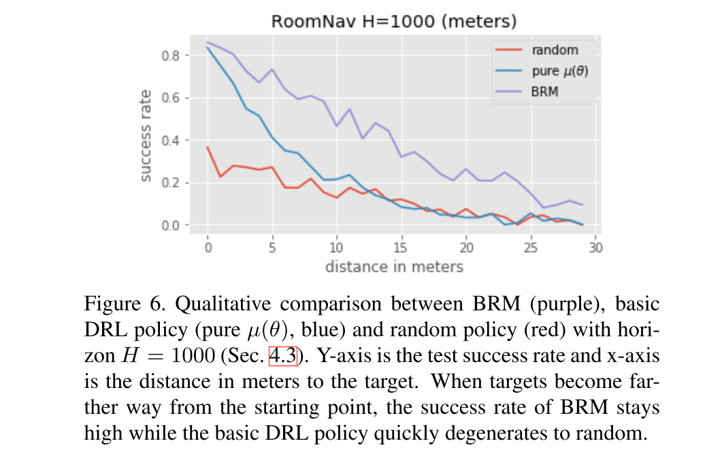
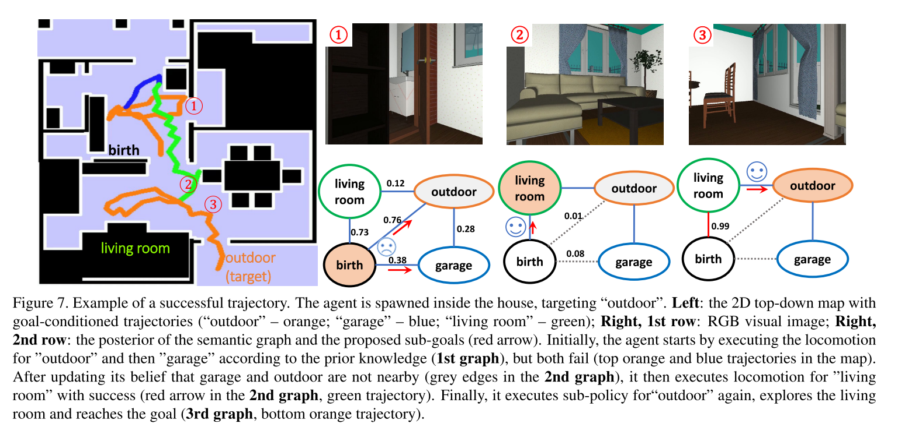

# Bayesian Relational Memory for Semantic Visual Navigation

[Paper](https://openaccess.thecvf.com/content_ICCV_2019/papers/Wu_Bayesian_Relational_Memory_for_Semantic_Visual_Navigation_ICCV_2019_paper.pdf) | [Code](https://github.com/jxwuyi/HouseNavAgent) | 2019

*Yi Wu, Yuxin Wu, Aviv Tamar, Stuart Russell, Georgia Gkioxari, Yuandong Tian*

> **Paper Reading**: Task of **Active Visual Navigation**

## Introduction

本文又是一篇解决视觉导航问题在未知环境**泛化性**的文章，思路是利用一种叫做 **Bayesian Relational Memory (BRM) 的记忆结构**。

BRM 采用 semantic entities 的概率关系图形式，以达到：

- 从训练环境中获取先验布局；
- 在 testing 中估计后验布局；
- 实现高效的导航规划。

> Memory is a crucial component for intelligent agents to gain extensive reasoning abilities over a long horizon.

（题外话）我特别喜欢看每篇文章正文的第一句，总是充满了人们对智能的向往。

由于部分可观察性，agent 必须记住其过去的经验并做出相应的反应。因此，用于视觉导航的深度学习（DL）模型通常在其设计中对内存结构进行编码。 LSTM最初被用作通用隐式存储器。最近，为了提高性能，使用了显式和专门用于导航的结构化记忆。目前有两种用于导航的记忆形式：

- spatial memory：将LSTM中的一维内存扩展为代表环境空间结构的二维矩阵，其中矩阵中的特定条目对应于环境中的2D位置/区域。由于其规则的结构，**值迭代可以直接应用于内存矩阵的有效规划**；
- topological memory：上一种方法计算量过大，对于导航问题我们不需要太过精确，并且**心理学证据表明动物并不强烈依赖于 metric representations**。因此将memory 表示为拓扑图是合理的，其中顶点是环境中的地标，边表示地标之间的短期可达性。

然而，以上两种在人类常有的泛化性特点上都是辣鸡。因此就有了本文的 BRM。

BRM 可以被看做概率版的拓扑图，每个节点表示一个语义概念（例如，对象类别，房间类型等），可以通过神经检测器进行检测，每个边缘表示两个概念之间的关系。

- 把 training 中环境的关系作为先验知识构建概率拓扑图并给出每两个节点之间的概率；
- Testing的 exploration 期间，可以逐步观察该特定测试环境中关系的存在，并通过Bayesian rules 来更新这些关系在 memory 中的概率，以得出后验知识；
- 通过深度强化学习（DRL）训练了一个语义目标条件的LSTM运动策略，以进行控制，并通过规划具有后验概率的关系图，agent 选择了下一个语义子目标进行导航（如上图的 sub-goals）。

## Bayesian Relational Memory

又是一篇仿真文，不再是 AI2-THOR 仿真器了，换成了 House3D。Task 的定义详见前两篇文章。

BRM 方法的结构包含 **the Bayesian Relational Memory (BRM)（下右）** 以及 **an LSTM locomotor policy for control（下左）**：

结构很一目了然嘛

- BRM 根据 current observation 与 target 产生 sub-goal
- sub-goal 与 current observation 一起作为 LSTM policy / semtantic-goal-conditioned policy 的输入
- 输出 action

### Memory 结构

包括两部分：

- **semantic classifier：**用于分类当前房间类型，这是在训练集上监督学习得到的。为了避免主视角的局限性，本文采用了四个画面组成的全景画面（大力出奇迹啊）。然后就是用 10层 CNN来提取特征之类的传统 CV 操作啦；
- **Probabilistic relation graph:**  形式为 $P(z,y;\psi)$ 的图模型，其中 z 为隐变量，y 为观测变量，$\psi$ 为参数。本文使用的是伯努利分布。图的节点包含了所有房间类型。

上图展示了**后验的更新与规划**

1. 经过 short horizon 的探索后，可以获取一系列语义信号/房间类型 c，并存入 replay buffer 中；
2. 将这些二进制向量（1代表当前房间类型，0为其他房间）按位或计算，得到在 short traj 内到达的所有区域；
3. 当两个目标在 short traj 上同时出现，则被认作 close-by；
4. 更新后验概率。

### Goal Conditioned Policy

形式为 $\mu(s_t,g|\theta)$，s_t为观测，g为sub-goal，$\theta$为参数。Actor-critic 训练。

**Reward shaping**：

- 当智能体移向目标房间g时，它会收到与距离递减成正比的正奖励（这就很迷了，这个距离怎么来的？？又是模拟器直接导出？？）
- 如果agent走开或撞到障碍物，将处以惩罚
- 10 for sucess，0.1 for time penalty

由于有限的K个目标集，本文采用了一种 behaviour approach 来提高性能。即为每个语义目标 T 训练了**一个单独的策略**，并从在BRM模块中，我们直接执行其相应的行为网络。（有趣，所以这篇文章这是用于规划 sub-goal 而已，剩下的都不是事了）

## Experiments

Baseline 只有 Random 和 pure policy 以及HRL+RNN，大概只是想展示一下 BRM 是有意义的吧。

## Conclusion

Bayesian 的思想在引入与利用先验上真是经久不衰。本文的思路较为简单，只是为 model-free 的 RL policy 加上了一个 概率图形式的 model 而已。而 BRM 的作用也主要在于生成 sub-goal。所以这篇文章相比于前两篇的task复杂度更低了，只需要到达目标房间即可，而前两篇是在房间内更加细致的导航。