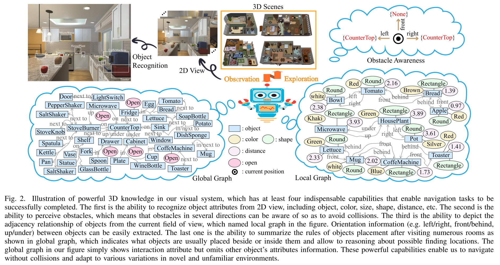
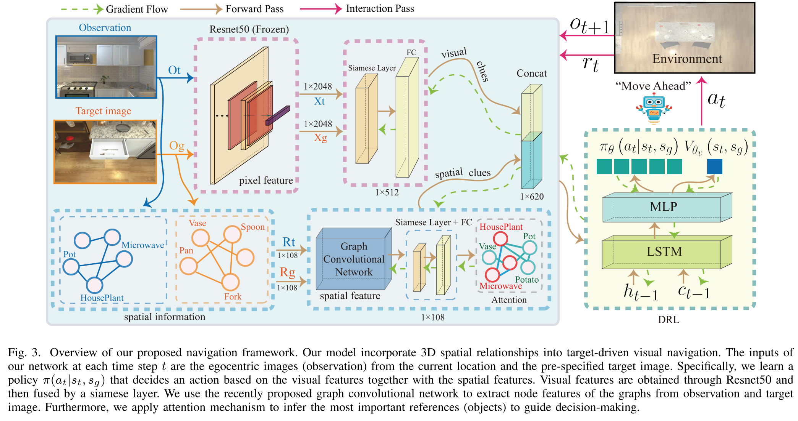
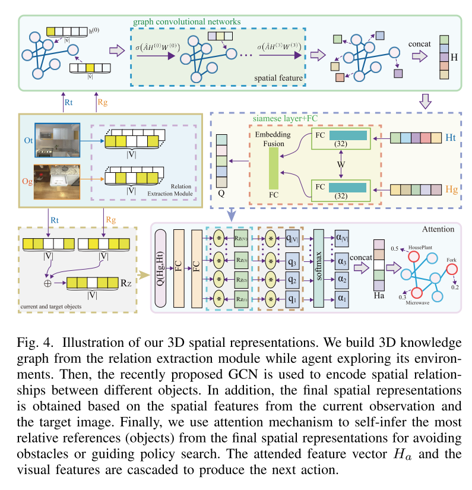
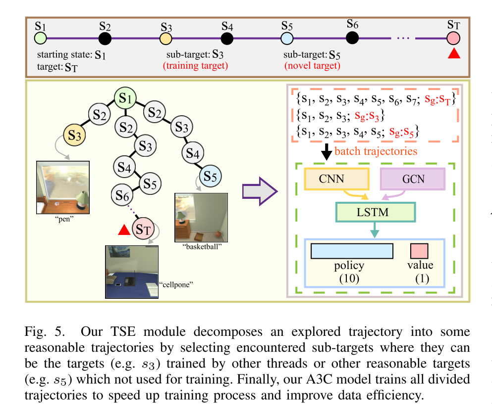
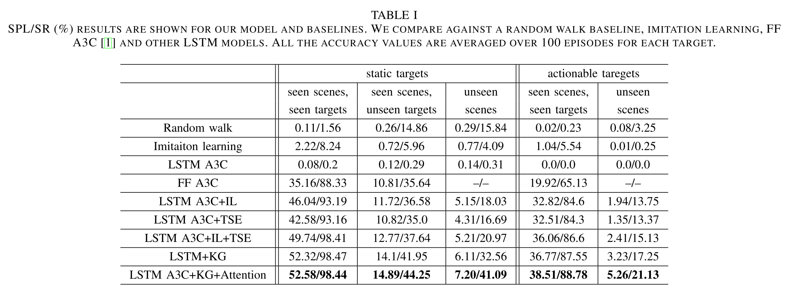
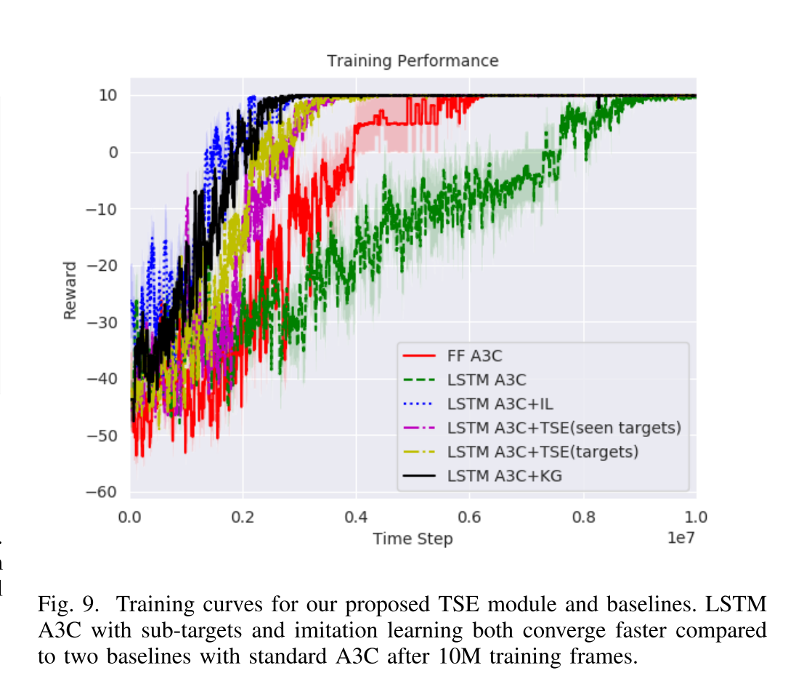
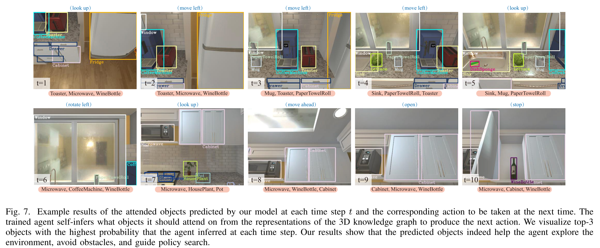
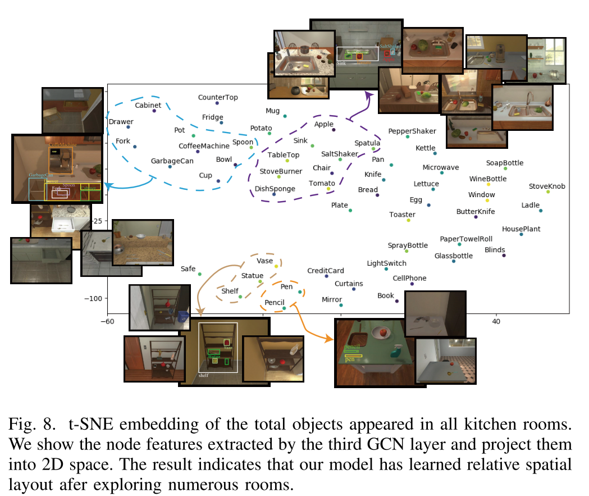

# Improving Target-driven Visual Navigation with Attention on 3D Spatial Relationships

[Paper](http://arxiv.org/abs/2005.02153) | Code | 2020

*Yunlian Lv, Ning Xie, Yimin Shi, Zijiao Wang, and Heng Tao Shen*

> **Paper Reading**: Task of **Active Visual Navigation**

## Introduction

第四篇仿真文，我已经对这个领域的physical usage不抱希望了。依然是熟悉的AI2-THOR模拟器，我们还是来看看这回是什么思路吧。

本文思路如下：

1. 从探索的图像中抽取物体之间的**三维空间关系**来构成 relational graphs；
2. 用 **GCN** 来获取图节点的特征；
3. **Attention  Mechanism** 学习应该关注观测图像的哪些部分，来引导策略探索；
4. 用类似 **HER** 的方法，本文称为 target skill extension (TSE) ，从失败的探索中学习，解决 sparse reward (稀疏奖励) 问题；
5. 此外，本文还用了 **imitation learning** 的示范数据来辅助agent。

**本文有两个不太一样的地方：**

- action多了一个stop (可是这和 done 有啥区别呢？)；
- 在环境中设置了可动的物体来提升 task 复杂度，比方说鸡蛋在盒子里，必须要打开盒子才算可见。

## The Proposed Method

### Base Algorithm

和前几篇一样，将 NN 结构为 LSTM 的A3C 作为基础 RL algorithm，以求能够学习到二维图像到三维场景中动作的映射。（SAC等其他的不行吗？为啥非要用A3C）

类似李飞飞组的做法，将 target 和 observation 的 image 作为输入。

### Visual Features

1. 在 ImageNet 上预训练的 **ResNet50** 作为 target 和 observation 的 image 的特征提取器；
2. 用 **deep siamese network** 将二者 concat 起来。

剩下的都在图里，我就不赘述了。

### Spatial Relationships

这个部分才是本文精华所在，本文指出 3D knowledge graph 可以编码多种空间 (front, left, right, in, up, under) 关系。$G=(V,E)$

- 节点 V：代表 object
- 边 E：代表两个 object 之间的关系

YOLOv3 作为 object detector

1. relation extraction module：同时出现的object的边是相连的；
2. 基于知识图构建邻接矩阵 A，并初始化节点特征 $H_0$ 为一个 onehot 特征向量；
3. 对 A 正则化得 $\hat A$，使每个节点包含自己的节点特征；
4. GNN 使用边缘信息聚合节点信息以生成新的节点表示，因此使用GCN来计算节点特征向量，$H^{(l+1)}=\sigma\left(\hat{A} H^{(l)} W^{(l)}\right)$；
5. $H_t, H_g$ 编码 target 和 observation 的 image 从GCN得到的空间特征信息；
6. 通过 Attention Mechanism 得到 attention vector $H_a$，并以此作为RL算法的state 输入。

### Sub-targets Extraction

这段是模仿 HER 解决稀疏奖励的。由于A3C是多线程的，一个线程学习到的目标仍可能被其他线程遇到。所以本文将A3C与 sub-targets 结合用于 data-augmentation 并将其称为  target skill extension（TSE）模块。

本文将观测中出现新object或其他线程的目标作为一个sub-target。因此，一条 trajectory 可以被切分成多条不同 target 的轨迹。从而解决了稀疏奖励问题。

### Imitation Learning

本文为辅助 agent 加速训练过程，对于**每一个 training target**给出一条示范轨迹。

## Experiment

### Baseline

### Results

