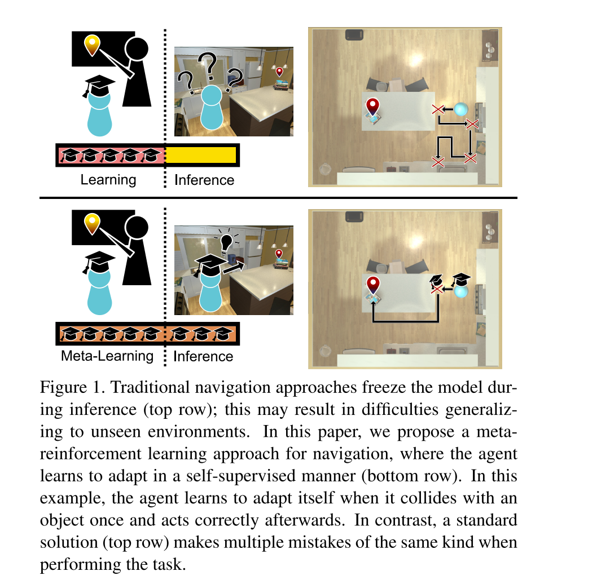
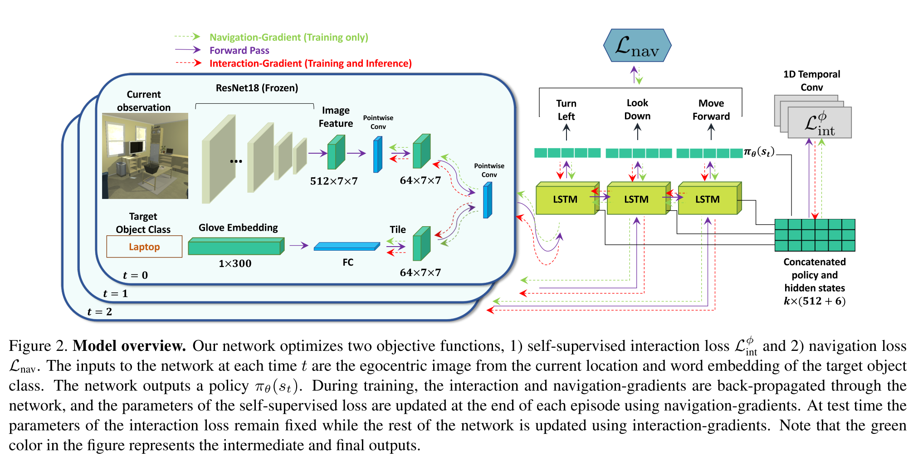
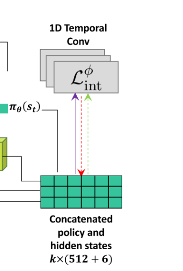
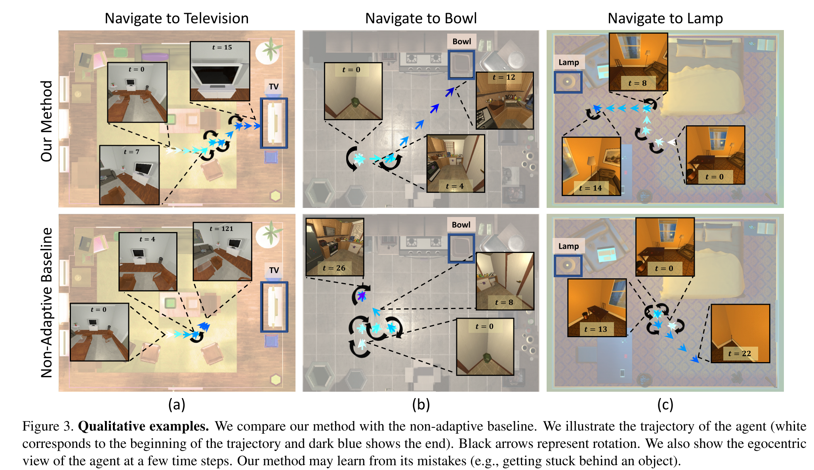
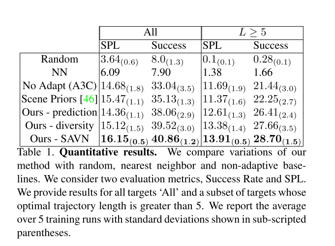
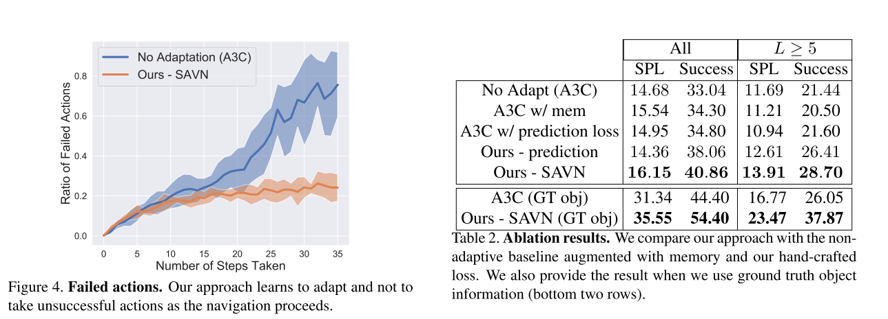

# Learning to learn how to learn: Self-adaptive visual navigation using meta-learning

[Paper](https://scholar.google.com/scholar_url?url=http://openaccess.thecvf.com/content_CVPR_2019/html/Wortsman_Learning_to_Learn_How_to_Learn_Self-Adaptive_Visual_Navigation_Using_CVPR_2019_paper.html&hl=zh-CN&sa=T&oi=gsb&ct=res&cd=0&d=15373556339863734503&ei=UMP9XpbWKcmqyATd7KnoAQ&scisig=AAGBfm2-rskeGs0rWJsIBxQQKeF4iElr3Q) | [Code](https://github.com/allenai/savn) 

*Mitchell Wortsman, Kiana Ehsani, Mohammad Rastegari, Ali Farhadi, Roozbeh Mottaghi*

> **Paper Reading**: Task of **Active Visual Navigation**

## Introduction

Meta-learning 一直是个很有意思的想法，learning to learn 的说法也很激励人。我之前也涉猎过一下 Meta-learning 的基础知识，如下：

[Meta-Learning: An Introduction Ⅰ](https://zhuanlan.zhihu.com/p/99730942)

本文的思路是：

> Learning is an inherently continuous phenomenon. When humans learn a new task there is no explicit distinction between training and inference. As we learn a task, we keep learning about it while performing the task. What we learn and how we learn it varies during different stages of learning.

这么经典的一段话我就不翻译了，自己体会一下字里行间洋溢着的造物主的喜悦吧！总而言之，本文认为 **training 和 testing/inference 之间是没有明显边界的，我们可以边执行动作边学习**。

learning to learn 的好处就是**泛化性**，agent是 “真正地”(暂不确定) 理解了 task，而非单纯地对trajectory的记忆与复现。

本文提出了一种 **self-adaptive visual navigation method（SAVN）**，该方法学会了**在没有任何明确监督的情况下，通过构建自监督交互损失来适应新环境**。

## Task 

与上一篇一样，单纯的视觉导航、target-driven。

**state:** egocentric RGB images + target object class (GloVe embedding)

**action: ** {MoveAhead, RotateLeft, RotateRight, LookDown, LookUp, Done}

**done:** 固定steps内，target可见并足够近

## Adaptive Navigation

本文算法的展开方式也很有趣，从**单纯的 Learning (traditional DRL navigation method)，到 Learning  to Learn，再到 Learning how to learn**。

### Learning

本文的主要学习框架如下：

1. Pretained ResNet-18的特征 + GloVe embedding concat 起来；
2. 展平并传入LSTM；
3. 将LSTM隐状态和agent的内部状态表示形式互换使用（右下角那步concat）；
4. 应用附加的线性层后，可以获得策略和value；
5. 构建一个常用的actor-critic navigation损失 $L_{nav}$。通过最小化 $L_{nav}$，可以最大化了奖励函数。

### Learning to Learn

这一部分的方法源自 MAML 算法，相关知识见

[Meta-Learning: An Introduction Ⅱ](https://zhuanlan.zhihu.com/p/100035717)

MAML的训练目标为
$$
\min _{\theta} \sum_{\tau \in \mathcal{T}_{\text {train }}} \mathcal{L}\left(\theta-\alpha \nabla_{\theta} \mathcal{L}\left(\theta, \mathcal{D}_{\tau}^{\text {tr }}\right), \mathcal{D}_{\tau}^{\text {val }}\right)
$$
使用**自适应**参数 $\theta-\alpha \nabla_{\theta} \mathcal{L}\left(\theta, \mathcal{D}_{\tau}^{\mathrm{tr}}\right)$，来取代网络参数 θ 推断 $\mathcal{D}_{\tau}^{\text {val }}$。

本文的目标是使agent在与环境交互时不断学习。与MAML一样，我们将SGD更新用于这种 adaptation。**这些SGD更新会在agent与场景交互时修改agent的策略网络，使agent能够适应场景**。本文建议这些更新应针对 $L_{int}$ 进行，将其称为**交互损失**。最小化交互损失应该有助于agent完成其导航任务。
$$
\min _{\theta} \sum_{\tau \in \mathcal{T}_{\text {train }}} \mathcal{L}_{\text {nav }}\left(\theta-\alpha \nabla_{\theta} \mathcal{L}_{\text {int }}\left(\theta, \mathcal{D}_{\tau}^{\text {int }}\right), \mathcal{D}_{\tau}^{\text {nav }}\right)
$$
这个目标函数的**含义**是：起初使agent与环境交互并适应环境，k步后，再对自监督损失做一次SGD更新来获得**自适应**参数 $\theta-\alpha \nabla_{\theta} \mathcal{L}\left(\theta, \mathcal{D}_{\tau}^{\mathrm{tr}}\right)$。

接下来本文尝试通过自监督的交互来适应相同的domain：
$$
\begin{aligned}
\min _{\theta} \sum_{\tau \in \mathcal{T}_{\text {train }}} & \mathcal{L}_{\text {nav }}\left(\theta, \mathcal{D}_{\tau}^{\text {nav }}\right) \\
&-\alpha\left\langle\nabla_{\theta} \mathcal{L}_{\text {int }}\left(\theta, \mathcal{D}_{\tau}^{\text {int }}\right), \nabla_{\theta} \mathcal{L}_{\text {nav }}\left(\theta, \mathcal{D}_{\tau}^{\text {nav }}\right)\right\rangle
\end{aligned}
$$
**学习最大程度地减少导航损失，同时最大程度地提高自监督相互作用损失和监督航行损失所获得的梯度之间的相似性**。这样做的意义在于：**如果这两个损失足够相似，将training时的监督loss $L_{nav}$ 用自监督loss $L_{int}$ 来代替，我们就可以实现在inference的时候仍然进行training，这也是上一节流程图中 $L_{nav}$只有一个绿色箭头的原因。**然而找到一个具有相似梯度的自监督loss是不容易的，这就引出了下一节对自监督交互损失的学习。

### Learning to Learn How to Learn

上一节将自监督交互损失与监督损失做相似性的过程，可以当作**学会学习**。那么这一节learn自监督交互损失就成为了**学会如何去学习**。（好像没啥区别，反正只是个好听的名字罢了）

本文将 $L_{int}$ 构建为一个关于参数 $\phi$ 的神经网络，所以 training 时的目标函数变为：
$$
\min _{\theta, \phi} \sum_{\tau \in \mathcal{T}_{\text {train }}} \mathcal{L}_{\text {nav }}\left(\theta-\alpha \nabla_{\theta} \mathcal{L}_{\text {int }}^{\phi}\left(\theta, \mathcal{D}_{\tau}^{\text {int }}\right), \mathcal{D}_{\tau}^{\text {nav }}\right)
$$
并在 inference 时冻结参数 $\phi$。由于这个网络没有明确的目标，就使其模仿 $L_{nav}$ 。

使用一维时序卷积 (one dimensional temporal convolu-
tions) 作为学习损失的结构，一层 10x1，一层1x1。以前 k 步的 LSTM 隐状态与 policies 的 concat 作为input。

除了学习得到的损失函数外，还可以通过 hand crafted 设计一下两种损失公式：

1. $\mathcal{L}_{\mathrm{int}}^{\mathrm{div}}\left(\theta, \mathcal{D}_{\tau}^{\mathrm{int}}\right)=\sum_{i<j \leq k} g\left(s_{i}, s_{j}\right) \log \left(\pi_{\theta}^{\left(a_{i}\right)}\left(s_{j}\right)\right)$
   **鼓励 agent 采取不同的 actions**，g 是状态之间的像素差异/相似度；
2. $\mathcal{L}_{\mathrm{int}}^{\mathrm{pred}}\left(\theta, \mathcal{D}_{\tau}^{\mathrm{int}}\right)=\sum_{t=0}^{k-1} \mathcal{H}\left(q_{\theta}^{\left(a_{t}\right)}\left(s_{t}\right), 1-g\left(s_{t}, s_{t+1}\right)\right)$
   **旨在预测 agent 每个动作的成功率。**

### Training and Testing 

综上，SAVN算法的流程如下：

## Experiments

### Comparison

- Random:
- NN: Nearest neighbor baseline
- Vanilla A3C
- Scene Priors
- Ours - prediction
- Ours - diversity
- Ours - SAVN

### Results

## Conclusion

总的来说，对于视觉导航任务，泛化性是一个至关重要的指标。本文的一系列神乎其神的Meta操作真是令人迷惑又似乎暗含着某些道理，可能是我太菜了hhhhh。