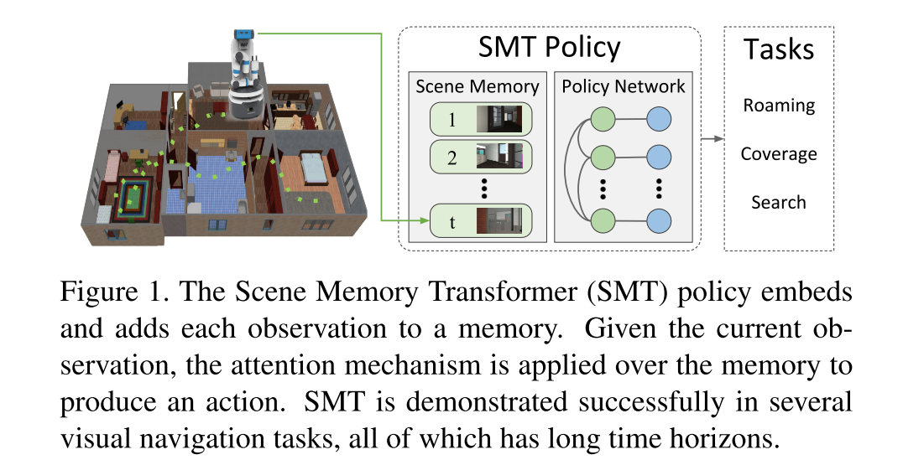
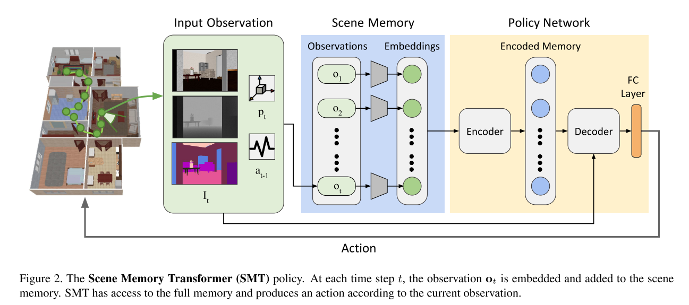

# Scene memory transformer for embodied agents in long-horizon tasks

[Paper](https://openaccess.thecvf.com/content_CVPR_2019/papers/Fang_Scene_Memory_Transformer_for_Embodied_Agents_in_Long-Horizon_Tasks_CVPR_2019_paper.pdf) | [Code](https://github.com/ErikGartner/scene-memory-transformer) | [Video](https://sites.google.com/ view/scene-memory-transformer) | CVPR 2019

*Kuan Fang, Alexander Toshev, Li Fei-Fei, Silvio Savarese*

> **Paper Reading**: Task of **Active Visual Navigation**

## Introduction

本文是李飞飞组的作品，旨在利用attention mechanism构建一个记忆结构

### Scene Memory Transformer (SMT)

- Obs：**图像信息（RGB + 深度图 + a semantic segmentation mask obtained from a camera sensor mounted on the robot）+ agent pose + 之前的action**
- Action：{go forward, turn left, turn right}

Obs 给的条件明显比前几篇文章多很多，之前都是单纯的RGB obs。

参照流程图，整个交互训练流程就可以简单地概括为：

### Scene Memory

这个模块试图**以一种嵌入形式存储所有过去的observations**，目的不是赋予它任何几何结构，而是使其尽可能通用。此外，本文将**对每个步骤的观察分别保存在内存中**，而不是像在RNN中那样将它们合并到单个状态向量中。

1. 传入上面提到的三部分组成的 obs；
2. embed + concat 并传入全连接，$\psi(o)=\mathrm{FC}\left(\left\{\phi_{I}(I), \phi_{p}(p), \phi_{a}\left(a_{\mathrm{prev}}\right)\right\}\right)$；
3. 更新 memory，$\text { Update }(M, o)=M \cup\{\psi(o)\}$。

这个memory更新方式，很明显是随着episode length线性增长的。本文指出由于做了embedding到低维，所以可以存储在硬件上。

### Attention-based Policy Network

- Encode：通过在所有其他元素的context中变换每个存储元素来对内存进行编码，此步骤有可能捕获环境中的时空依赖性。
- 使用编码的内存作为context，根据当前的观察结果对动作进行解码；

无论是encoder还是decoder都用到了attention，$\operatorname{Att}(U, K, V)=\operatorname{softmax}\left(U K^{T}\right) V$，上面是两层残差层。

1. 首先，在大型环境中移动的代理必须处理不断增长的past obs。而 encoder-decoder 结构在冗长的文本输入范围内表现出了出色的性能。
2. 其次，与常见的RNN或其他结构化的外部存储器相反，我们没有在存储器上强加预定义的顺序或结构。取而代之的是，我们将时空信息编码为观测的一部分，并让策略学习者通过编码器-解码器结构的注意力机制来解释与任务相关的信息。

### Memory Factorization

这个模块主要是解决计算复杂度的问题。在长时间执行的任务中，内存会显着增长，二次复杂度可能会令人望而却步。本文替换了方程式中的self-attention模块。由两个相似设计的块组成，但计算更易处理：
$$
\text { AttFact }(M, \tilde{M})=\text { AttBlock }(M, \operatorname{Att} \operatorname{Block}(\tilde{M}, M))
$$
将iterative farthest point sampling（FPS）应用于M中的嵌入观测值，以便选择在特征空间中彼此远离的元素子集。 

## Experiments

### Baselines

- Random：uniformly samples 3 actions；
- Reactive：通过 feedforward net 直接计算 Q value，obs通过两层全连接embed；
- LSTM
- FRMQN：同样是保存embedded obs 到 固定长度的memory中，只是没有用 encoder-decoder 而是简单的 LSTM；
- SM + Pooling：未使用 encoder-decoder 而是用了 max pooling；
- SMT + Factorization：加入了上一节提到的 Factorization；
- SMT

### Results

### Ablation

## Conclusion

本文以整体的历史轨迹信息的attention编码，作为policy决策的输入，取代了传统 off-policy RL algorithm 从 replay buffer 中 sample data 进行训练，好处就是可能数据利用率更高。