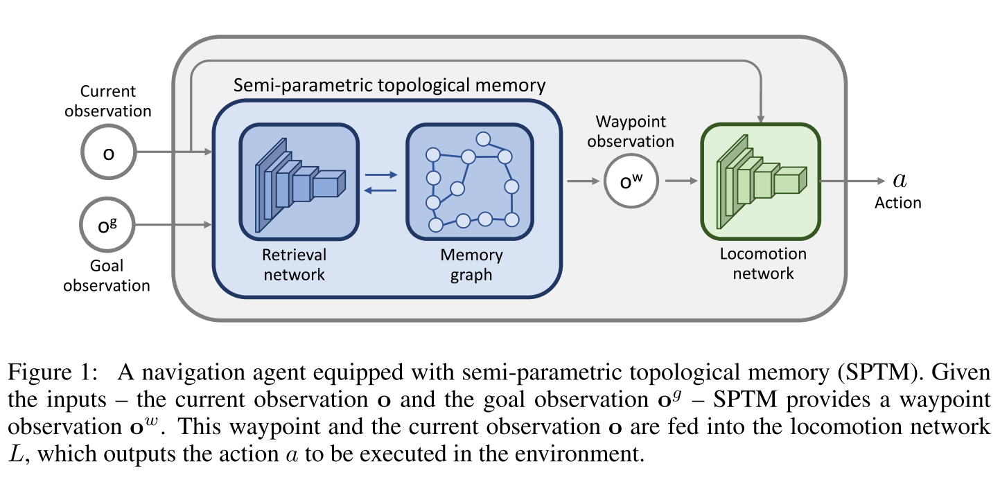
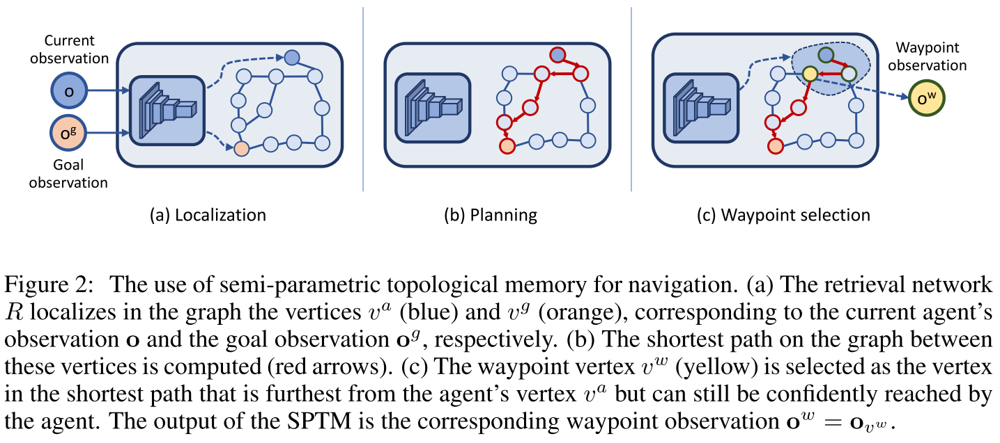
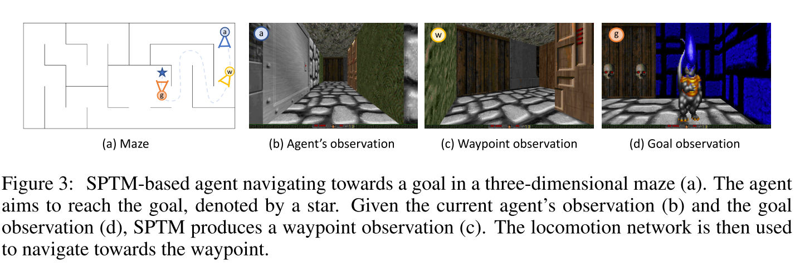
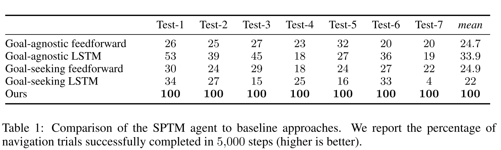
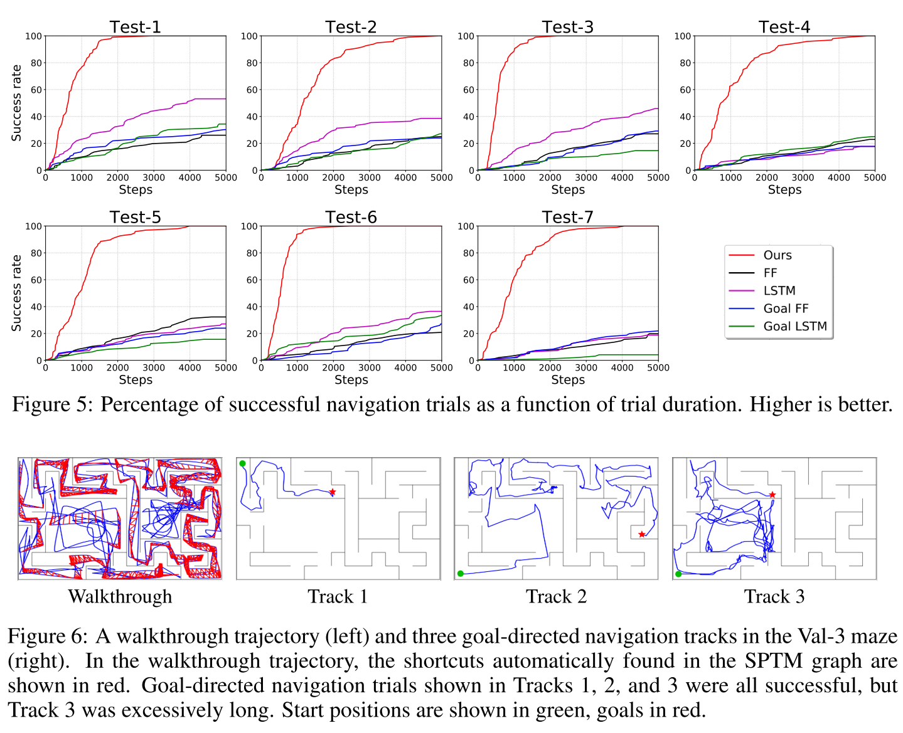

# Semi-parametric topological memory for navigation

[Paper](https://arxiv.org/abs/1803.00653) | [Code](https://github.com/nsavinov/SPTM) | ICLR 2018

*Nikolay Savinov, Alexey Dosovitskiy, Vladlen Koltun*

> **Paper Reading**: Task of **Active Visual Navigation**

## Introduction

本文模仿动物基于地标的导航，提出了新的 memory architecture 以实现视觉导航任务的泛化性。结构名为 **semi- parametric topological memory (SPTM)**，它由一个（无参）**图**（由与环境中的位置相对应的节点组成），以及一个能够根据观测结果从图中检索节点的（有参）**深层网络**构成。

与之前一样，图存储的是地标之间的联通性。本文将 SPTM 作为规划模块（就和model-based 的model一样，只是这回是图model）。

## Method

### Semi-parametric Topological Memory

本文比较奇怪的是，上图的 $o^w$ 我一开始以为是个 state representation，**结果竟然是个 sub-target！**所以后续在 Locomotion network 上同时输出 waypoint obs 和 current obs 就很好理解了。下面还是分步详细解释一下：

**Retrieval Net：**

这是检索网络的意思，用于估计两个obs的相似度。先用基于agent随机探索的轨迹，以**自监督**的方式在一组环境上预训练该网络。也就是说这实质上是个classification task，那么自监督是怎么实现的呢？

1. 在随机探索的traj里，采样三元组 $\left\langle\mathbf{o}_{i}, \mathbf{o}_{j}, y_{i j}\right\rangle$，这个 y 就是判断两个obs是否够相似的二进制位。由于是连续探索的，所以我们只需要看采样的时间戳是否在某个阈值内（本文设定 l =20 timesteps），即可将 y = 1；反之，达到另一个阈值（本文设定 Mxl = 5x20 steps），y=0，表示两个 obs 相隔足够远；
2. 两个 obs 以之前介绍过的 siamese 结构经过 ResNet-18 的特征提取；
3. 再concat两个特征向量，经过五层全连接，得到 2-way softmax；
4. 计算 cross-entropy loss。

**Memory graph：**

这个图也是用探索数据建立的。取一些观测序列，图上的每个节点存一个观测（谜一样的操作？？），节点之间的边联通性取决于：

- 二者来自连续的时间戳；
- 观测足够近，依据上一节 retrieval net的判断方法。

**Finding the waypoint：**

当实际导航的时候，SPTM向 locomotion net 提供一个 sub-target 一样的 waypoint，这个过程分三步：

1. **Localization：**agent在记忆图中给自己以及目标定个位，这就用到了 retrieval net 的距离比较了；
2. **Planning：**用Dijkstra算法在图中招到当前位置到目标的最短路径；
3. **Waypoint Selection：**在最短路径中选择一个 sub-target，要求有信心可达的，不要太远也不要太近，这还是可以依赖 retrieval net。

### Locomotion Network

还是利用随机探索时的轨迹数据，摘取足够近的两个 obs作为input，以及对应的action作为label。监督训练该网络。这个网络的结构和前面介绍的 Retrieval Net一样。

> **这个网络，竟然是个监督学习！我本以为这是篇RL文章，毕竟我一直在做RL，结果竟然是纯 DL 的，抱歉了是我没好好审题。**

## Experiment

### Baselines

注意第一个是个A3C，而且很奇怪的没给 goal，这整篇文章透漏着蜜汁自信，最后竟然只是和 vanilla A3C 以及 vanilla LSTM 比了比？？？

> 自从刚刚得知了这是个纯 DL 的文章，我就产生了深深的怀疑。

### Results

别看上面有测试集，看起来像是很generalization的样子。实际上文中写道：

当给出一个新迷宫，agent开始在仿真中随机探索 10500 步，并且还是人工驱动agent在迷宫里跑。他们还给出了探索的样例：https://sites.google.com/view/SPTM

## Conclusion

本文大概是**年代较早（2018年）**，思路比较简单。个人认为本文的问题主要在于：

1. 我实在说服不了自己这样的随机探索与预先建图有什么区别；
2. Graph的节点直接生猛地保存了 obs 也是第一次见；
3. 本文多次依仗 Retrieval Net 来判断 obs 的相似度，本来以为是个好方法，然而如果脱离了预先探索，这就是废纸一张；
4. 依据这个结构，明显不具备广义意义上的泛化性，agent更像是记住了每一条路，而不是学会寻路，光是理念上就被前面写过的meta方法吊打。

