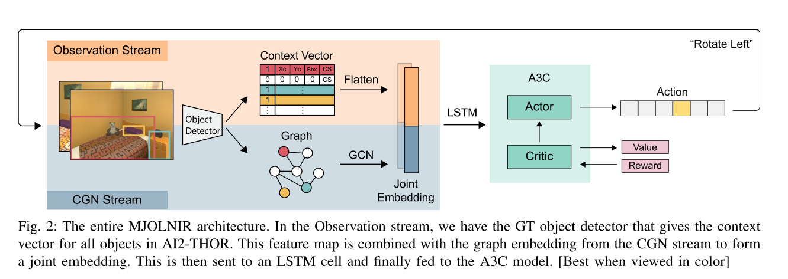
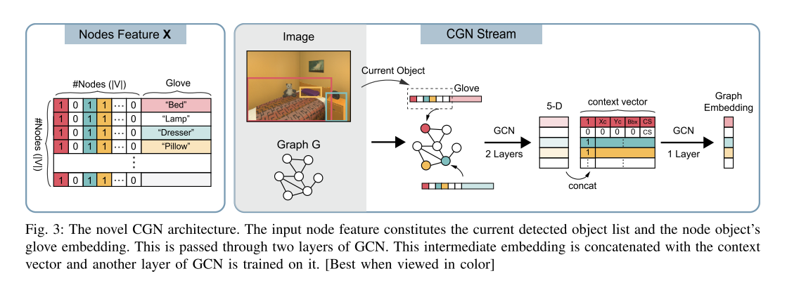
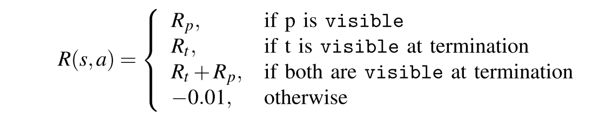
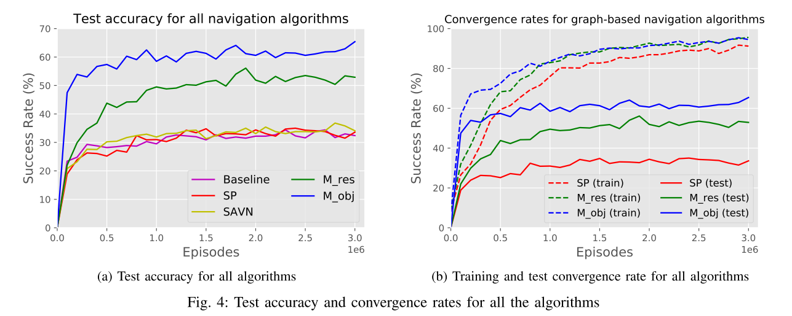

# Target driven visual navigation exploiting object relationships

[Paper](http://arxiv.org/abs/2003.06749) | [Code](https://sites.google.com/eng.ucsd.edu/mjolnir) | [Website](https://sites.google.com/eng.ucsd.edu/mjolnir)

*Yiding Qiu, Anwesan Pal, Henrik I. Christensen*

> **Paper Reading**: Task of **Active Visual Navigation**

## Introduction

**本文提出了Memory-utilized Joint hierarchical Object Learning for Navigation in Indoor Rooms (MJOLNIR) 算法，旨在利用目标物之间的内在关系来实现目标驱动的机器人视觉导航（非SLAM等建图，纯视觉）。**

以下图为例，本文使用了知识图谱来构建物体之间的关系，在视觉导航时借鉴知识图谱的关系来缩小寻找目标。

这也是一种典型地利用先验知识压缩状态表征 (state representation) 维度的思路。

现有的方法并没有使用先验知识 (prior knowledge) 或者语义环境(semantic context) 来辅助机器人导航的推断 (inference)。即使在训练时收敛很快，但是测试时**泛化性**很差。可能的原因就是之前的方法只是单纯地在多轮尝试后记住了训练集。

**本文算法具有以下四个特性：**

- 无地图导航
- Target-driven 而非间接的、利用坐标的 Point-Goal 导航
- 利用了物体间的分层语义关系
- 利用物体间的 parent-target 关系来构建 intermediate goals or sub-rewards

## Task

在给定房间内，寻找给定目标集中的物体。

state = current observation + prior scene context + target information

action = {MoveAhead, RotateLeft, RotateRight, LookUp, LookDown and Done}

MoveAhead 每次前进 0.25米，Rotate每次转45度，Look每次俯仰角改变30度。

如果目标在视野内，且距离1.5米，则 done。

## CONTEXT-BASED VISUAL NAVIGATION

除了目标集，该算法首先需要提供一个 **parent objects 集**，包含了屋子中的一些主要物件并且在空间或语义上与目标物体有关。这些父类信息是手动收集的。（Emmm）

### 知识图构建

该算法的知识图是根据 Visual Genome 数据集的图像-标题信息构建的，此外还引入了 5-D context vector $\left[b_{i}, x_{c}, y_{c}, b b o x, C S\right]^{T}$

- $b_i$：二进制，表示物体 $o_i$ 是否在当前帧中；
- $(x_c, y_c), bbox$：物体 $o_i$ 边界框中心位置的坐标以及框大小；
- $CS$：对象 $o_i$ 和目标对象 $t\in T$ 的各个词嵌入之间的余弦相似性 $C S\left(\mathbf{g}_{o_{i}}, \mathbf{g}_{t}\right)=\frac{\mathbf{g}_{o_{i}} \cdot \mathbf{g}_{t}}{\left\|\mathbf{g}_{o_{i}}\right\| \cdot\left\|\mathbf{g}_{t}\right\|}$

### 算法框架

输入信息包括：

- Observation Stream （包含当前观测图像的编码信息）：两种编码方法 ResNet-18 or 5-D context vector再展平；
- **Contextualized Graph Network (CGN) Stream** （嵌入了通过知识图获得的先验记忆）：利用GCN学习节点嵌入，具体如下图（注意对应颜色）。

1. 给定**知识图G**以及**当前观测图像**；
2. 设计节点特征向量 X 来包含每个物体的GloVe嵌入以及 object detector 的输出（即二进制判断对应位的物体在不在图中）；
3. 组合的输入节点特征通过2层GCN，以生成5-D中间嵌入；
4. 然后，将此新特征与 context vector 连接起来，然后送到GCN的另一层以生成最终的图形嵌入;
5. Observation vector + graph embedding 组合成联合嵌入，作为A3C的输入。

### Reward Engineering

当视野内出现父类 p 时，就给出 partial reward $R_p=R_t*Pr(t|p)*k$

- $R_t$：对应target的奖励

- k：比例系数

- Pr(t|p)：取自 partial reward 矩阵M，其中每一行都有所有父对象相对于给定目标对象的相对接近度的概率分布。

  - 这个相关度是根据**AI2-THOR模拟器**平面图中存在的对象之间的相对空间距离来计算。（说好的是无图target-driven？？？怎么又用地图的坐标信息？？）

  - 当多个父类可见，则取Pr最大值。
  - 第二次看到这个父类就不再给予reward。（鼓励其寻找不同的父类以找到目标）

- 终结点的奖励设置

## Experiments

**AI2-THOR模拟器** （没有实物单纯仿真还是太理想化了）

**目标：**Kitchen - Toaster, Spatula, Bread, Mug, CoffeeMachine, Apple; Living room - Painting, Laptop, Television, RemoteControl, Vase, ArmChair; Bedroom - Blinds, DeskLamp, Pillow, AlarmClock, CD; Bathroom - Mirror, ToiletPaper, SoapBar, Towel, SprayBottle.

**父类：**StoveBurner, CounterTop, Sink, Microwave,
TableTop, Fridge, Shelf, Drawer, FloorLamp, Sofa, Bed, NightStand, Desk, Dresser, Cabinet, Toilet, Bathtub, ShowerDoor.

**模型比较：**

- Random：uniform policy
- Baseline：[李飞飞组的方法](https://scholar.google.com/scholar_url?url=https://ieeexplore.ieee.org/abstract/document/7989381/&hl=zh-CN&sa=T&oi=gsb&ct=res&cd=0&d=13649064528748203270&ei=v5r9XuDsL8WLygTQo4zYBQ&scisig=AAGBfm2cH8A9msFkp3M7zDBHnFg5dxiXDw)，state = current obs + target obs
- Scene Prior (SP)：[Visual semantic navigation using scene priors](https://scholar.google.com/scholar_url?url=https://arxiv.org/abs/1810.06543&hl=zh-CN&sa=T&oi=gsb&ct=res&cd=0&d=10385662033870004027&ei=HJv9XsW4JbuB6rQPnNE0&scisig=AAGBfm3cndR_eZU8Yq4OdzATEWDez4haIw)，一种引入先验的方法，GCN + ResNet-18以及目标物体的GloVe嵌入在各自的特征图之间的逐点卷积 + A3C；
- SAVN：[Learning to learn how to learn: Self-adaptive visual navigation using meta-learning](https://scholar.google.com/scholar_url?url=http://openaccess.thecvf.com/content_CVPR_2019/html/Wortsman_Learning_to_Learn_How_to_Learn_Self-Adaptive_Visual_Navigation_Using_CVPR_2019_paper.html&hl=zh-CN&sa=T&oi=gsb&ct=res&cd=0&d=15373556339863734503&ei=HJz9XovnDcO2ywTVw4PgBg&scisig=AAGBfm2-rskeGs0rWJsIBxQQKeF4iElr3Q)，agent通过交互式损失函数不断了解其环境；
- MJOLNIR-r：pretrained ResNet-18 + GloVe in observation stream + CGN stream；
- MJOLNIR-o：context vector in observation stream + CGN stream。

## Conclusion

本文有以下**创新**：

- 利用了物体之间关系的先验知识作为 state
- 引入了 context vector 来学习以 parent-target 形式关联的物体之间的 closeness
- 泛化性好

**疑惑**：

- 主要是 partial reward 那一步怎么就突然用到了空间坐标距离信息，这在实际中不太好获取吧，感觉也和target-driven相违背。
- 另外，这个手动设置物体关系的操作也是有些迷啊。

**请大佬们评论区解惑，要是原作者能看到就更好了。**