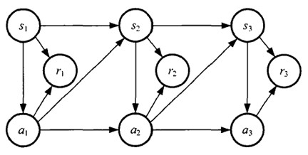

# Preliminary: RL basic knowledge Ⅰ

## 马尔可夫决策过程MDP

### 马尔可夫模型的几类子模型

各种马尔可夫子模型的关系:

|                    |     不考虑动作      |              考虑动作               |
| :----------------: | :-----------------: | :---------------------------------: |
|  **状态完全可见**  |   马尔科夫链(MC)    |        马尔可夫决策过程(MDP)        |
| **状态不完全可见** | 隐马尔可夫模型(HMM) | 不完全可观察马尔可夫决策过程(POMDP) |

### 马尔可夫决策过程

一个马尔可夫决策过程由一个五元组构成$M = (S, A, P_{sa}, 𝑅,\gamma)$ [注1]

- S: 表示状态集(states)，有$s∈S$，$s_i$表示第i步的状态。
- A:表示一组动作(actions)，有$a∈A$，$a_i$表示第i步的动作。
- $𝑃_{sa}$: 表示状态转移概率。$𝑃_{s𝑎}$ 表示的是在当前$s ∈ S$状态下，经过$a ∈ A$作用后，会转移到的其他状态的概率分布情况。比如，在状态s下执行动作$a$，转移到s'的概率可以表示为$p(s'|s,a)$。
- $R: S×A⟼ℝ$ ，R是回报函数(reward function)。有些回报函数状态$S$的函数，可以简化为$R: S⟼ℝ$。如果一组$(s,a)$转移到了下个状态$s'$，那么回报函数可记为$r(s'|s, a)$。如果$(s,a)$对应的下个状态s'是唯一的，那么回报函数也可以记为$r(s,a)$。
- $\gamma$: discount rate，作为未来回报的折扣。

**MDP 的动态过程**如下：某个智能体(agent)的初始状态为$s_0$，然后从 A 中挑选一个动作$a_0$执行，执行后，agent 按$P_{sa}$概率随机转移到了下一个$s_1$状态，$s1∈P_{s_0a_0}$。然后再执行一个动作$a_1$，就转移到了$s_2$，接下来再执行$a_2$…，我们可以用下面的图表示状态转移的过程。

如果回报r是根据状态s和动作a得到的，则MDP还可以表示成下图：

### 值函数(value function)

强化学习学到的是一个从环境状态到动作的映射（即行为策略），记为策略$π: S→A$。而强化学习往往又具有延迟回报的特点: 如果在第n步输掉了棋，那么只有状态$s_n$和动作$a_n$获得了立即回报$r(s_n,a_n)=-1$，前面的所有状态立即回报均为0。所以对于之前的任意状态s和动作a，立即回报函数r(s,a)无法说明策略的好坏。因而需要定义值函数(value function，又叫效用函数)来**表明当前状态下策略π的长期影响**。

#### 状态值函数(state value function)

**重点看第三个式子**

- $$
  V^{\pi}(\mathrm{s})=E_{\pi}\left[\sum_{i=0}^{h} r_{i} | s_{0}=s\right]
  $$

- $$
  V^{\pi}(\mathrm{s})=\lim _{h \rightarrow \infty} E_{\pi}\left[\frac{1}{h} \sum_{i=0}^{h} r_{i} | s_{0}=s\right]
  $$

- $$
  V^{\pi}(\mathrm{s})=E_{\pi}\left[\sum_{i=0}^{\infty} \gamma^{i} r_{i} | s_{0}=s\right]
  $$

其中：

a)是采用策略π的情况下未来有限h步的期望立即回报总和；

b)是采用策略π的情况下期望的平均回报；

c)是**值函数最常见的形式**，式中γ∈[0,1]称为折合因子，表明了未来的回报相对于当前回报的重要程度。特别的，γ=0时，相当于只考虑立即不考虑长期回报，γ=1时，将长期回报和立即回报看得同等重要。

$$
\begin{aligned}
V^{\pi}(\mathrm{s})&=E_{\pi}\left[\mathrm{r}_{0}+\gamma \mathrm{r}_{1}+\gamma^{2} \mathrm{r}_{2}+\gamma^{3} \mathrm{r}_{3}+\ldots | s_{0}=s\right] \\ &=E_{\pi}\left[r_{0}+\gamma E\left[\gamma \mathrm{r}_{1}+\gamma^{2} \mathrm{r}_{2}+\gamma^{3} \mathrm{r}_{3}+\ldots\right] | s_{0}=s\right] \\ &=E_{\pi}\left[\mathrm{r}\left(\mathrm{s}^{\prime} | \mathrm{s}, \mathrm{a}\right)+\gamma V^{\pi}(\mathrm{s'}) | s_{0}=s\right]\end{aligned}
$$
给定策略π和初始状态s，则动作$a=π(s)$，下个时刻将以概率$p(s'|s,a)$转向下个状态$s'$，那么上式的期望可以拆开，可以重写为：

$$
V^{\pi}(\mathrm{s})=\sum_{s \in S} p\left(\mathrm{s}^{\prime} | \mathrm{s}, \mathrm{\pi(s)}\right)\left[\mathrm{r}\left(\mathrm{s}^{\prime} | \mathrm{s}, \mathrm{\pi(s)}\right)+\gamma \mathrm{V}^{\pi}\left(\mathrm{s}^{\prime}\right)\right]
$$
**注意：**在$V^π(s)$中，π和初始状态s是我们给定的，而初始动作a是由策略π和状态s决定的，即a=π(s)。

#### 动作值函数(action value function Q函数)

$$
Q^{\pi}(\mathrm{s}, \mathrm{a})=E\left[\sum_{i=0}^{\infty} \gamma^{i} r_{i} | \mathrm{s}_{0}=\mathrm{s}, \mathrm{a}_{0}=\mathrm{a}\right]
$$

给定当前状态s和当前动作a，在未来遵循策略π，那么系统将以概率p(s'|s,a)转向下个状态s'，上式可以重写为：

$$
Q^{\pi}(\mathrm{s}, \mathrm{a})=\sum_{s' \in S} p\left(\mathrm{s}^{\prime} | \mathrm{s}, \mathrm{a}\right)\left[\mathrm{r}\left(\mathrm{s}^{\prime} | \mathrm{s}, \mathrm{a}\right)+\gamma \mathrm{V}^{\pi}\left(\mathrm{s}^{\prime}\right)\right]
$$
**在$Q^π(s,a)$中，不仅策略π和初始状态s是我们给定的，当前的动作a也是我们给定的，这是$Q^π(s,a)$和$V^π(a)$的主要区别。**

在得到值函数后，即可列出MDP的最优策略：

$$
\pi^{*}=\underset{\pi}{\arg \max } \mathrm{V}^{\pi}(\mathrm{s}),(\forall \mathrm{s})
$$
即我们的目标是寻找的是在任意初始条件s下，能够最大化值函数的策略π*。
