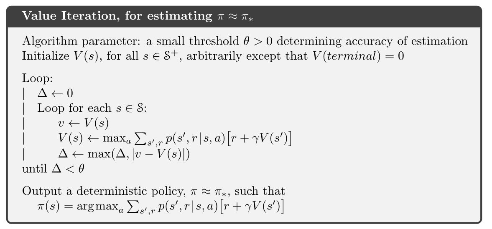

## Preliminary of RL Ⅱ: DP, MC & TD

> 这篇巨长且详细的post主要讲一下 **MDP 问题的求解方法**。
> 【我已经尽力简明，但你读下去仍需勇气与毅力，当然，这些都应是我们做科研的基本素养】
> 上文讲过，MDP问题是具有延迟回报性质的，即当前状态下的最优动作不一定具有长远利益。在序列决策问题中，必须要求智能体具有**长远的眼光**，因此解决对未来回报的估计并不断迭代到最优策略就是MDP的求解之道。

> 请使用 markdown 编辑器阅读，推荐使用 Typora。

> MDP基本的解法有三种： 
>
> - 动态规划法(dynamic programming methods) 
> - 蒙特卡洛方法(Monte Carlo methods)  
> - 时间差分法(temporal difference)

上图是很经典的三种方法的差异图，即使现在还完全不知道他们的定义，也可以总结出它们的特性。

|                                       | Monte-Carlo | Temporal-Difference | Dynamic Programming |
| :------------------------------------ | :---------: | :-----------------: | :-----------------: |
| 是否需要执行到本轮结束(上图绿色方块T) |     是      |         否          |         否          |
| 是否需要遍历所有可能动作              |     否      |         否          |         是          |

- 是否需要执行到本轮结束决定了算法的更新频率，这当然是越快越好
- 是否需要遍历所有可能动作决定了是否需要预先知道系统模型，否则不可能获取所有可能的动作已经对应的结果

**先下个结论**

综上可知，TD综合了MC和DP的优点，因此这也是我们在RL中常用的方法。

### Dynamic Programming 动态规划

那么，什么是动态规划？

[什么是动态规划（Dynamic Programming）？动态规划的意义是什么？ - 阮行止的回答 - 知乎](https://www.zhihu.com/question/23995189/answer/613096905)

知道你们懒得看，毕竟这篇文章已经够长了。帮你们总结一下精髓：

将 **复杂问题的最优解** 划分为 **多个小问题的最优解** 的求解问题，就像递归一样，且子问题的最优解会被**储存起来重复利用**。

（有疑惑还是建议看一下上面链接，答主的例子很简明）

对于**无后效性**且需要**长远眼光**的 MDP 问题来说，DP 确实很合适。下面所述的**贝尔曼方程就是递归结构**，**值函数可以储存子问题的解**。

#### 一、贝尔曼方程 (Bellman Equation)

$V^\pi$和$Q^\pi$的表达式总结如下：

$$
\begin{equation}\label{bellman}
{V^{\pi}(\mathrm{s})=\sum_{s^{\prime} \in S} p\left(\mathrm{s}^{\prime} | \mathrm{s}, \pi(\mathrm{s})\right)\left[\mathrm{r}\left(\mathrm{s}^{\prime} | \mathrm{s}_{2} \pi(\mathrm{s})\right)+\gamma V^{\pi}(\mathrm{s})\right]=E_{\pi}\left[r\left(s^{\prime} | s, a\right)+\gamma V^{\pi}(\mathrm{s}) | s_{0}=s\right]} \\ {Q^{\pi}(\mathrm{s}, \mathrm{a})=\sum_{s^{\prime} \in S} p\left(\mathrm{s}^{\prime} | \mathrm{s}, \mathrm{a}\right)\left[\mathrm{r}\left(\mathrm{s}^{\prime} | \mathrm{s}, \mathrm{a}\right)+\gamma V^{\pi}\left(\mathrm{s}^{\prime}\right)\right]=E_{\pi}\left[r\left(s^{\prime} | s, a\right)+\gamma V^{\pi}\left(\mathrm{s}^{\prime}\right) | s_{0}=s, \mathrm{a}_{0}=\mathrm{a}\right]}\end{equation}
$$
在动态规划中，上面两个式子称为**贝尔曼方程**，它表明了**当前状态的值函数与下个状态的值函数的关系**  。不难看出，这是递归结构，即我们可以使用上一个迭代周期的状态价值来计算更新当前周期某state或action-state的值。在此基础上，使用DP来解决强化学习问题就很自然了。

> 优化目标$π^*$可以表示为：
>$$
\pi^{*}(\mathrm{s})=\arg \max _{\pi} V^{\pi}(\mathrm{s})
>$$
> 分别记最优策略$π$对应的状态值函数和动作值函数为 $V^*(s)$ $和$$Q^*(s, a)$, 最优策略和最优值函数一定是对应关系的。

> 状态值函数和行为值函数分别满足如下**贝尔曼最优性方程(Bellman optimality equation)，定义了最优解满足的条件**：
> $$
\begin{align*}
V^{*}(\mathrm{s})&=\max _{a} E\left[r\left(s^{\prime} | s, a\right)+\gamma V^{*}\left(\mathrm{s}^{\prime}\right) | s_{0}=s\right] \\ &=\max _{a \in A(s)} \sum p\left(\mathrm{s}^{\prime} | \mathrm{s}, \pi(\mathrm{s})\right)\left[\mathrm{r}\left(\mathrm{s}^{\prime} | \mathrm{s}, \pi(\mathrm{s})\right)+\gamma V^{\pi}\left(\mathrm{s}^{\prime}\right)\right]\end{align*}
> $$
> $$
\begin{align*}
\mathrm{Q}^{*}(\mathrm{s})&=E\left[r\left(s^{\prime} | s, a\right)+\gamma \max _{a^{\prime}} Q^{*}\left(s^{\prime}, \mathrm{a}^{\prime}\right) | s_{0}=s, \mathrm{a}_{0}=\mathrm{a}\right]\\
&=\sum p\left(\mathrm{s}^{\prime} | \mathrm{s}, \pi(\mathrm{s})\right)\left[\mathrm{r}\left(\mathrm{s}^{\prime} | \mathrm{s}, \pi(\mathrm{s})\right)+\gamma \max _{a=A(\mathrm{s})} Q^{*}\left(\mathrm{s}^{\prime}, \mathrm{a}^{\prime}\right)\right]
\end{align*}
> $$
> 故可知，$V^*(s)$ $和$$Q^*(s, a)$存在如下关系：
>$$
\mathrm{V}^{*}(\mathrm{s})=\max _{a} \mathrm{Q}^{*}(\mathrm{s}, \mathrm{a})
>$$
#### 二、策略估计 (Policy Evaluation)

> 对于任意的策略π，我们如何使用DP计算其状态值函数$V^π(s)$？

**确定性策略**：(上一节主要介绍的就是确定性策略）
$$
{V^{\pi}(\mathrm{s})=\sum_{s^{\prime} \in S} p\left(\mathrm{s}^{\prime} | \mathrm{s}, \pi(\mathrm{s})\right)\left[\mathrm{r}\left(\mathrm{s}^{\prime} | \mathrm{s}_{2} \pi(\mathrm{s})\right)+\gamma V^{\pi}(\mathrm{s})\right]}
$$
**扩展到一般**：如果在某策略$π$下，$π(s)$对应的动作$a$有多种可能，每种可能记为$π(a|s)$，则状态值函数为
$$
V^{\pi}(\mathrm{s})=\sum_{a} \pi(\mathrm{a} | \mathrm{s}) \sum_{s=s} p\left(\mathrm{s}^{\prime} | \mathrm{s}, \pi(\mathrm{s})\right)\left[\mathrm{r}\left(\mathrm{s}^{\prime} | \mathrm{s}, \pi(\mathrm{s})\right)+\gamma V^{\pi}\left(\mathrm{s}^{\prime}\right)\right]
$$
**主要思路**：一般采用迭代的方法更新状态值函数，首先将所有$V_π(s)$的初值赋为0（其他状态也可以赋为任意值，不过吸收态必须赋0值），然后采用如下式子更新所有状态s的值函数（第k+1次迭代）：
$$
V_{k+1}(\mathrm{s})=\sum_{a} \pi(\mathrm{a} | \mathrm{s}) \sum_{s^{\prime}=S} p\left(\mathrm{s}^{\prime} | \mathrm{s}, \mathrm{a}\right)\left[\mathrm{r}\left(\mathrm{s}^{\prime} | \mathrm{s}, \mathrm{a}\right)+\gamma V_{k}(\mathrm{s})\right]
$$
对于$V^π(s)$，有**两种更新方法**：

1. 将第k次迭代的各状态值函数 $[V_k(s1),V_k(s2),V_k(s3), \dots]$ 保存在一个数组中，第k+1次的 $V^π(s)$ 采用第k次的$V^π(s')$来计算，并将结果保存在第二个数组中。
2. 即仅用一个数组保存各状态值函数，每当得到一个新值，就**将旧的值覆盖**，形如$[V_{k+1}(s_1),V_{k+1}(s_2),V_k(s_3), \dots]$，第k+1次迭代的$V^π(s)$可能用到第k+1次迭代得到的$V^π(s')$。

通常情况下，我们**采用第二种方法更新数据**，因为它及时利用了新值，能更快的收敛。整个策略估计算法如下图所示：

**看个经典的例子：**

详见：[强化学习（三）用动态规划（DP）求解](https://www.cnblogs.com/pinard/p/9463815.html)-[3. 策略评估求解实例]

#### 三、策略改进 (Policy Improvement)

假设我们有一个策略$π$，并且确定了它的所有状态的值函数$V^π(s)$。对于某状态s，有动作$a_0=π(s)$。 那么如果我们在状态s下不采用动作$a_0$，而采用其他动作$a≠π(s)$是否会更好呢？要判断好坏就需要我们计算行为值函数$Q^π(s,a)$，公式我们前面已经说过：
$$
Q^{\pi}(\mathrm{s}, \mathrm{a})=\sum_{s'\in S} p\left(\mathrm{s}^{\prime} | \mathrm{s}, \mathrm{a}\right)\left[\mathrm{r}\left(\mathrm{s}^{\prime} | \mathrm{s}, \mathrm{a}\right)+\gamma V^{\pi}\left(\mathrm{s}^{\prime}\right)\right]
$$
**评判标准**是：$Q^π(s,a)$是否大于$V^π(s)$。如果$Q^π(s,a)$> $V^π(s)$，那么至少说明新策略【仅在状态s下采用动作a，其他状态下遵循策略π】比旧策略【所有状态下都遵循策略π】整体上要更好。

**策略改进定理(policy improvement theorem)**：$π$和$π'$是两个确定的策略，如果对所有状态$s∈S$有$Q^π(s,π'(s))≥V^π(s)$，那么策略π'必然比策略π更好，或者至少一样好。这等价于，对所有 $s\in S$，$V^{π'}(s)≥V^π(s)$。

有了在某状态s上改进策略的方法和策略改进定理，我们可以**遍历所有状态和所有可能的动作a**，并采用贪心策略来获得新策略$π'$。即对所有的$s∈S$, 采用下式更新策略：
$$
\begin{array}{l}{\pi^{\prime}(s)=\underset{a}{\operatorname{argmax}} Q^{\pi}(s, a)} \\ {=\underset{a}{\operatorname{argmax}} E_{\pi}\left[r\left(s^{\prime} | s, a\right)+\gamma V^{\pi}(s) | s_{0}=s, a_{0}=a\right]} \\ {=\underset{a}{\operatorname{argmax}} \sum_{s'\in S} p\left(s^{\prime} | s, a\right)\left[r\left(s^{\prime} | s, a\right)+\gamma V^{\pi}\left(s^{\prime}\right)\right]}\end{array}
$$
这种采用关于值函数的贪心策略获得新策略，改进旧策略的过程，称为**策略改进(Policy Improvement)**

贪心策略收敛:

> 假设策略改进过程已经收敛，即对所有的$s$，$V^{π'}(s)$等于$V^π(s)$。那么根据上面的策略更新的式子，可以知道对于所有的$s∈S$下式成立:
>
> $$
> \begin{array}{l}{V^{*}(\mathrm{s})=\max _{a} E\left[r\left(\mathrm{s}^{\prime} | \mathrm{s}_{2} \mathrm{a}\right)+\gamma V^{*}(\mathrm{s}) | s_{0}=s\right]} \\ {=\max _{a} \sum_{s'\in S} p\left(\mathrm{s}^{\prime} | \mathrm{s}, a\right)\left[\mathrm{r}\left(\mathrm{s}^{\prime} | \mathrm{s}, a\right)+\gamma V^{*}(\mathrm{s})\right]}\end{array}
> $$

这个式子正好就是我们在 **Equation** $\ref{bellman}$ 中所说的Bellman optimality equation，所以$π$和$π'$都必然是最优策略！神奇吧！

#### 四、策略迭代 (Policy Iteration)

策略迭代算法就是上面两节内容的组合。假设我们有一个策略π，那么**我们可以用 policy evaluation 获得它的值函数 Vπ(s)，然后根据 policy improvement 得到更好的策略π'，接着再计算 Vπ'(s), 再获得更好的策略π''**，整个过程顺序进行如下图所示：
$$
\pi_{0} \stackrel{\mathrm{E}}{\longrightarrow} v_{\pi_{0}} \stackrel{\mathrm{i}}{\longrightarrow} \pi_{1} \stackrel{\mathrm{E}}{\longrightarrow} v_{\pi_{1}} \stackrel{\mathrm{i}}{\longrightarrow} \pi_{2} \stackrel{\mathrm{E}}{\longrightarrow} \cdots \stackrel{\mathrm{i}}{\longrightarrow} \pi_{*} \stackrel{\mathrm{E}}{\longrightarrow} v_{*}
$$

完整的算法如下图所示：

#### 五、值迭代

**问题：**从上面我们可以看到，策略迭代算法包含了一个策略估计的过程，而策略估计则需要扫描 (sweep) 所有的状态若干次，其中巨大的计算量直接影响了策略迭代算法的效率。我们必须要获得精确的 $V^π$值吗？事实上不必，有几种方法可以在保证算法收敛的情况下，缩短策略估计的过程。

**解决：**值迭代（Value Iteration）就是其中非常重要的一种。它的每次迭代只扫描 (sweep) 了每个状态一次。值迭代的每次迭代对所有的 $s∈S$ 按照下列公式更新：
$$
\begin{array}{l}{V_{k+1}(\mathrm{s})=\max _{a} E\left[r\left(s^{\prime} | s, a\right)+\gamma V_{k}(\mathrm{s}) | s_{0}=s\right]} \\ {=\max _{a} \sum p\left(\mathrm{s}^{\prime} | \mathrm{s}, \pi(\mathrm{s})\right)\left[\mathrm{r}\left(\mathrm{s}^{\prime} | \mathrm{s}, \pi(\mathrm{s})\right)+\gamma V_{k}(\mathrm{s})\right]}\end{array}
$$
**步骤：**即在值迭代的第 $k+1$ 次迭代时，直接将能获得的最大的 $V^\pi(s)$ 值赋给 $V_{k+1}$。值迭代算法直接用可能转到的下一步 s'的 V(s') 来更新当前的 V(s)，算法甚至都不需要存储策略$π$。而实际上这种更新方式同时改变了策略$π_k$ 和 $V(s)$ 的估值 $V_k(s)$。 直到算法结束后，我们再通过 $V$ 值来获得最优的π。

此外，值迭代还可以理解成是采用迭代的方式逼近 **Equation** $\ref{bellman}$  中所示的贝尔曼最优方程。

值迭代完整的算法如图所示：

由上面的算法可知，值迭代的最后一步，我们才根据 $V(s)$，获得最优策略π*。

一般来说值迭代和策略迭代都需要经过无数轮迭代才能精确的收敛到 $V^*$ 和$π$， **而实践中，我们往往设定一个阈值来作为中止条件，即当 $V^π (s)$ 值改变很小时，我们就近似的认为获得了最优策略。在折扣回报的有限 MDP(discounted finite MDPs) 中，进过有限次迭代，两种算法都能收敛到最优策略 π**。

#### 小结

至此我们了解了马尔可夫决策过程的动态规划解法，动态规划的优点在于它有很好的数学上的解释，但是动态要求一个**完全已知的环境模型**，需要明确的状态转移概率 $p(s',r|s,a)$ ，这在现实中是很难做到的。另外，当状态数量较大的时候，动态规划法的效率也将是一个问题。下一章介绍蒙特卡洛方法，它的优点在于不需要完整的环境模型。

#### Reference

[1] [Kintoki's blog](https://www.cnblogs.com/jinxulin/) (感谢大佬，大部分都是从您这儿学/抄的)

[2] [强化学习 - 动态规划(Dynamic Programming)](https://zhuanlan.zhihu.com/p/72360992)

### Monte-Carlo 蒙特卡洛

来自于摩洛哥赌城蒙特卡洛的方法，本着 [**豆子越多，我越棒**](http://www.ruanyifeng.com/blog/2015/07/monte-carlo-method.html) 的思想，打算以频率逼近概率。这听起来很熟悉吧，就是概率论里学到的。

在强化学习中，蒙特卡洛方法定义在 episode task 上，所谓的 episode task 就是**指不管采取哪种策略π，都会在有限时间内到达终止状态并获得回报的任务**。比如玩棋类游戏，在有限步数以后总能达到输赢或者平局的结果并获得相应回报。

MC 只需要经验就能求解最优策略。比如在初始状态 $s$，遵循策略π，最终获得了总回报 $R$，这就是一条经验。与豆子一样，经验越多，自然就越逼近 $s$ 状态值函数的估计。蒙特卡洛方法就是依靠样本的平均回报来解决强化学习问题的。

与DP一样，MC 也有策略估计，策略改进，策略迭代。

#### 一、蒙特卡洛策略估计 (Monte Carlo Policy evaluation)

首先考虑用蒙特卡洛方法来学习状态值函数 $V^π (s)$。如上所述，估计 $V^π (s)$ 的一个明显的方法是**对于所有到达过该状态的回报取平均值**。这里又分为 first-visit MC methods 和 every-visit MC methods。这里，我们只考虑 first MC methods，即在一个 episode 内，我们只记录 s 的第一次访问，并对它取平均回报。

现在我们假设有如下一些样本，取折扣因子γ=1，即直接计算累积回报，则有

根据 first MC methods，对出现过状态 $s$ 的 episode 的累积回报取均值，有 Vπ(s)≈ (2 + 1 – 5 + 4)/4 = 0.5

容易知道，当我们经过无穷多的 episode 后，Vπ(s) 的估计值将收敛于其真实值。$V(s)\rightarrow V^\pi (s), if\quad n\rightarrow \infty $

#### 二、蒙特卡洛策略改进（动作值函数的 MC 估计）

**问题：**不具备准确的状态转移概率 $p(s'|a,s)$ ，就无法计算类似 DP 的策略改进公式。

**解决：**MC 通过估计动作值函数 Qπ(s,a) 来解决

**步骤：**类似于 Vπ(s) 的策略估计，在状态 s 下采用动作 a，后续遵循策略 π 获得的期望累积回报即为 Qπ(s,a)，依然用平均回报来估计它。有了 Q 值，就可以进行策略改进了
$$
\pi'=\arg\max_a Q^\pi(s,a)
$$

#### 三、持续探索 (Maintaining Exploration)

**问题：**蒙特卡洛策略改进会导致策略始终执行估值最大的动作，而无法对其他动作的估值进行更新。

> 假设在某个确定状态 s0 下，能执行 a0, a1, a2 这三个动作，如果智能体已经估计了两个 Q 函数值，如 Q(s0,a0), Q(s0,a1)，且 Q(s0,a0)>Q(s0,a1)，那么它在未来将只会执行一个确定的动作 a0。这样我们就无法更新 Q(s0,a1) 的估值和获得 Q(s0,a2) 的估值了。

**解决：**用 _soft_ policies 来替换确定性策略，使所有的动作都有可能被执行。例如，著名的 *ε-greedy policy*，即在所有的状态下，用 1-ε的概率来执行当前的最优动作 a0，ε的概率来执行其他动作 a1, a2。

**步骤：**在具体实施中，需要慢慢减少ε值，最终使算法收敛，并得到最优策略。

#### 四、蒙特卡洛策略迭代（蒙特卡洛控制）

类似 DP：

**问题：**值函数 Qπ(s,a) 的估计值需要在无穷多 episode 后才能收敛到其真实值。**低效**。

**解决：**参照 DP 值迭代的思想，即每次不需要完整的策略估计，而仅使用值函数的近似值进行迭代。

**步骤：**在每个 episode 后都重新估计下动作值函数（尽管不是真实值），然后根据近似的动作值函数，进行策略更新。

#### 小结

**优点：**

1. 不需要环境模型，即不需要知道状态转移概率，而是从经验中学习
2. 对所有状态 s 的估计都是独立的，而不依赖与其他状态的值函数。

**缺点：**

1. 需要一个episode才能估计一次
2. 无法应用于无限长、无终止的task

#### Reference

[1] [强化学习之蒙特卡罗算法](https://zhuanlan.zhihu.com/p/82395432)

[2] R.Sutton et al. Reinforcement learning: An introduction, 1998

[3] Wikipedia，蒙特卡罗方法

### Temporal Difference 时序差分

回顾一下动态规划算法(DP)和蒙特卡罗方法(MC)的特点，对于动态规划算法有如下特性：

- 需要环境模型，即状态转移概率 $P_{sa}$

- 状态值函数的估计是自举的(*bootstrapping*)，即当前状态值函数的更新依赖于已知的其他状态值函数。

相对的，蒙特卡罗方法的特点则有：

- 可以从经验中学习不需要环境模型
- 状态值函数的估计是相互独立的
- 只能用于episode tasks

而我们希望的算法是这样的：

- 不需要环境模型
- 它不局限于episode task，可以用于连续的任务

#### 一、基本思想

首先将 MC 算法的累计回报求平均的值函数更新方式，改写为递归形式，称为 constant-*α* MC：
$$
V\left(s_{t}\right) \leftarrow V\left(s_{t}\right)+\alpha\left[G_{t}-V\left(s_{t}\right)\right]
$$
其中，$G_t$是一个episode直至结束的实际累计回报，$\alpha$是学习率。

直观的理解是，**用实际累积回报 $ G_t$ 作为状态值函数 $V(s_t)$ 的估计值**。具体做法是对每个episode，考察实验中 $s_t $ 的实际累积回报 $G_t$ 和当前估计 $V(s_t)$的偏差值，并用该偏差值乘以学习率来更新得到 $V(s_t )$的新估值。

现在我们将公式修改如下，**把 $G_t $ 换成 $r_{t+1}+\gamma V\left(s_{t+1}\right)$，**就得到了 $TD(0)$ 的状态值函数更新公式：
$$
V\left(s_{t}\right) \leftarrow V\left(s_{t}\right)+\alpha\left[r_{t+1}+\gamma V\left(s_{t+1}\right)-V\left(s_{t}\right)\right]
$$
这一过程称为 **bootstrapping 自举**。

为什么修改成这种形式呢，我们回忆一下状态值函数的定义：
$$
\begin{equation}\label{V}
V^{\pi}(s)=E_{\pi}\left[r\left(s^{\prime} | s, a\right)+\gamma V^{\pi}\left(s^{\prime}\right)\right]
\end{equation}
$$
容易发现这其实是根据 **Equation** $\ref{V}$ 的形式，利用真实的**立即回报** $r_{t+1}$和**下个状态的值函数**$V(s_{t+1})$来更新 $V(s_t)$，这种方式就称为**时序差分(temporal difference)**。相较于MC，TD的agent每走一步它都可以更新一次，不需要等到到达终点之后才进行更新。

#### 二、MC & TD 比较

我们举个例子，假设有以下8个episode, 其中A-0表示经过状态A后获得了回报0:

|   index   | samples  |
| :-------: | :------: |
| episode 1 | A-0, B-0 |
| episode 2 |   B-1    |
| episode 3 |   B-1    |
| episode 4 |   B-1    |
| episode 5 |   B-1    |
| episode 6 |   B-1    |
| episode 7 |   B-1    |
| episode 8 |   B-0    |

首先我们使用constant-*α* MC方法估计状态A的值函数，其结果是 $V(A)=0$，这是因为状态$A$只在episode 1出现了一次，且其累计回报为0。

现在我们使用TD(0)的更新公式，简单起见取 $\lambda =1$，我们可以得到 $V(A)=0.75$。这个结果是如何计算的呢？ 

1. 首先，状态B的值函数是容易求得的，B作为终止状态，获得回报1的概率是75%，因此  $V(B)=0.75$。

2. 接着从数据中我们可以得到状态A转移到状态B的概率是100%并且获得的回报为0。根据公式(5)可以得到

$$
V(A) \leftarrow V(A)+\alpha[0+\lambda V(B)-V(A)]
$$

​       可见在只有 $V(A)=\lambda V(B)=0.75$ 的时候，式(2)收敛。对这个例子，可以作图表示：

 
 可见式(5)由于**能够利用其它状态的估计值**，其得到的结果更加合理，并且由于**不需要等到任务结束就能更新估值**，也就不再局限于episode task了。此外，实验表明TD(0)从收敛速度上也显著优于MC方法。

将式(2)作为状态值函数的估计公式后，前面文章中介绍的**策略估计**算法就变成了如下形式，这个算法称为TD prediction:

#### 小结

TD 引入自举，综合了MC和DP的优点，成为强化学习中最常用的解决方案。
