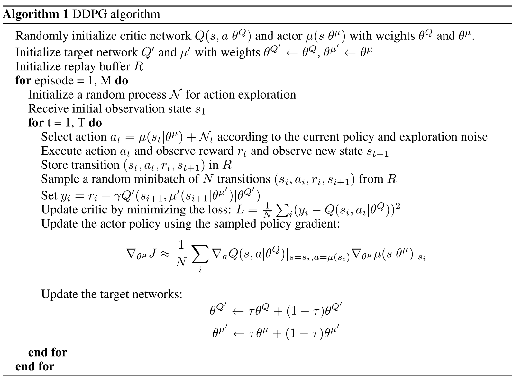
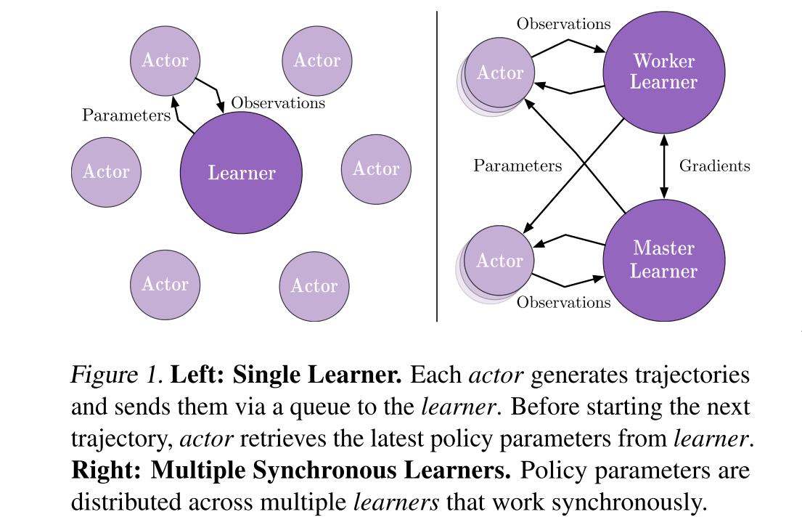
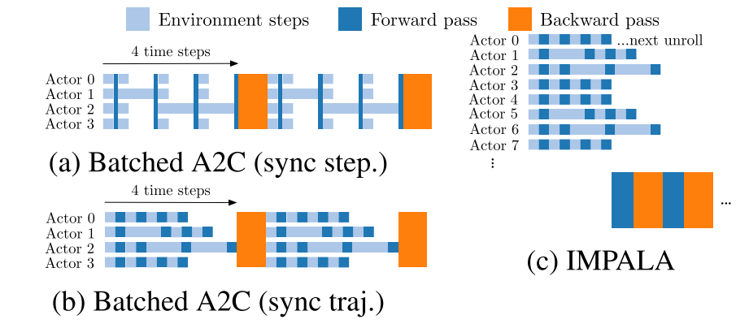
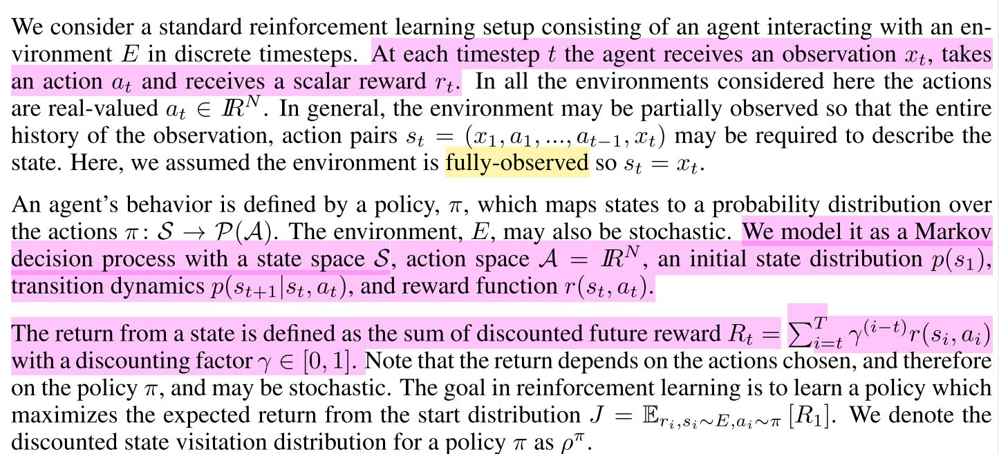

# Preliminary

## 马尔可夫决策过程MDP

### 马尔可夫模型的几类子模型

各种马尔可夫子模型的关系:

|                    |     不考虑动作      |              考虑动作               |
| :----------------: | :-----------------: | :---------------------------------: |
|  **状态完全可见**  |   马尔科夫链(MC)    |        马尔可夫决策过程(MDP)        |
| **状态不完全可见** | 隐马尔可夫模型(HMM) | 不完全可观察马尔可夫决策过程(POMDP) |

### 马尔可夫决策过程

一个马尔可夫决策过程由一个四元组构成$M = (S, A, P_{sa}, 𝑅)$ [注1]

- S: 表示状态集(states)，有$s∈S$，$s_i$表示第i步的状态。
- A:表示一组动作(actions)，有$a∈A$，$a_i$表示第i步的动作。
- $𝑃_{sa}$: 表示状态转移概率。$𝑃_{s𝑎}$ 表示的是在当前$s ∈ S$状态下，经过$a ∈ A$作用后，会转移到的其他状态的概率分布情况。比如，在状态s下执行动作$a$，转移到m的概率可以表示为$p(s'|s,a)$。
- $R: S×A⟼ℝ$ ，R是回报函数(reward function)。有些回报函数状态$S$的函数，可以简化为$R: S⟼ℝ$。如果一组$(s,a)$转移到了下个状态$s'$，那么回报函数可记为$r(s'|s, a)$。如果$(s,a)$对应的下个状态s'是唯一的，那么回报函数也可以记为$r(s,a)$。

MDP 的动态过程如下：某个智能体(agent)的初始状态为$s_0$，然后从 A 中挑选一个动作$a_0$执行，执行后，agent 按$P_sa$概率随机转移到了下一个$s1$状态，$s1∈P_{s_0a_0}$。然后再执行一个动作$a_1$，就转移到了$s_2$，接下来再执行$a_2$…，我们可以用下面的图表示状态转移的过程。

如果回报r是根据状态s和动作a得到的，则MDP还可以表示成下图：

### 值函数(value function)

增强学习学到的是一个从环境状态到动作的映射（即行为策略），记为策略$π: S→A$。而增强学习往往又具有延迟回报的特点: 如果在第n步输掉了棋，那么只有状态$s_n$和动作$a_n$获得了立即回报$r(s_n,a_n)=-1$，前面的所有状态立即回报均为0。所以对于之前的任意状态s和动作a，立即回报函数r(s,a)无法说明策略的好坏。因而需要定义值函数(value function，又叫效用函数)来**表明当前状态下策略π的长期影响**。

#### 状态值函数(state value function)

**重点看第三个式子**

- $$
  V^{\pi}(\mathrm{s})=E_{\pi}\left[\sum_{i=0}^{h} r_{i} | s_{0}=s\right]
  $$

- $$
  V^{\pi}(\mathrm{s})=\lim _{h \rightarrow \infty} E_{\pi}\left[\frac{1}{h} \sum_{i=0}^{h} r_{i} | s_{0}=s\right]
  $$

- $$
  V^{\pi}(\mathrm{s})=E_{\pi}\left[\sum_{i=0}^{\infty} \gamma^{i} r_{i} | s_{0}=s\right]
  $$

其中：

a)是采用策略π的情况下未来有限h步的期望立即回报总和；

b)是采用策略π的情况下期望的平均回报；

c)是**值函数最常见的形式**，式中γ∈[0,1]称为折合因子，表明了未来的回报相对于当前回报的重要程度。特别的，γ=0时，相当于只考虑立即不考虑长期回报，γ=1时，将长期回报和立即回报看得同等重要。

$$
\begin{array}{l}{V^{\pi}(\mathrm{s})=E_{\pi}\left[\mathrm{r}_{0}+\gamma \mathrm{r}_{1}+\gamma^{2} \mathrm{r}_{2}+\gamma^{3} \mathrm{r}_{3}+\ldots | s_{0}=s\right]} \\ {=E_{\pi}\left[r_{0}+\gamma E\left[\gamma \mathrm{r}_{1}+\gamma^{2} \mathrm{r}_{2}+\gamma^{3} \mathrm{r}_{3}+\ldots\right] | s_{0}=s\right]} \\ {=E_{\pi}\left[\mathrm{r}\left(\mathrm{s}^{\prime} | \mathrm{s}, \mathrm{a}\right)+\gamma V^{\pi}(\mathrm{s'}) | s_{0}=s\right]}\end{array}
$$
给定策略π和初始状态s，则动作$a=π(s)$，下个时刻将以概率$p(s'|s,a)$转向下个状态$s'$，那么上式的期望可以拆开，可以重写为：

$$
V^{\pi}(\mathrm{s})=\sum_{s \in S} p\left(\mathrm{s}^{\prime} | \mathrm{s}, \mathrm{\pi(s)}\right)\left[\mathrm{r}\left(\mathrm{s}^{\prime} | \mathrm{s}, \mathrm{\pi(s)}\right)+\gamma \mathrm{V}^{\pi}\left(\mathrm{s}^{\prime}\right)\right]
$$
**注意：**在$V^π(s)$中，π和初始状态s是我们给定的，而初始动作a是由策略π和状态s决定的，即a=π(s)。

#### 动作值函数(action value function Q函数)

$$
Q^{\pi}(\mathrm{s}, \mathrm{a})=E\left[\sum_{i=0}^{\infty} \gamma^{i} r_{i} | \mathrm{s}_{0}=\mathrm{s}, \mathrm{a}_{0}=\mathrm{a}\right]
$$

给定当前状态s和当前动作a，在未来遵循策略π，那么系统将以概率p(s'|s,a)转向下个状态s'，上式可以重写为：

$$
Q^{\pi}(\mathrm{s}, \mathrm{a})=\sum_{s' \in S} p\left(\mathrm{s}^{\prime} | \mathrm{s}, \mathrm{a}\right)\left[\mathrm{r}\left(\mathrm{s}^{\prime} | \mathrm{s}, \mathrm{a}\right)+\gamma \mathrm{V}^{\pi}\left(\mathrm{s}^{\prime}\right)\right]
$$
**在$Q^π(s,a)$中，不仅策略π和初始状态s是我们给定的，当前的动作a也是我们给定的，这是$Q^π(s,a)$和$V^π(a)$的主要区别。**

在得到值函数后，即可列出MDP的最优策略：

$$
\pi^{*}=\underset{\pi}{\arg \max } \mathrm{V}^{\pi}(\mathrm{s}),(\forall \mathrm{s})
$$
即我们的目标是寻找的是在任意初始条件s下，能够最大化值函数的策略π*。

**[一个优秀的例子](https://www.cnblogs.com/jinxulin/p/3517377.html)**

## MDP的动态规划解法

基本的解法有三种：

- 动态规划法(dynamic programming methods)
- 蒙特卡罗方法(Monte Carlo methods)
- 时间差分法(temporal difference)

本文先介绍动态规划法求解MDP

### 贝尔曼方程（Bellman Equation）

$V^\pi$和$Q^\pi$的表达式总结如下：

$$
\begin{equation}\label{bellman}
{V^{\pi}(\mathrm{s})=\sum_{s^{\prime} \in S} p\left(\mathrm{s}^{\prime} | \mathrm{s}, \pi(\mathrm{s})\right)\left[\mathrm{r}\left(\mathrm{s}^{\prime} | \mathrm{s}_{2} \pi(\mathrm{s})\right)+\gamma V^{\pi}(\mathrm{s})\right]=E_{\pi}\left[r\left(s^{\prime} | s, a\right)+\gamma V^{\pi}(\mathrm{s}) | s_{0}=s\right]} \\ {Q^{\pi}(\mathrm{s}, \mathrm{a})=\sum_{s^{\prime} \in S} p\left(\mathrm{s}^{\prime} | \mathrm{s}, \mathrm{a}\right)\left[\mathrm{r}\left(\mathrm{s}^{\prime} | \mathrm{s}, \mathrm{a}\right)+\gamma V^{\pi}\left(\mathrm{s}^{\prime}\right)\right]=E_{\pi}\left[r\left(s^{\prime} | s, a\right)+\gamma V^{\pi}\left(\mathrm{s}^{\prime}\right) | s_{0}=s, \mathrm{a}_{0}=\mathrm{a}\right]}\end{equation}
$$
在动态规划中，上面两个式子称为**贝尔曼方程**，它表明了**当前状态的值函数与下个状态的值函数的关系**  。

优化目标$π^*$可以表示为：

$$
\pi^{*}(\mathrm{s})=\arg \max _{\pi} V^{\pi}(\mathrm{s})
$$
分别记最优策略$π$对应的状态值函数和动作值函数为 $V^*(s)$ $和$$Q^*(s, a)$

状态值函数和行为值函数分别满足如下**贝尔曼最优性方程(Bellman optimality equation)，定义了最优解满足的条件**：

$$
\begin{align*}
V^{*}(\mathrm{s})&=\max _{a} E\left[r\left(s^{\prime} | s, a\right)+\gamma V^{*}\left(\mathrm{s}^{\prime}\right) | s_{0}=s\right] \\ &=\max _{a \in A(s)} \sum p\left(\mathrm{s}^{\prime} | \mathrm{s}, \pi(\mathrm{s})\right)\left[\mathrm{r}\left(\mathrm{s}^{\prime} | \mathrm{s}, \pi(\mathrm{s})\right)+\gamma V^{\pi}\left(\mathrm{s}^{\prime}\right)\right]\end{align*}
$$

$$
\begin{align*}
\mathrm{Q}^{*}(\mathrm{s})&=E\left[r\left(s^{\prime} | s, a\right)+\gamma \max _{a^{\prime}} Q^{*}\left(s^{\prime}, \mathrm{a}^{\prime}\right) | s_{0}=s, \mathrm{a}_{0}=\mathrm{a}\right]\\
&=\sum p\left(\mathrm{s}^{\prime} | \mathrm{s}, \pi(\mathrm{s})\right)\left[\mathrm{r}\left(\mathrm{s}^{\prime} | \mathrm{s}, \pi(\mathrm{s})\right)+\gamma \max _{a=A(\mathrm{s})} Q^{*}\left(\mathrm{s}^{\prime}, \mathrm{a}^{\prime}\right)\right]
\end{align*}
$$

故可知，$V^*(s)$ $和$$Q^*(s, a)$存在如下关系：
$$
\mathrm{V}^{*}(\mathrm{s})=\max _{a} \mathrm{Q}^{*}(\mathrm{s}, \mathrm{a})
$$

### 策略估计(Policy Evaluation)

> 对于任意的策略π，我们如何计算其状态值函数$V^π(s)$？

**确定性策略**：(上一节主要介绍的就是确定性策略）
$$
{V^{\pi}(\mathrm{s})=\sum_{s^{\prime} \in S} p\left(\mathrm{s}^{\prime} | \mathrm{s}, \pi(\mathrm{s})\right)\left[\mathrm{r}\left(\mathrm{s}^{\prime} | \mathrm{s}_{2} \pi(\mathrm{s})\right)+\gamma V^{\pi}(\mathrm{s})\right]}
$$
**扩展到一般**：如果在某策略$π$下，$π(s)$对应的动作$a$有多种可能，每种可能记为$π(a|s)$，则状态值函数为
$$
V^{\pi}(\mathrm{s})=\sum_{a} \pi(\mathrm{a} | \mathrm{s}) \sum_{s=s} p\left(\mathrm{s}^{\prime} | \mathrm{s}, \pi(\mathrm{s})\right)\left[\mathrm{r}\left(\mathrm{s}^{\prime} | \mathrm{s}, \pi(\mathrm{s})\right)+\gamma V^{\pi}\left(\mathrm{s}^{\prime}\right)\right]
$$
一般采用迭代的方法更新状态值函数，首先将所有$V_π(s)$的初值赋为0（其他状态也可以赋为任意值，不过吸收态必须赋0值），然后采用如下式子更新所有状态s的值函数（第k+1次迭代）：

$$
V_{k+1}(\mathrm{s})=\sum_{a} \pi(\mathrm{a} | \mathrm{s}) \sum_{s^{\prime}=S} p\left(\mathrm{s}^{\prime} | \mathrm{s}, \mathrm{a}\right)\left[\mathrm{r}\left(\mathrm{s}^{\prime} | \mathrm{s}, \mathrm{a}\right)+\gamma V_{k}(\mathrm{s})\right]
$$
对于$V^π(s)$，有**两种更新方法**：

1. 将第k次迭代的各状态值函数 $[V_k(s1),V_k(s2),V_k(s3), \dots]$ 保存在一个数组中，第k+1次的Vπ(s)采用第k次的$V^π(s')$来计算，并将结果保存在第二个数组中。
2. 即仅用一个数组保存各状态值函数，每当得到一个新值，就**将旧的值覆盖**,形如$[V_{k+1}(s_1),V_{k+1}(s_2),V_k(s_3), \dots]$，第k+1次迭代的$V^π(s)$可能用到第k+1次迭代得到的$V^π(s')$。

通常情况下，我们**采用第二种方法更新数据**，因为它及时利用了新值，能更快的收敛。整个策略估计算法如下图所示：

### 策略改进(Policy Improvement) (策略择优)

假设我们有一个策略$π$，并且确定了它的所有状态的值函数$V^π(s)$。对于某状态s，有动作$a_0=π(s)$。 那么如果我们在状态s下不采用动作$a_0$，而采用其他动作$a≠π(s)$是否会更好呢？要判断好坏就需要我们计算行为值函数$Q^π(s,a)$，公式我们前面已经说过：
$$
Q^{\pi}(\mathrm{s}, \mathrm{a})=\sum_{s'\in S} p\left(\mathrm{s}^{\prime} | \mathrm{s}, \mathrm{a}\right)\left[\mathrm{r}\left(\mathrm{s}^{\prime} | \mathrm{s}, \mathrm{a}\right)+\gamma V^{\pi}\left(\mathrm{s}^{\prime}\right)\right]
$$
**评判标准**是：$Q^π(s,a)$是否大于$V^π(s)$。如果$Q^π(s,a)$> $V^π(s)$，那么至少说明新策略【仅在状态s下采用动作a，其他状态下遵循策略π】比旧策略【所有状态下都遵循策略π】整体上要更好。

**策略改进定理(policy improvement theorem)**：$π$和$π'$是两个确定的策略，如果对所有状态$s∈S$有$Q^π(s,π'(s))≥V^π(s)$，那么策略π'必然比策略π更好，或者至少一样好。其中的不等式等价于$V^{π'}(s)≥V^π(s)$。

有了在某状态s上改进策略的方法和策略改进定理，我们可以**遍历所有状态和所有可能的动作a**，并采用贪心策略来获得新策略$π'$。即对所有的$s∈S$, 采用下式更新策略：
$$
\begin{array}{l}{\pi^{\prime}(s)=\underset{a}{\operatorname{argmax}} Q^{\pi}(s, a)} \\ {=\underset{a}{\operatorname{argmax}} E_{\pi}\left[r\left(s^{\prime} | s, a\right)+\gamma V^{\pi}(s) | s_{0}=s, a_{0}=a\right]} \\ {=\underset{a}{\operatorname{argmax}} \sum_{s'\in S} p\left(s^{\prime} | s, a\right)\left[r\left(s^{\prime} | s, a\right)+\gamma V^{\pi}\left(s^{\prime}\right)\right]}\end{array}
$$
这种采用关于值函数的贪心策略获得新策略，改进旧策略的过程，称为**策略改进(Policy Improvement)**

贪心策略收敛:

> 假设策略改进过程已经收敛，即对所有的$s$，$V^{π'}(s)$等于$V^π(s)$。那么根据上面的策略更新的式子，可以知道对于所有的$s∈S$下式成立:
>
> $$
> \begin{array}{l}{V^{*}(\mathrm{s})=\max _{a} E\left[r\left(\mathrm{s}^{\prime} | \mathrm{s}_{2} \mathrm{a}\right)+\gamma V^{*}(\mathrm{s}) | s_{0}=s\right]} \\ {=\max _{a} \sum_{s'\in S} p\left(\mathrm{s}^{\prime} | \mathrm{s}, a\right)\left[\mathrm{r}\left(\mathrm{s}^{\prime} | \mathrm{s}, a\right)+\gamma V^{*}(\mathrm{s})\right]}\end{array}
> $$

这个式子正好就是我们在 **Equation** $\ref{bellman}$ 中所说的Bellman optimality equation，所以$π$和$π'$都必然是最优策略！神奇吧！

### 策略迭代 (Policy Iteration)

策略迭代算法就是上面两节内容的组合。假设我们有一个策略π，那么**我们可以用 policy evaluation 获得它的值函数 Vπ(s)，然后根据 policy improvement 得到更好的策略π'，接着再计算 Vπ'(s), 再获得更好的策略π''**，整个过程顺序进行如下图所示：

$$
\pi_{0} \stackrel{\mathrm{E}}{\longrightarrow} v_{\pi_{0}} \stackrel{\mathrm{i}}{\longrightarrow} \pi_{1} \stackrel{\mathrm{E}}{\longrightarrow} v_{\pi_{1}} \stackrel{\mathrm{i}}{\longrightarrow} \pi_{2} \stackrel{\mathrm{E}}{\longrightarrow} \cdots \stackrel{\mathrm{i}}{\longrightarrow} \pi_{*} \stackrel{\mathrm{E}}{\longrightarrow} v_{*}
$$
完整的算法如下图所示：

### 值迭代(Value Iteration)

从上面我们可以看到，策略迭代算法包含了一个策略估计的过程，而策略估计则需要扫描 (sweep) 所有的状态若干次，其中巨大的计算量直接影响了策略迭代算法的效率。我们必须要获得精确的 $V^π$值吗？事实上不必，有几种方法可以在保证算法收敛的情况下，缩短策略估计的过程。

值迭代（Value Iteration）就是其中非常重要的一种。它的每次迭代只扫描 (sweep) 了每个状态一次。值迭代的每次迭代对所有的 $s∈S$ 按照下列公式更新：
$$
\begin{array}{l}{V_{k+1}(\mathrm{s})=\max _{a} E\left[r\left(s^{\prime} | s, a\right)+\gamma V_{k}(\mathrm{s}) | s_{0}=s\right]} \\ {=\max _{a} \sum p\left(\mathrm{s}^{\prime} | \mathrm{s}, \pi(\mathrm{s})\right)\left[\mathrm{r}\left(\mathrm{s}^{\prime} | \mathrm{s}, \pi(\mathrm{s})\right)+\gamma V_{k}(\mathrm{s})\right]}\end{array}
$$
即在值迭代的第 $k+1$ 次迭代时，直接将能获得的最大的 $V^\pi(s)$ 值赋给 $V(k+1)$。值迭代算法直接用可能转到的下一步 s'的 V(s') 来更新当前的 V(s)，算法甚至都不需要存储策略$π$。而实际上这种更新方式同时却改变了策略$π_k$ 和 $V(s)$ 的估值 $V_k(s)$。 直到算法结束后，我们再通过 $V$ 值来获得最优的π。

此外，值迭代还可以理解成是采用迭代的方式逼近 **Equation** $\ref{bellman}$  中所示的贝尔曼最优方程。

值迭代完整的算法如图所示：

由上面的算法可知，值迭代的最后一步，我们才根据 $V(s)$，获得最优策略π*。

一般来说值迭代和策略迭代都需要经过无数轮迭代才能精确的收敛到 $V^*$ 和$π$， **而实践中，我们往往设定一个阈值来作为中止条件，即当 $V^π (s)$ 值改变很小时，我们就近似的认为获得了最优策略。在折扣回报的有限 MDP(discounted finite MDPs) 中，进过有限次迭代，两种算法都能收敛到最优策略 π**。

至此我们了解了马尔可夫决策过程的动态规划解法，动态规划的优点在于它有很好的数学上的解释，但是动态要求一个完全已知的环境模型，这在现实中是很难做到的。另外，当状态数量较大的时候，动态规划法的效率也将是一个问题。下一篇介绍蒙特卡罗方法，它的优点在于不需要完整的环境模型。

**参考资料：**

[1] R.Sutton et al. Reinforcement learning: An introduction , 1998 

[2] 徐昕，增强学习及其在移动机器人导航与控制中的应用研究[D],2002

## 蒙特卡罗方法(MC)

### 基本思想 

蒙特卡罗方法又叫统计模拟方法，它使用随机数（或伪随机数）来解决计算的问题，是一类重要的数值计算方法。该方法的名字来源于世界著名的赌城蒙特卡罗，而蒙特卡罗方法正是以概率为基础的方法。

一个简单的例子可以解释蒙特卡罗方法，假设我们需要计算一个不规则图形的面积，那么图形的不规则程度和分析性计算（比如积分）的复杂程度是成正比的。而采用蒙特卡罗方法是怎么计算的呢？首先你把图形放到一个已知面积的方框内，然后假想你有一些豆子，把豆子均匀地朝这个方框内撒，散好后数这个图形之中有多少颗豆子，再根据图形内外豆子的比例来计算面积。当你的豆子越小，撒的越多的时候，结果就越精确。

### 增强学习中的蒙特卡罗方法

现在我们开始讲解增强学习中的蒙特卡罗方法，与上篇的 DP 不同的是，这里不需要对环境的完整知识。蒙特卡罗方法仅仅需要经验就可以求解最优策略，这些经验可以在线获得或者根据某种模拟机制获得。

要注意的是，我们仅将蒙特卡罗方法定义在 episode task 上，所谓的 episode task 就是**指不管采取哪种策略π，都会在有限时间内到达终止状态并获得回报的任务**。比如玩棋类游戏，在有限步数以后总能达到输赢或者平局的结果并获得相应回报。

那么什么是经验呢？经验其实就是训练样本。比如在初始状态 $s$，遵循策略π，最终获得了总回报 $R$，这就是一个样本。如果我们有许多这样的样本，就可以估计在状态 $s$ 下，遵循策略π的期望回报，也就是状态值函数  了$V^π (s)$ 。蒙特卡罗方法就是依靠样本的平均回报来解决增强学习问题的。

尽管蒙特卡罗方法和动态规划方法存在诸多不同，但是蒙特卡罗方法借鉴了很多动态规划中的思想。在动态规划中我们首先进行**策略估计**，计算特定策略$π$对应的 $V^π$ 和 $Q^π$ ，然后进行**策略改进**，最终形成**策略迭代**。这些想法同样在蒙特卡罗方法中应用。

###  蒙特卡罗策略估计 (Monte Carlo Policy evaluation)

首先考虑用蒙特卡罗方法来学习状态值函数 $V^π (s)$。如上所述，估计 $V^π (s)$ 的一个明显的方法是对于所有到达过该状态的回报取平均值。这里又分为 first-visit MC methods 和 every-visit MC methods。这里，我们只考虑 first MC methods，即在一个 episode 内，我们只记录 s 的第一次访问，并对它取平均回报。

现在我们假设有如下一些样本，取折扣因子γ=1，即直接计算累积回报，则有

根据 first MC methods，对出现过状态 $s$ 的 episode 的累积回报取均值，有 Vπ(s)≈ (2 + 1 – 5 + 4)/4 = 0.5

    容易知道，当我们经过无穷多的 episode 后，Vπ(s) 的估计值将收敛于其真实值。

###  动作值函数的 MC 估计 (Monte Carlo Estimation of Action Values)

在状态转移概率 $p(s'|a,s)$ 已知的情况下，策略估计后有了新的值函数，我们就可以进行策略改进了，只需要看哪个动作能获得最大的期望累积回报就可以。然而在没有准确的状态转移概率的情况下这是不可行的。为此，我们需要估计动作值函数 Qπ(s,a)。Qπ(s,a) 的估计方法前面类似，即在状态 s 下采用动作 a，后续遵循策略π获得的期望累积回报即为 Qπ(s,a)，依然用平均回报来估计它。有了 Q 值，就可以进行策略改进了
$$
\pi'=\arg\max_a Q^\pi(s,a)
$$

### 持续探索 (Maintaining Exploration)

下面我们来探讨一下 Maintaining Exploration 的问题。前面我们讲到，我们通过一些样本来估计 Q 和 V，并且在未来执行估值最大的动作。这里就存在一个问题，假设在某个确定状态 s0 下，能执行 a0, a1, a2 这三个动作，如果智能体已经估计了两个 Q 函数值，如 Q(s0,a0), Q(s0,a1)，且 Q(s0,a0)>Q(s0,a1)，那么它在未来将只会执行一个确定的动作 a0。这样我们就无法更新 Q(s0,a1) 的估值和获得 Q(s0,a2) 的估值了。这样的后果是，我们无法保证 Q(s0,a0) 就是 s0 下最大的 Q 函数。

Maintaining Exploration 的思想很简单，就是用 _soft_ policies 来替换确定性策略，使所有的动作都有可能被执行。比如其中的一种方法是ε-greedy policy，即在所有的状态下，用 1-ε的概率来执行当前的最优动作 a0，ε的概率来执行其他动作 a1, a2。这样我们就可以获得所有动作的估计值，然后通过慢慢减少ε值，最终使算法收敛，并得到最优策略。简单起见，在下面 MC 控制中，我们使用 exploring start，即仅在第一步令所有的 a 都有一个非零的概率被选中。

### 蒙特卡罗控制 (Monte Carlo Control)

我们看下 MC 版本的策略迭代过程：

根据前面的说法，值函数 Qπ(s,a) 的估计值需要在无穷多 episode 后才能收敛到其真实值。这样的话策略迭代必然是低效的。在上一篇 DP 中，我们介绍了值迭代算法，即每次都不用完整的策略估计，而仅仅使用值函数的近似值进行迭代，这里也用到了类似的思想。每次策略的近似值，然后用这个近似值来更新得到一个近似的策略，并最终收敛到最优策略。这个思想称为广义策略迭代。

具体到 MC control，就是在每个 episode 后都重新估计下动作值函数（尽管不是真实值），然后根据近似的动作值函数，进行策略更新。这是一个 episode by episode 的过程。

一个采用 exploring starts 的 Monte Carlo control 算法，如下图所示，称为 Monte Carlo ES。而对于所有状态都采用 _soft_ policy 的版本，这里不再讨论。

###  小结

Monte Carlo 方法的一个显而易见的好处就是我们不需要环境模型了，可以从经验中直接学到策略。它的另一个好处是，它对所有状态 s 的估计都是独立的，而不依赖与其他状态的值函数。在很多时候，我们不需要对所有状态值进行估计，这种情况下蒙特卡罗方法就十分适用。

不过，现在增强学习中，直接使用 MC 方法的情况比较少，而较多的采用 TD 算法族。但是如同 DP 一样，MC 方法也是增强学习的基础之一，因此依然有学习的必要。

**参考资料：**

[1] R.Sutton et al. Reinforcement learning: An introduction, 1998

[2] Wikipedia，蒙特卡罗方法

## 时间差分学习

接下来我们回顾一下动态规划算法(DP)和蒙特卡罗方法(MC)的特点，对于动态规划算法有如下特性：

- 需要环境模型，即状态转移概率 $P_{sa}$

- 状态值函数的估计是自举的(*bootstrapping*)，即当前状态值函数的更新依赖于已知的其他状态值函数。

相对的，蒙特卡罗方法的特点则有：

- 可以从经验中学习不需要环境模型
- 状态值函数的估计是相互独立的
- 只能用于episode tasks

而我们希望的算法是这样的：

- 不需要环境模型
- 它不局限于episode task，可以用于连续的任务

本文介绍的**时间差分学习**(Temporal-Difference learning, TD learning)正是具备了上述特性的算法，它结合了DP和MC，并兼具两种算法的优点。

### 基本思想

在介绍TD learning之前，我们先引入如下简单的蒙特卡罗算法，我们称为

constant-*α* MC，它的状态值函数更新公式如下：
$$
V\left(s_{t}\right) \leftarrow V\left(s_{t}\right)+\alpha\left[R_{t}-V\left(s_{t}\right)\right]
$$
 其中 $R_t$ 是每个episode结束后获得的实际累积回报，$\alpha$是学习率

这个式子的直观的理解就是, **用实际累积回报 $R_t$ 作为状态值函数 $V(s_t)$ 的估计值**。具体做法是对每个episode，考察实验中 $s_t $ 的实际累积回报 $R_t$ 和当前估计 $V(s_t)$的偏差值，并用该偏差值乘以学习率来更新得到 $V(s_t )$的新估值。

现在我们将公式修改如下，把 $R_t $换成 $r_{t+1}+\gamma V\left(s_{t+1}\right)$，就得到了 $TD(0)$ 的状态值函数更新公式：
$$
V\left(s_{t}\right) \leftarrow V\left(s_{t}\right)+\alpha\left[r_{t+1}+\gamma V\left(s_{t+1}\right)-V\left(s_{t}\right)\right]
$$
为什么修改成这种形式呢，我们回忆一下状态值函数的定义：
$$
\begin{equation}\label{V}
V^{\pi}(s)=E_{\pi}\left[r\left(s^{\prime} | s, a\right)+\gamma V^{\pi}\left(s^{\prime}\right)\right]
\end{equation}
$$
 容易发现这其实是根据 **Equation** $\ref{V}$ 的形式，利用真实的**立即回报** $r_{t+1}$和**下个状态的值函数**$V(s_{t+1})$来更新 $V(s_t)$，这种方式就称为**时间差分(temporal difference)**。由于我们没有状态转移概率，所以要利用多次实验来得到期望状态值函数估值。类似MC方法，在足够多的实验后，状态值函数的估计是能够收敛于真实值的。

那么MC和TD(0)的更新公式的有何不同呢？我们举个例子，假设有以下8个episode, 其中A-0表示经过状态A后获得了回报0:

|   index   | samples  |
| :-------: | :------: |
| episode 1 | A-0, B-0 |
| episode 2 |   B-1    |
| episode 3 |   B-1    |
| episode 4 |   B-1    |
| episode 5 |   B-1    |
| episode 6 |   B-1    |
| episode 7 |   B-1    |
| episode 8 |   B-0    |

首先我们使用constant-*α* MC方法估计状态A的值函数，其结果是 $V(A)=0$，这是因为状态$A$只在episode 1出现了一次，且其累计回报为0。

现在我们使用TD(0)的更新公式，简单起见取 $\lambda =1$，我们可以得到 $V(A)=0.75$。这个结果是如何计算的呢？ 

1. 首先，状态B的值函数是容易求得的，B作为终止状态，获得回报1的概率是75%，因此  $V(B)=0.75$。

2. 接着从数据中我们可以得到状态A转移到状态B的概率是100%并且获得的回报为0。根据公式(5)可以得到

$$
V(A) \leftarrow V(A)+\alpha[0+\lambda V(B)-V(A)]
$$

​       可见在只有 $V(A)=\lambda V(B)=0.75$ 的时候，式(2)收敛。对这个例子，可以作图表示：
 
 可见式(5)由于**能够利用其它状态的估计值**，其得到的结果更加合理，并且由于**不需要等到任务结束就能更新估值**，也就不再局限于episode task了。此外，实验表明TD(0)从收敛速度上也显著优于MC方法。

将式(2)作为状态值函数的估计公式后，前面文章中介绍的**策略估计**算法就变成了如下形式，这个算法称为TD prediction:

## 强化学习分类

1. - 不理解环境(Model-free RL)

     Q Learning、Sarsa、Policy Gradients

   - 理解环境(Model-Based RL)

     相较于Model-free，Model-Based可以构建虚拟环境，并且可以**想象**

2. - 基于概率(Policy-Based RL)：输出的是概率，不一定选择最高概率的，适用于连续动作：Policy Gradients
   - 基于价值(Value-Based RL)：输出的是价值，一定选择价值最高的动作：QLearning、Sarsa
   - Actor-Critic：Actor基于概率做出动作，Critic再基于价值给出动作的价值
3. - 回合更新(Monte-Carlo update)：游戏结束更新

     基础版Policy Gradients

   - 单步更新(Temporal-Difference update)：游戏进行的每一步都可以更新

     Q Learning、Sarsa、升级版Policy Gradients

4. - 在线学习(On-Policy)

     Sarsa、Sarsa($\lambda$)

   - 离线学习(Off-Policy)

     Q Learning、DQN

# Algorithm

## Q-value based

### Q Learning 

根据$Q$表对下一时刻的动作进行选择，下图是$Q$表的更新方式

此时，$S_2$并未进行下一次的动作，而是预估了一下后果，由此来更新$S_1$的$Q$表。

其中，$\alpha$是**学习速率**，$\epsilon$是**选择$Q$表最大值的概率**。若$\epsilon=90\%$，则$90\%$概率选择$Q$表最大值即最优动作，$10\%$的概率随机动作。
$$
Q(s, a) \leftarrow Q(s, a)+\alpha\left[r+\gamma \max _{a^{\prime}} Q\left(s^{\prime}, a^{\prime}\right)-Q(s, a)\right]
$$
由于$Q(s',a')$是**下一次的动作**，会通过乘以**奖励衰减值**$\gamma$的方式影响前一次的$Q$表取值，因此很容易想到只要$\gamma\neq 0$，以后的每次动作得到的奖励值都会影响之前动作的$Q$表取值。

- Q估计：$s_1$状态最优动作$a$的Q值
- Q现实：在选择了动作$a$后，进入 $s'$状态。Q表中 $s'$状态对应的Q值的最大值加上执行动作$a$之后得到的奖励值$r$，即为Q现实。

### Sarsa

1. 决策部分与Q Learning一样
2. 区别在于Q表的更新方式：
   - Q Learning并没有实际进行下一次的动作，**会选择有危险的动作**，因此是离线学习；
   - Sarsa是实践派，进行了实际的下一步动作，**会避免选择有危险的动作**，因此是在线学习；

### Sarsa($\lambda$)

1. **不仅更新离奖励最近的一步，还更新来时沿途的每一步**

   > Sarsa 是一种单步更新法, 在环境中每走一步, 更新一次自己的行为准则, 我们可以在这样的 Sarsa 后面打一个括号, 说他是 Sarsa(0), 因为他等走完这一步以后直接更新行为准则. 如果延续这种想法, 走完这步, 再走一步, 然后再更新, 我们可以叫他 Sarsa(1). 同理, 如果等待回合完毕我们一次性再更新呢, 比如这回合我们走了 n 步, 那我们就叫 Sarsa(n). 为了统一这样的流程, 我们就有了一个 $\lambda$ 值来代替我们想要选择的步数, 这也就是 Sarsa($\lambda$) 的由来. 

2. 更新沿途存在的**问题**：会记录不必要的重复步骤，因此需要Sarsa($\lambda$)

3. $\lambda$ 的**含义**：

   

   $\lambda$是一个**衰变值**，在$0-1$之间，离奖励越远的步对到达奖励的影响越小，衰减越大；反之，离奖励越近的步对奖励的影响越大，衰减较小。

   

4. **算法**：

### DQN(Deep Q Network)

1. 抛弃Q表这种Q值记录方式，使用神经网络生成Q值，在状态较多的情况下格外有效率

2. - Q估计：通过NN预测出的$Q(s_2, a_1), Q(s_2,a_2)$的最大值
   - Q现实：Q 估计中最大值的动作来换取环境中的奖励 reward+$\gamma*$下一步$s'$中通过NN预测出的$Q(s‘, a_1), Q(s',a_2)$的最大值
   
3. **DQN两大利器**：
   - Experience replay: 作为一种离线学习，每次 DQN 更新的时候，我们都可以随机抽取一些之前的经历进行学习。随机抽取这种做法打乱了经历之间的相关性，也使得神经网络更新更有效率。
   - Fixed Q-target: 在 DQN 中使用到两个结构相同但参数不同的神经网络, 预测 Q 估计的神经网络具备最新的参数, 而预测 Q 现实的神经网络使用的参数则是很久以前的.
   
4. **算法**：
$$
Q(s, a) \leftarrow Q(s, a)+\alpha\left[r+\gamma \max _{a^{\prime}} \hat{Q}\left(s^{\prime}, a^{\prime}| \hat\theta\right)-Q(s, a|\theta)\right]
$$
  

- 记忆库 (用于重复学习)
- 神经网络计算 Q 值
- 暂时冻结 `q_target` 参数 (切断相关性)

### Double DQN

因为我们的神经网络预测 `Qmax` 本来就有误差, 每次也向着最大误差的 `Q现实` 改进神经网络, 就是因为这个 `Qmax` 导致了 **overestimate(过估计)**。

As a consequence, at the beginning of the training we don’t have enough information about the best action to take. Therefore, taking the maximum q value (which is noisy) as the best action to take can lead to false positives. If non-optimal actions are regularly given a higher Q value than the optimal best action, the learning will be complicated\.

The solution is: when we compute the Q target, *we use two networks to decouple the action selection from the target Q value generation*. We:

- *use our DQN network to select what is the best action to take for the next state* (the action with the highest Q value).
- *use our target network to calculate the target Q value of taking that action at the next state.*

有两个神经网络: `Q_eval` $Q$ (Q估计中的), `Q_target` $\hat{Q}$ (Q现实中的).

Natural DQN:
$$
Y_{t}^{\mathrm{DQN}} \equiv R_{t+1}+\gamma \max _{a} \hat{Q}\left(S_{t+1}, a ; \boldsymbol{\theta}_{t}^{-}\right)
$$
Double DQN:
$$
Y_{t}^{\text {DoubleDQN }} \equiv R_{t+1}+\gamma \hat{Q}\left(S_{t+1}, \underset{a}{\operatorname{argmax}} Q\left(S_{t+1}, a ; \boldsymbol{\theta}_{t}\right), \boldsymbol{\theta}_{t}^{-}\right)
$$
对比原始和Double的cost曲线：

### Dueling DQN

#### Theory

Remember that Q-values correspond **to how good it is to be at that state and taking an action at that state Q(s,a).**

So we can decompose Q(s,a) as the sum of:

- **V(s)**: the value of being at that state
- **A(s,a)**: the advantage of taking that action at that state (how much better is to take this action versus all other possible actions at that state).

$$
\begin{equation}\label{dueling}
Q(s,a)=A(s,a)+V(s)
\end{equation}
$$

With Dueling DQN, we want to separate the estimator of these two elements, using two new streams:

- one that estimates the **state value V(s)**
- one that estimates the **advantage for each action A(s,a)**

And then we combine these two streams **through a special aggregation layer to get an estimate of Q(s,a).**

#### Reason

With our normal DQN, we need to calculate the value of each action at that state. **But what’s the point if the value of the state is bad?** What’s the point to calculate all actions at one state when all these actions lead to death?

As a consequence, by decoupling we’re able to calculate $V(s)$. This is particularly **useful for states where their actions do not affect the environment in a relevant way.** In this case, it’s unnecessary to calculate the value of each action. For instance, **moving right or left only matters if there is a risk of collision**. And, in most states, **the choice of the action has no effect on what happens**.

#### Implementation

The combination is not what we gave in **Equation** $\ref{dueling}$. Because if we do that, we’ll fall into the **issue of identifiability**, that is — given $Q(s,a)$ we’re unable to find $A(s,a)$ and $V(s)$. It will be a problem for back propagation.

To avoid this problem, we can force our advantage function estimator to have 0 advantage at the chosen action. To do that, we subtract the average advantage of all actions possible of the state.

It can help us find much more reliable Q values for each action by decoupling the estimation between two streams.

### Prioritized Experience Replay

#### Theory

The idea is that some experiences may be more important than others for our training, but might occur less frequently. Because we sample the batch uniformly (selecting the experiences randomly) these rich experiences that occur rarely have practically no chance to be selected.

We want to take in priority **experience where there is a big difference between our prediction and the TD target, since it means that we have a lot to learn about it.**

We use the absolute value of the magnitude of our TD error:

And we **put that priority in the experience of each replay buffer.**

But we can’t just do greedy prioritization, because it will lead to always training the same experiences (that have big priority), and thus over-fitting. 

So we introduce stochastic prioritization, **which generates the probability of being chosen for a replay.**

**But**, because we use priority sampling, purely random sampling is abandoned. As a consequence, we introduce bias toward high-priority samples (more chances to be selected). Samples that have high priority are likely to be used for training many times in comparison with low priority experiences (= bias). As a consequence, we’ll update our weights with only a small portion of experiences that we consider to be really interesting.

To correct this bias, we use **importance sampling weights (IS)** that will adjust the updating by reducing the weights of the often seen samples.

The weights corresponding to high-priority samples have very little adjustment (because the network will see these experiences many times), whereas those corresponding to low-priority samples will have a full update.

The role of **b** is to control how much these importance sampling weights affect learning. In practice, the b parameter is annealed up to 1 over the duration of training, because these weights are more important **in the end of learning when our q values begin to converge.** The unbiased nature of updates is most important near convergence, as explained in this [article](http://pemami4911.github.io/paper-summaries/deep-rl/2016/01/26/prioritizing-experience-replay.html).

#### Implementation

First of all, we can’t just implement PER by sorting all the Experience Replay Buffers according to their priorities. This will not be efficient at all due to **O(nlogn) for insertion and O(n) for sampling.**

As explained in[ this really good article](https://jaromiru.com/2016/11/07/lets-make-a-dqn-double-learning-and-prioritized-experience-replay/), we need to use another data structure instead of sorting an array — an unsorted **sumtree.**

## Policy-based

### Policy gradient

Policy gradient输出不是 action 的 value, 而是具体的那一个 action, 这样 policy gradient 就跳过了 value 这个阶段.

**优势：**

1. 输出的这个 action 可以是一个**连续值**, 之前我们说到的 value-based 方法输出的都是不连续的值, 然后再选择值最大的 action. 而 policy gradient 可以在一个连续分布上选取 action.

2. Convergence: The problem with value-based methods is that they can have a big oscillation while training. This is because the choice of action may change dramatically for an arbitrarily small change in the estimated action values.

   On the other hand, with policy gradient, we just follow the gradient to find the best parameters. We see a smooth update of our policy at each step.

   Because we follow the gradient to find the best parameters, we’re guaranteed to converge on a local maximum (worst case) or global maximum (best case).

3. Policy gradients can learn stochastic policies

   - we don’t need to implement an exploration/exploitation trade off.

   -  get rid of the problem of perceptual aliasing.

#### Disadvantages

1. A lot of the time, they converge on a local maximum rather than on the global optimum.
2. in a situation of Monte Carlo, waiting until the end of episode to calculate the reward. 

#### Theory

$$
\pi_\theta(a|s)=P[a|s]
$$

We must find the best parameters (θ) to maximize a score function, J(θ).
$$
J(\theta)=E_{\pi\theta}[\sum\gamma r]
$$
There are two steps:

- Measure the quality of a π (policy) with a policy score function J(θ)
- Use **policy gradient ascent** to find the best parameter θ that improves our π.

##### Policy score function

1. episode environment with same start state $s_1 $
   $$
   J_1(\theta)=E_\pi[G_1=R_1+\gamma R_2+\gamma^2 R_3+\dots]=E_\pi (V(s_1))
   $$

2. continuous environment (use the average value) 

	$$
	J_{avgv}(\theta)=E_{\pi}(V(s))=\sum d(s)V(s)
	$$

	where $d(s)=\dfrac{N(s)}{\sum_{s'}N(s')}$, $N(s)$ means Number of occurrences of the state, $\sum_{s'}N(s')$ represents Total number of occurrences of all state.
	
3. use the average reward per time step. The idea here is that we want to get the most reward per time step.

   

#### Policy gradient asscent

$$
\theta\leftarrow \theta + \alpha\nabla_\theta J(\theta)
$$

$$
\theta^*=\arg\max_\theta \underbrace{E_{\pi \theta}[\sum_t R(s_t,a_t)]}_{J(\theta)}
$$

Our score function J(θ) can be also defined as:

Since J(θ) is compose of state distribution and action distribution, when we gradient with respect to $\theta$, the effect of action is simple to find but the state affect is much more complicate due to the unknown environment. The solution is to use Policy Gradient Theorem:

$$
\begin{equation}
\begin{aligned}
\nabla_\theta J(\theta)&=\nabla_\theta \sum_\tau \pi(\tau;\theta)R(\tau)\\
&=\sum_\tau \nabla_\theta \pi(\tau;\theta)R(\tau)
\end{aligned}
\end{equation}
$$

It is hard to differentiating $\pi$, unless we can transform it into a **logarithm**. ([likelihood ratio trick](http://blog.shakirm.com/2015/11/machine-learning-trick-of-the-day-5-log-derivative-trick/))

#### Pseudocode

一种基于整条回合数据的更新

其中，$\nabla log \pi_{\theta}(s_t,a_t)v_t$表示在状态 $s$对所选动作的 $a$ 的吃惊度，$\pi_{\theta}(s_t,a_t)$代表 $Policy(s,a)$，其概率越小，反向的 $log(Policy(s,a))$(即 `-log(P)`) 反而越大. 如果在 `Policy(s,a)` 很小的情况下, 拿到了一个大的 `R`, 也就是大的 `V`, 那 $\nabla log \pi_{\theta}(s_t,a_t)v_t$ 就更大, 表示更吃惊, (**我选了一个不常选的动作, 却发现原来它能得到了一个好的 reward, 那我就得对我这次的参数进行一个大幅修改**). 这就是吃惊度的物理意义。

## Actor-Critic

### Actor Critic

#### Theory

- a Critic that measures how good the action taken is (value-based)
- an Actor that controls how our agent behaves (policy-based)

Instead of waiting until the end of episode as we do in Monte Carlo REINFORCE, we make an update at each step(**TD Learning**)

结合了 Policy Gradient (Actor) 和 Function Approximation (Critic) 的方法. `Actor` 基于概率选行为, `Critic` 基于 `Actor` 的行为评判行为的得分, `Actor` 根据 `Critic` 的评分修改选行为的概率，输入的单次奖赏变成了critic输出的总奖赏增量td-error。critic建立s-Q的网络，然后根据[s, r, s_]来训练，并返回td-error。

**优势：**可以进行单步更新, 比传统的 Policy Gradient 要快.

**劣势：**取决于 Critic 的价值判断, 但是 Critic 难收敛, 再加上 Actor 的更新, 就更难收敛. 为了解决收敛问题, Google Deepmind 提出了 `Actor Critic` 升级版 `Deep Deterministic Policy Gradient`. 后者融合了 DQN 的优势, 解决了收敛难的问题. 

### Advantage Actor-Critic (A2C)

value-based methods have **high variability**. To reduce this problem, we spoke about using the advantage function instead of the value function.

This function will tell us **the improvement compared to the average the action taken at that state is.** 

If A(s,a) > 0: our gradient is pushed in that direction.

If A(s,a) < 0 (our action does worse than the average value of that state) our gradient is pushed in the opposite direction.

However, the problem is that we need two value functions. Fortunately, we can use the TD error as a good estimator of the advantage function.

### Asynchronous Advantage Actor Critic(A3C)

In A3C, we don’t use experience replay as this requires lot of memory. Instead, we asynchronously **execute different agents in parallel on multiple instances of the environment.**

While A2C is synchronous, that the only difference. We wait until all workers have finished their training and calculated their gradients to average them, to update our global network.

#### Disadvantage

The problem of A3C is explained in [this awesome article](https://lilianweng.github.io/lil-log/2018/04/08/policy-gradient-algorithms.html#a2c). Because of the asynchronous nature of A3C, some workers (copies of the Agent) will be playing with older version of the parameters. Thus the aggregating update will not be optimal.

### PPO(Proximal Policy Optimization)

#### Theory

**The central idea of Proximal Policy Optimization is to avoid having too large policy update.** To do that, we use a ratio that will tells us the difference between our new and old policy and clip this ratio from 0.8 to 1.2. Doing that will ensure **that our policy update will not be too large.**

The problem comes from the step size of gradient ascent:

- Too small, **the training process was too slow**
- Too high, **there was too much variability in the training.**

The idea is that PPO improves the stability of the Actor training by limiting the policy update at each training step.

To be able to do that PPO introduced a new objective function called “**Clipped surrogate objective function**” that **will constraint the policy change in a small range using a clip.**

Instead of using log pi to trace the impact of the actions, we can use **the ratio between the probability of action under current policy divided by the probability of the action under previous policy.**
$$
r_t(\theta)=\dfrac{\pi_\theta(a_t|s_t)}{\pi_{\theta_{old}}(a_t|s_t)}, \text{so } r(\theta_{old})=1
$$

- If $r_t(θ)$ >1, it means that the **action is more probable in the current policy than the old policy.**
- If $r_t(θ)$ is between 0 and 1: it means that the **action is less probable for current policy than for the old one.**

As consequence, our new objective function could be:
$$
L^{CPI}(\theta)=\hat{\mathbb{E}}_t\lbrack\dfrac{\pi_\theta(a_t|s_t)}{\pi_{\theta_{old}}(a_t|s_t)}\hat{A}_t\rbrack=\hat{\mathbb{E}}_t[r_t(\theta)\hat{A}_t]
$$
**By doing that we’ll ensure that not having too large policy update because the new policy can’t be too different from the older one.**

To do that we have two solutions:

- TRPO (Trust Region Policy Optimization) uses KL divergence constraints outside of the objective function to constraint the policy update. But this method **is much complicated to implement and it takes more computation time.**
- PPO clip probability ratio directly in the objective function with its Clipped surrogate objective function.

The final Clipped Surrogate(代理) Objective Loss:

#### Advantage

It can be used in both discrete and continuous control.

#### Disadvantage

on-policy -> data inefficient

### DDPG(Deep Deterministic Policy Gradient )

`DDPG` 结合了之前获得成功的 `DQN` 结构, 提高了 `Actor Critic` 的稳定性和收敛性。为了体现`DQN`的思想，每种神经网络都需要再细分为两个， 

- Actor有估计网络和现实网络，估计网络用来输出实时的动作, 供actor在现实中实行。而现实网络则是用来更新价值网络系统的。
- Critic这边也有现实网络和估计网络，他们都在输出这个状态的价值，而输入端却有不同，状态现实网络这边会拿着从动作现实网络来的动作加上状态的观测值加以分析，而状态估计网络则是拿着当时Actor施加的动作当作输入。

#### Pseudocode

#### Advantage

off-policy -> sample efficient

#### Disadvantage

If the Q-function approximator develops an incorrect sharp peak for some actions, the policy will quickly exploit that peak and then have brittle or incorrect behavior. 

### Twin Delayed DDPG (TD3)

#### Theory

##### Target policy smoothing

Actions used to form the Q-learning target are based on the target policy, , but with clipped noise added on each dimension of the action. After adding the clipped noise, the target action is then clipped to lie in the valid action range (all valid actions, , satisfy ). The target actions are thus:
$$
a^{\prime}\left(s^{\prime}\right)=\operatorname{clip}\left(\mu_{\theta_{\text {targ}}}\left(s^{\prime}\right)+\operatorname{clip}(\epsilon,-c, c), a_{L o w}, a_{H i g h}\right), \quad \epsilon \sim \mathcal{N}(0, \sigma)
$$
It essentially severs as a regularizer and can avert the disadvantage of DDPG which is mentioned above.

##### Clipped double-Q learning

To do that, we build two Q-functions, both of them use a single target, calculated using whichever of the two Q-functions gives a smaller target value:
$$
y\left(r, s^{\prime}, d\right)=r+\gamma(1-d) \min _{i=1,2} Q_{\phi_{i, \text { targ }}}\left(s^{\prime}, a^{\prime}\left(s^{\prime}\right)\right)
$$
and then both are learned by regressing to this target:
$$
\begin{array}{l}{L\left(\phi_{1}, \mathcal{D}\right)=\underset{\left(s, a, r, s^{\prime}, d\right) \sim \mathcal{D}}{\mathrm{E}}\left[\left(Q_{\phi_{1}}(s, a)-y\left(r, s^{\prime}, d\right)\right)^{2}\right]} \\ {L\left(\phi_{2}, \mathcal{D}\right)=\underset{\left(s, a, r, s^{\prime}, d\right) \sim \mathcal{D}}{\mathrm{E}}\left[\left(Q_{\phi_{2}}(s, a)-y\left(r, s^{\prime}, d\right)\right)^{2}\right]}\end{array}
$$
Using the smaller Q-value for the target, and regressing towards that, and can help fend off(抵制) overestimation in the Q-function.

##### “Delayed” Policy Updates

the policy is learned just by maximizing :
$$
\max_{\theta} \underset{s \sim {\mathcal D}}{{\mathrm E}}\left[ Q_{\phi_1}(s,\mu_\theta(s)) \right]
$$
which is pretty much unchanged from DDPG. However, in TD3, the policy is updated less frequently than the Q-functions are. This helps damp(缓解; 使潮湿, 潮湿的) the volatility(波动性) that normally arises in DDPG because of how a policy update changes the target.

#### Advantage

off-policy, deterministic, used in continuous

#### Pseudocode

### Soft Actor Critic(SAC)

- Actor-critic框架（用两个网络分别近似policy和value function／Q function）
- Off-policy（提高样本效率）
- 最大化entropy（熵）来保证稳定性和exploration

在RL中最大化熵的好处：

- 鼓励exploration（因为最大化熵会使policy输出的action分布更加均匀）
- 可以学到更多near-optimal的行为，也就是在一些状态下，可能存在多个动作都是最优的，那么使选择它们的概率相同，可以提高学习的速度

#### Theory

For general DRL, the goal is to maximum expected sum of rewards
$$
\pi^*=\arg\max_\pi \mathbb{E}_{(s_t,a_t)\sim \rho_\pi}[\sum_tR(s_t,a_t)]
$$

#### Advantage

stochastic policy, off-policy

# Architecture

### IMPALA

Paper: [IMPALA: Scalable Distributed Deep-RL with Importance Weighted Actor-Learner Architectures](D:\Academic_Information\Mendeley\1802.01561.pdf)

#### 并行架构

IMPALA架构使用Learner代替传统Actor，而这里的Actors相当于A3C中的agents，用于并行探索。然而A3C-based agents向中央server传输策略参数的梯度信息，IMPALA的Actors则是向中央learner通信经验轨迹(trajectories of experience)。由于IMPALA的learner可以获得全部的经验轨迹，因此可以实现非常高的数据吞吐量。但由于生成经验轨迹的策略会滞后于learner的策略，因此IMPALA成为了**off-policy**算法。IMPALA使用**V-trace off-policy actor-critic算法**来修正这种不一致。

(a)和(b)揭示了A2C存在GPU利用率低的问题，而IMPALA将探索和学习分开，由多个Actors在多个env中探索，再由中央learner学习，实现了GPU的高效利用

#### V-trace算法

传统RL问题的目标是寻找一个策略 $\pi$ 使未来折扣奖励的期望 （ $V^{\pi}(x) \stackrel{\mathrm{def}}{=} \mathbb{E}_{\pi}\left[\sum_{t \geq 0} \gamma^{t} r_{t}\right]$）最大，其中 $\gamma\in[0,1)$是折扣系数，$r_t=r(x_t,a_t)$是在t时刻的奖励，$x_t$是在t时刻的状态，$a_t\sim\pi(\cdot|x_t)$ 是根据策略 $\pi$ 生成的action。

Off-policy 的RL算法是用由策略  $\mu$ 生成的轨迹（behaviour policy），来学习基于另一个策略 $\pi$ 的状态值函数 $V^{\pi}$ ($\pi$ 一般不同于 $\mu$ ) ，称作target policy.

##### V-trace target

Consider a trajectory $\left(x_{t}, a_{t}, r_{t}\right)_{t=s}^{t=s+n}$ generated by the actor following some policy $\mu$ . We define the n-steps V-trace target for $V(x_s)$, our value approximation at state $x_s$, as:
$$
v_{s} \stackrel{\mathrm{def}}{=} V\left(x_{s}\right)+\sum_{t=s}^{s+n-1} \gamma^{t-s}\left(\prod_{i=s}^{t-1} c_{i}\right) \delta_{t} V
$$
其中，$\delta_{t} V \stackrel{\mathrm{def}}{=} \rho_{t}\left(r_{t}+\gamma V\left(x_{t+1}\right)-V\left(x_{t}\right)\right)$是 $V$的时间差分（TD)，$\rho_{t} \stackrel{\mathrm{def}}{=} \min \left(\overline{\rho}, \frac{\pi\left(a_{t} | x_{t}\right)}{\mu\left(a_{t} | x_{t}\right)}\right)$和 $c_{i} \stackrel{\text { det }}{=}$
$\min \left(\overline{c}, \frac{\pi\left(a_{i} | x_{i}\right)}{\mu\left(a_{i} | x_{i}\right)}\right)$ 是重要性采样(IS)的截断，并假设$\overline{\rho} \geq \overline{c}$，可以理解为 $\overline{\rho}$ 影响 V 的收敛方向, 而 $\overline{c}$ 影响收敛速度。引入采样截断的意义在于：对过时已久的数据不进行采用 

**Remark 1**. V-trace targets can be computed recursively:
$$
v_{s}=V\left(x_{s}\right)+\delta_{s} V+\gamma c_{s}\left(v_{s+1}-V\left(x_{s+1}\right)\right)
$$

##### V-trace Actor-Critic Algorithm

V值参数 $\theta$ 更新：
$$
\left(v_{s}-V_{\theta}\left(x_{s}\right)\right) \nabla_{\theta} V_{\theta}\left(x_{s}\right)
$$

策略参数 $\omega$ 更新：
$$
\rho_{s} \nabla_{\omega} \log \pi_{\omega}\left(a_{s} | x_{s}\right)\left(r_{s}+\gamma v_{s+1}-V_{\theta}\left(x_{s}\right)\right)
$$
为防止过早的收敛，我们在上式基础上增加熵正则化项，像A3C一样
$$
-\nabla_{\omega} \sum_{\alpha} \pi_{\omega}\left(a | x_{s}\right) \log \pi_{\omega}\left(a | x_{s}\right)
$$

## 论文

### CONTINUOUS CONTROL WITH DEEP REINFORCEMENT LEARNING

本篇文章提出了基于DPG(deterministic policy gradient)和DQN的**DDPG**算法。成功地将DQN应用到**连续动作**域，并且这是一种基于DPG的Actor-Critic、**无模型**算法。DDPG是一种端到端的算法，可以直接从原始输入数据映射到输出数据。A long-standing challenge of robotic control is to learn an action policy directly from raw sensory input such as video.

**DQN缺点：**

DQN是可以解决的问题一般要具有高维观测空间，并且其动作空间是低维且离散的。

**DQN优势：**

1. 网络是从replay buffer中离线的学习到的，这样就减小了数据间的相关性；
2. 该网络使用target-Q网络进行训练，以便在时间差异备份期间提供一致的目标。

**DDPG优势：**

可以在保持超参数和网络结构不变的情况下，从低维观测空间中鲁棒地学习到策略。

#### RL基础

1. Action-value function：

    $$
    Q^π(s_t, a_t) = E_{r_{i≥t},s_{i>t}∼E,a_{i>t}∼π} [R_t|s_t, a_t]
    $$

    表示在状态 $s_t$ 选择了动作 $a_t$ 的期望返回值，并且在此之后策略服从 $\pi$。
    
2. 贝尔曼方程中体现了状态之间的递归关系

    $$
    Q^π(s_t, a_t) = E_{r_t,s_{t+1}∼E} [r(s_t, a_t) + γ E_{a_t+1∼π} [Q^π(s_{t+1}, a_{t+1})]]
    $$

3. 如果策略是确定的，可用 $\mu : S ← A$ 来表示策略，并且这样就省去了求 $n+1$ 次期望的过程
    $$
    Q^µ(s_t, a_t) = E_{r_t,s_{t+1}∼E} [r(s_t, a_t) + γQ^µ(s_{t+1}, µ(s_{t+1}))]
    $$
    这样期望就只和环境有关，意味着可以通过迁移学习的方式从另一个随机策略 $\beta$ 中离线学习到 $Q^{\mu}$. Q-Leaning是一种经典离线学习算法，使用的是贪婪策略 $\mu(s)=\arg \max_aQ(s,a)$
    
4. DPG：The DPG algorithm maintains a parameterized **actor function µ(s|θµ)** which specifies the current policy by deterministically mapping states to a specific action. The **critic Q(s, a)** is learned using the Bellman equation as in Q-learning. The actor is updated by following the applying the chain rule to the expected return from the start distribution J with respect to the actor parameters:
    $$
    \begin{align*}
    ∇_{θ^µ}J &≈ E_{s_t∼ρ^β} [∇_{θ^µ}Q(s, a|θ^Q)|_{s=s_t,a=µ(s_t|θ^µ)}]\\
    &= E_{s_t∼ρ^β}[ ∇_aQ(s, a|θ^Q)|_{s=st,a=µ(s_t)}∇_{θ^µ}
    µ(s|θ^µ)|_{s=st}]
    \end{align*}
    $$

#### DDPG算法

对于Q-Learning这样的算法来说，非线性函数逼近是不能保证收敛性的，因此借鉴DQN用神经网络来在线逼近函数的成功案例，开发了DDPG。

One challenge when using neural networks for reinforcement learning is that most optimization algorithms assume that the samples are independently and identically distributed(IID). **Additionally, to make efficient use of hardware optimizations, it is essential to learn in mini- batches, rather than online.**

1. Problem 1 发散：

   Since the network $Q(s, a|θ^Q)$ being updated is also used in calculating the target value (equation 5), the Q update is prone to divergence. We create a copy of the actor and critic networks, $Q‘(s, a|θ^{Q’})$
    and $µ'(s|θ^{µ'})$ respectively, that are used for calculating the target values. This means that the target values are constrained to change slowly, greatly improving the stability of learning. 即使延迟更新导致了学习速度慢，但是它所带来的稳定性更加重要。

2. Problem 2 输入量范围不一致：

   Using *batch normalization* (Ioffe & Szegedy, 2015). This technique normalizes each dimension across the samples in a minibatch to have unit mean and variance. In addition, it maintains a run- ning average of the mean and variance to use for normalization during testing.

3. Problem 3 探索：

   DDPG这样的离线学习算法的好处在于，可以将探索独立于学习算法之外。我们定义一个包含噪声的动作策略：
   $$
   \mu'(s_t)=\mu(s_t|\theta_t^{\mu})+\mathcal{N}
   $$
   利用Ornstein-Uhlenbeck过程来生成惯性物理系统的探索

#### 相关问题

**Trust region policy optimization (TRPO)** (Schulman et al., 2015b), directly constructs stochastic neural network policies without decomposing problems into optimal control and supervised phases. 经过精准的调参，该方法可以近乎单调的更新，并且不需要计算动作值函数，可能因此导致数据效率下降。

**Guided policy search (GPS) ** algorithms (e.g., (Levine et al., 2015)) decomposes the problem (Actor-Critic存在的问题) into three phases that are rela- tively easy to solve: 

1. First, it uses full-state observations to create locally-linear approximations of the dynamics around one or more nominal trajectories, 
2. Then uses optimal control to find the locally-linear optimal policy along these trajectories; 
3. Finally, it uses supervised learning to train a complex, non-linear policy (e.g. a deep neural network) to reproduce the state-to-action mapping of the optimized trajectories.

**PILCO** (Deisenroth & Rasmussen, 2011) uses **Gaussian processes** to learn a non-parametric, probabilistic model of the dynamics. 但是在高维问题上不切实际。**不过深度函数逼近看起来是将强化学习应用到大型的、高维问题上的最好办法。**

还可以使用**压缩权重**或**无监督学习**的方法来从像素中学习策略(Koutn´ık et al., 2014) （两篇）

#### 不足

需要大量的训练步数才能找到解决方案。

