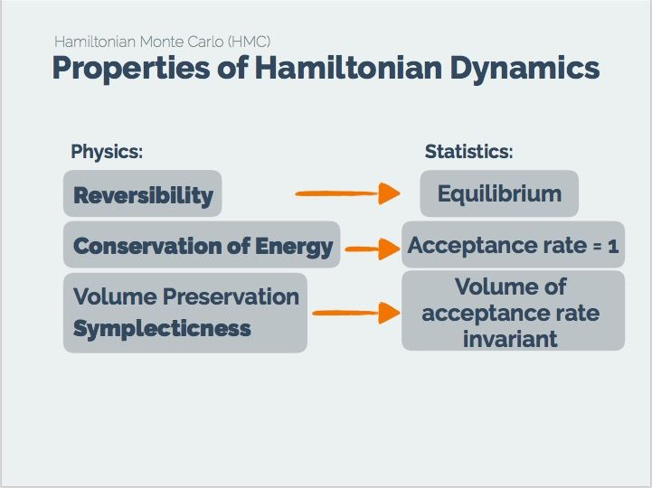

# Sampling Ⅱ: HMC, M-H and Gibbs

## 引言

上一节关于MCMC 的文章后面给出了一些 python 实现，但是大家会发现标准库的实现都不是 vanilla MCMC，而是 HMC 和 M-H 算法。这两个又是什么呢？Vanilla MCMC 又有什么缺点呢？

MCMC 的算法使用了一种接受、拒绝的条件判断结构，试想如果大部分采样值都被拒绝转移，就会导致采样了上百万次也没有使马尔可夫链收敛到平稳分布。这在实际中也是无法接受的。本节就介绍MCMC的改进版：Metropolis-Hastings (M-H) 采样、Gibbs采样

## Metropolis-Hastings (M-H) 采样

> M-H 是两个算法创造者的名字，如果你也想拥有这等殊荣，被永世铭记，就要跟我一起好好学习呀！

M-H 采样用于解决MCMC接受率过低的问题。

我们从上一节MCMC的细致平稳条件出发：
$$
\pi(i) Q(i, j) \alpha(i, j)=\pi(j) Q(j, i) \alpha(j, i)
$$
MCMC接受率过低主要原因是 $\alpha(i,j)$ 过小的缘故，但是如果上式两端同时放大，细致平稳条件仍然可以满足：
$$
\pi(i) Q(i, j) \times 0.1=\pi(j) Q(j, i) \times 0.2
$$

$$
\pi(i) Q(i, j) \times 0.5=\pi(j) Q(j, i) \times 1
$$

Vanilla MCMC 对于这个值的计算方式是：
$$
\begin{array}{l}
\alpha(i, j)=\pi(j) Q(j, i) \\
\alpha(j, i)=\pi(i) Q(i, j)
\end{array}
$$
因此，一个直观且有效的改进方法就是：
$$
\alpha(i, j)=\min \left\{\frac{\pi(j) Q(j, i)}{\pi(i) Q(i, j)}, 1\right\}
$$
**即把等式两边的 $\alpha(i,j),\alpha(j,i)$ 中最大的一个扩大到 1，对应的也按相应比例放大。**

#### Pseudocode

1. 选定任意的马尔科夫链状态转移矩阵 Q，平稳分布 $π(x)$，设定状态转移次数阈值$n_1$，需要的样本个数 $n_2$；
2. 从任意简单概率分布开始，采样得到初始状态 $x_0$；
3. for $t=0$ to $n_{1}+n_{2}-1$:
   - 从条件概率分布 $Q(x|x_t)$ 中采样得到样本$x_∗$
   - 从均匀分布采样u∼uniform[0,1]
   - 如果 $u<\alpha\left(x_{t}, x_{*}\right)=\min \left\{\frac{\pi(j) Q(j, i)}{\pi(i) Q(i, j)}, 1\right\}$, 则接受转移 $x_{t} \rightarrow x_{*}$，即  $x_{t+1}=x_*$
   - 否则不接受转移，即 $x_{t+1}=x_t$

样本集 $\left(x_{n_{1}}, x_{n_{1}+1}, \dots, x_{n_{1}+n_{2}-1}\right)$ 即为我们需要的平稳分布对应的样本集。

很多时候，我们选择的马尔科夫链状态转移矩阵 Q 如果是对称矩阵，即满足$Q(i,j)=Q(j,i)$，这时我们的接受率可以进一步简化为：
$$
\alpha(i, j)=\min \left\{\frac{\pi(j)}{\pi(i)}, 1\right\}
$$

#### Implementation

```python
def metropolis_hastings(func, rv, n, downsample=1):
    """
    Metropolis Hastings algorithm

    Parameters
    ----------
    func : callable
        (un)normalized distribution to be sampled from
    rv : RandomVariable
        proposal distribution
    n : int
        number of samples to draw
    downsample : int
        downsampling factor

    Returns
    -------
    sample : (n, ndim) ndarray
        generated sample
    """
    x = np.zeros((1, rv.ndim))
    sample = []
    for i in range(n * downsample):
        x_new = x + rv.draw() 
        accept_proba = func(x_new) * rv.pdf(x-x_new) / (func(x) * rv.pdf(x_new-x)) # alpha
        if random.random() < accept_proba:
            x = x_new
        if i % downsample == 0:
            sample.append(x[0])
    sample = np.asarray(sample)
    assert sample.shape == (n, rv.ndim), sample.shape
    return sample
```


## Gibbs 采样

M-H 在高维情况下有两个缺点：

- 计算 M-H 中的 $\min \left\{\frac{\pi(j) Q(j, i)}{\pi(i) Q(i, j)}, 1\right\}$ 是一笔很大的开销。
- 高维情况下需要以**多元联合分布**为采样目标，通常很难求出。

#### Gibbs采样思想

当联合分布未知或者难以取样，而每一个变量的条件分布则已知或者更易于取样的时候，我们就可以用Gibbs Sampling。Gibbs Sampling算法依次从每一个变量的分布中，以其他变量的当前值为条件，生成一个个体。易知，这个样本序列构成了一个Markov Chain，以及这个Markov Chain的平稳分布（stationary distribution）就是所需要的联合分布。

**给定一个多元分布，相比对联合分布$Q$积分然后求边缘分布$Q(x|x_t)$，从条件分布中取样的方法来的更加容易。**

以二维数据为例， 假设 $π(x1,x2)$ 是一个二维联合数据分布，观察第一个特征维度相同的两个点$A: (x^{(1)}_1,x^{(1)}_2)，B:(x^{(1)}_1,x^{(2)}_2)$（上标为马尔可夫链的时间戳，下标为特征），容易发现下面两式成立：
$$
\begin{array}{l}
\pi\left(x_{1}^{(1)}, x_{2}^{(1)}\right) \pi\left(x_{2}^{(2)} \mid x_{1}^{(1)}\right)=\pi\left(x_{1}^{(1)}\right) \pi\left(x_{2}^{(1)} \mid x_{1}^{(1)}\right) \pi\left(x_{2}^{(2)} \mid x_{1}^{(1)}\right) \\
\pi\left(x_{1}^{(1)}, x_{2}^{(2)}\right) \pi\left(x_{2}^{(1)} \mid x_{1}^{(1)}\right)=\pi\left(x_{1}^{(1)}\right) \pi\left(x_{2}^{(2)} \mid x_{1}^{(1)}\right) \pi\left(x_{2}^{(1)} \mid x_{1}^{(1)}\right)
\end{array}
$$
由于两式的右边相等，因此我们有：
$$
\pi\left(x_{1}^{(1)}, x_{2}^{(1)}\right) \pi\left(x_{2}^{(2)} \mid x_{1}^{(1)}\right)=\pi\left(x_{1}^{(1)}, x_{2}^{(2)}\right) \pi\left(x_{2}^{(1)} \mid x_{1}^{(1)}\right)
$$
即
$$
\pi(A) \pi\left(x_{2}^{(2)} \mid x_{1}^{(1)}\right)=\pi(B) \pi\left(x_{2}^{(1)} \mid x_{1}^{(1)}\right)
$$
**即在$x_1=x_1^{(1)}$这根一维线上，我们可以将条件概率分布 $\pi\left(x_{2} \mid x_{1}^{(1)}\right)$ 作为马尔科夫链的状态转移概率，则任意两个点之间的转移满足细致平稳条件！**

同理，如果是前后两个采样点 $A: (x^{(1)}_1,x^{(1)}_2)，C:(x^{(2)}_1,x^{(1)}_2)$，此时是 $x_2 = x_2^{(1)}$不变，那么在这条一维的线上，条件概率分布 $\pi\left(x_{1} \mid x_{2}^{(1)}\right)$ 是其满足细致平稳条件的状态转移矩阵。

**这也间接的导致了 MCMC 中的接受系数 $\alpha$ 恒等于1！即恒接受每一个采样点！**

设 $x^*$ 为新的采样点，k为唯一有变化的一维
$$
\alpha\left(x^{*}, x\right)=\frac{\pi\left(x^{*}\right) q_{k}\left(x \mid x^{*}\right)}{\pi(x) q_{k}\left(x^{*} \mid x\right)}=\frac{\pi\left(x_{k}^{*} \mid x_{\backslash k}^{*}\right) \pi\left(x_{\backslash k}^{*}\right) \pi\left(x_{k} \mid x_{\backslash k}^{*}\right)}{\pi\left(x_{k} \mid x_{\backslash k}\right) \pi\left(x_{\backslash k}\right) \pi\left(x_{k}^{*} \mid x_{\backslash k}\right)}=1
$$

#### 理论论证

为什么可以把 $\pi\left(x_{2} \mid x_{1}^{(1)}\right)$ 作为马尔可夫矩阵，这看起来和 $P(i, j)$ 也不像啊？？


#### 二维Gibbs采样

1. 平稳分布 $π(x_1, x_2)$，设定状态转移次数阈值$n_1$，需要的样本个数 $n_2$；
2. 从任意简单概率分布开始，采样得到初始状态 $x^{(0)}_1,x_2^{(0)}$；
3. for $t=0$ to $n_{1}+n_{2}-1$:
   - 从条件概率分布 $P\left(x_{2} \mid x_{1}^{(t)}\right)$ 中采样得到样本$x_2^{(t+1)}$
   - 从条件概率分布 $ P\left(x_{1} \mid x_{2}^{(t+1)}\right)$ 中采样得到样本$x_1^{(t+1)}$

样本集 $\left\{\left(x_{1}^{\left(n_{1}\right)}, x_{2}^{\left(n_{1}\right)}\right),\left(x_{1}^{\left(n_{1}+1\right)}, x_{2}^{\left(n_{1}+1\right)}\right), \ldots,\left(x_{1}^{\left(n_{1}+n_{2}-1\right)}, x_{2}^{\left(n_{1}+n_{2}-1\right)}\right)\right\}$ 即为我们需要的平稳分布对应的样本集。

整个采样过程中，我们通过**轮换坐标轴**，采样的过程为：
$$
\left(x_{1}^{(1)}, x_{2}^{(1)}\right) \rightarrow\left(x_{1}^{(1)}, x_{2}^{(2)}\right) \rightarrow\left(x_{1}^{(2)}, x_{2}^{(2)}\right) \rightarrow \ldots \rightarrow\left(x_{1}^{\left(n_{1}+n_{2}-1\right)}, x_{2}^{\left(n_{1}+n_{2}-1\right)}\right)
$$


#### 多维Gibbs采样

对于轮换到 $x_i$ 坐标轴上的转移，马尔科夫链的状态转移概率为$P(x_k|x_{\backslash  k})=P(x_k|x_1,x_2,...,x_{k−1},x_{k+1},...,x_n)$，即固定 n−1 个坐标轴，在某一个坐标轴上一维地移动。

1. 输入平稳分布 $\pi\left(x_{1}, x_{2}, \ldots, x_{n}\right)$ 或者对应的所有特征的条件概率分布，设定状态转移次数阅值 $n_{1},$ 需要的样本个数 $n_{2}$

2. 随机初始化初始状态值 $\left(x_{1}^{(0)}, x_{2}^{(0)}, \ldots, x_{n}^{(0)}\right)$

3. for $t=0$ to $n_{1}+n_{2}-1$:

   - 从条件概率分布 $P\left(x_{1} \mid x_{2}^{(t)}, x_{3}^{(t)}, \ldots, x_{n}^{(t)}\right)$ 中采样得到样本 $x_{1}^{t+1}$

   - 从条件概率分布 $P\left(x_{2} \mid x_{1}^{(t+1)}, x_{3}^{(t)}, x_{4}^{(t)}, \ldots, x_{n}^{(t)}\right)$ 中采样得到样本 $x_{2}^{t+1}$

   - $\ldots$

   - 从条件概率分布 $P\left(x_{n} \mid x_{1}^{(t+1)}, x_{2}^{(t+1)}, \ldots, x_{n-1}^{(t+1)}\right)$ 中采样得到样本 $x_{n}^{t+1}$

样本集 $\left\{\left(x_{1}^{\left(n_{1}\right)}, x_{2}^{\left(n_{1}\right)}, \ldots, x_{n}^{\left(n_{1}\right)}\right), \ldots,\left(x_{1}^{\left(n_{1}+n_{2}-1\right)}, x_{2}^{\left(n_{1}+n_{2}-1\right)}, \ldots, x_{n}^{\left(n_{1}+n_{2}-1\right)}\right)\right\}$ 即为我们需要的平稳分布对应的样本集。

#### Implementation

```python
import numpy as np
import seaborn as sns


def p_x_given_y(y, mus, sigmas):
    mu = mus[0] + sigmas[1, 0] / sigmas[0, 0] * (y - mus[1])
    sigma = sigmas[0, 0] - sigmas[1, 0] / sigmas[1, 1] * sigmas[1, 0]
    return np.random.normal(mu, sigma)


def p_y_given_x(x, mus, sigmas):
    mu = mus[1] + sigmas[0, 1] / sigmas[1, 1] * (x - mus[0])
    sigma = sigmas[1, 1] - sigmas[0, 1] / sigmas[0, 0] * sigmas[0, 1]
    return np.random.normal(mu, sigma)


def gibbs_sampling(mus, sigmas, iter=int(5e3)):
    samples = np.zeros((iter, 2))
    y = np.random.rand() * 10

    for i in range(iter):
        x = p_x_given_y(y, mus, sigmas)
        y = p_y_given_x(x, mus, sigmas)
        samples[i, :] = [x, y]

    return samples

if __name__ == '__main__':
    mus = np.array([5, 5])
    sigmas = np.array([[1, .9], [.9, 1]])

    # plot the ground truth
    x,y = np.random.multivariate_normal(mus, sigmas, int(1e5)).T
    sns.jointplot(x,y,kind="kde")

    # plot the Gibbs sampling results
    samples = gibbs_sampling(mus, sigmas)
    sns.jointplot(samples[:, 0], samples[:, 1])
```

**Ground Truth:**


 **Gibbs Sampling:**


## Hamiltonian Monte Carlo （HMC)

无论是 Vanilla MCMC，还是改进版的 M-H 和 Gibbs sampling，利用的是**随机游走**的运动（random walk）来模拟马氏链下一state的位置，使得状态在同一个区域来回的乱晃不能走出去“开阔眼界”，这样会造成effective sample size（ESS，衡量抽出的有效的或者没有相关性的样本的个数）较小抽样效率过低，这都是状态转移矩阵选择的问题。于是就有了更进阶版的MCMC来引导状态转移矩阵的设计，并提高采样点的接受率，**HMC**。


#### Hamiltonian dynamics

将 MCMC 与物理上的**哈密尔顿动力学 Hamiltonian dynamics**结合，**哈密尔顿动力学**是利用给定物体在**时刻** $\tau$ 的**位置 **z 和 **动量** r 来描述其运动过程，由于**位置 **z 和 **动量** r 分别对应着势能和动能，将势能和动能分别描述为关于**位置 **z 和 **动量** r 的函数，则**势能**为  U(z)，**动能**为 K(r) 。

动量是状态变量 z 的变化率：
$$
r_i = \dfrac{\text{d}z_i}{\text{d}r}
$$
概率分布 p(z) 可以写作：
$$
p(z)=\dfrac{exp(-U(z))}{Z_p}
$$
$Z_p$ 是归一化系数，将概率分布的和归一。

系统的加速度是动量的变化率，也是势能的负梯度：
$$
\frac{\mathrm{d} r_{i}}{\mathrm{d} \tau}=-\frac{\partial U({z})}{\partial z_{i}}
$$
动能的定义：
$$
K(\boldsymbol{r})=\frac{1}{2}\|\boldsymbol{r}\|^{2}=\frac{1}{2} \sum_{i} r_{i}^{2}
$$
则哈密顿函数可写作：
$$
H(z,r)=U(z)+K(r)
$$
实际上，这就是个 **“能量=动能+势能”** 的公式。

#### Hamiltonian 性质



为什么要用 Hamiltonian 呢？因为它具有的一些很好性质正好符合我们对细致平稳条件等性质的要求。

- Reversibility： **细致平稳条件**；

- Conservation of Energy/Hamiltonian：哈密尔顿函数的值是常量（设想一个小球在光滑超平面上的能量守恒），不随时间变化，从而使得**接受率为1**；
  $$
  \begin{aligned}
  \frac{\mathrm{d} H}{\mathrm{d} \tau} &=\sum_{i}\left\{\frac{\partial H}{\partial z_{i}} \frac{\mathrm{d} z_{i}}{\mathrm{d} \tau}+\frac{\partial H}{\partial r_{i}} \frac{\mathrm{d} r_{i}}{\mathrm{d} \tau}\right\} \\
  &=\sum_{i}\left\{\frac{\partial H}{\partial z_{i}} \frac{\partial H}{\partial r_{i}}-\frac{\partial H}{\partial r_{i}} \frac{\partial H}{\partial z_{i}}\right\}=0
  \end{aligned}
  $$
  
- volume preserving：动态系统在相空间（位置和动量组成的联合空间被）中体积不变
  我们注意到流场（位置在相空间的变化率）为 
  $$
  \boldsymbol{V}=\left(\frac{\mathrm{d} \boldsymbol{z}}{\mathrm{d} \tau}, \frac{\mathrm{d} \boldsymbol{r}}{\mathrm{d} \tau}\right)
  $$
  这个场的散度为零，即
  $$
  \begin{aligned}
  \operatorname{div} \boldsymbol{V} &=\sum_{i}\left\{\frac{\partial}{\partial z_{i}} \frac{\mathrm{d} z_{i}}{\mathrm{d} \tau}+\frac{\partial}{\partial r_{i}} \frac{\mathrm{d} r_{i}}{\mathrm{d} \tau}\right\} \\
  &=\sum_{i}\left\{+\frac{\partial}{\partial z_{i}} \frac{\partial H}{\partial r_{i}}-\frac{\partial}{\partial r_{i}} \frac{\partial H}{\partial z_{i}}\right\}=0
  \end{aligned}
  $$

#### MCMC with Hamiltonian

考虑相空间上的联合概率分布，它的总能量是哈密顿函数，即概率分布的形式为：
$$
p(\boldsymbol{z}, \boldsymbol{r})=\frac{1}{Z_{H}} \exp (-H(\boldsymbol{z}, \boldsymbol{r}))
$$
由于 H 的守恒性，就会使得 p(z, r) 保持不变。虽然 H 是不变的，但是 z 和 r 会发⽣变换。因此通过在⼀个有限的时间间隔上对哈密顿动态系统积分，我们就可以让 z 以⼀种系统化的方式发⽣较⼤的变化，**避免了随机游⾛的⾏为**。 

为了得到⼀个具有各态历经性的采样⽅法，我们可以在相空间中引⼊额外的移动，这些移动会 改变H的值，同时也保持了概率分布 p(z,r) 的不变性。

是将 r 的值替换为⼀个从以z为条件的概率分布中抽取的样本。这可以被看成吉布斯采样的步骤，因此保持了概率分布的不变性。必须解决计算哈密顿⽅程的数值积分的问题。

#### 蛙跳（leapfrog）离散化

这种⽅法使 ⽤下⾯的公式对位置变量和动量变量的离散时间近似 $\hat z$ 和 $\hat r$ 进行交替地更新。
$$
\begin{array}{c}
\widehat{r}_{i}\left(\tau+\frac{\epsilon}{2}\right)=\widehat{r}_{i}(\tau)-\frac{\epsilon}{2} \frac{\partial E}{\partial z_{i}}(\widehat{z}(r)) \\
\widehat{z}_{i}(\tau+\epsilon)=\widehat{z}_{i}(\tau)+\epsilon \widehat{r}_{i}\left(\tau+\frac{\epsilon}{2}\right) \\
\widehat{r}_{i}(\tau+\epsilon)=\widehat{r}_{i}\left(\tau+\frac{\epsilon}{2}\right)-\frac{\epsilon}{2} \frac{\partial E}{\partial z_{i}}(\widehat{z}(\tau+\epsilon))
\end{array}
$$

- 动量的更新是半步更新，步长为 $\dfrac{\epsilon}{2}$；
- 位置的更新是整步更新，步长为 $\epsilon$。


#### 延伸阅读

[A Conceptual Introduction to Hamiltonian Monte Carlo](https://arxiv.org/pdf/1701.02434.pdf)

[MCMC Using Hamiltonian Dynamics](http://www.mcmchandbook.net/HandbookChapter5.pdf)

**强烈推荐这个博主的可交互采样示意图：**

[Hamiltonian Monte Carlo explained](http://arogozhnikov.github.io/2016/12/19/markov_chain_monte_carlo.html)

## Reference 

1. [采样方法(Sampling Method)](https://zhuanlan.zhihu.com/p/62730810)
2. [M-H采样](https://www.cnblogs.com/pinard/p/6638955.html)
3. [Introduction to Metropolis - Duke](http://www2.stat.duke.edu/~rcs46/modern_bayes17/lecturesModernBayes17/lecture-6/06-metropolis.pdf)
4. [Bayesian Inference: Metropolis-Hastings Sampling - Rochester](http://www.mit.edu/~ilkery/papers/MetropolisHastingsSampling.pdf)
5. [马尔可夫链蒙特卡罗算法（MCMC）](https://zhuanlan.zhihu.com/p/37121528)
6. [MCMC(四)Gibbs采样](https://www.cnblogs.com/pinard/p/6645766.html)
7. [Bayesian Inference: Gibbs Sampling - Rochester](http://www.mit.edu/~ilkery/papers/GibbsSampling.pdf)
8. [MCMC-Gibbs Sampling](https://zhuanlan.zhihu.com/p/21275614)
9. [MCMC: Hamiltonian Monte Carlo](https://theclevermachine.wordpress.com/2012/11/18/mcmc-hamiltonian-monte-carlo-a-k-a-hybrid-monte-carlo/)
10. [MCMC算法--多元高斯分布Gibbs采样(Python代码)](https://blog.csdn.net/Eric2016_Lv/article/details/79756331)
11. [Hamiltonian Monte Carlo explained](http://arogozhnikov.github.io/2016/12/19/markov_chain_monte_carlo.html)