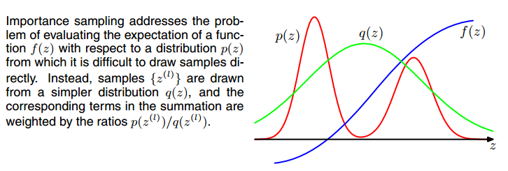
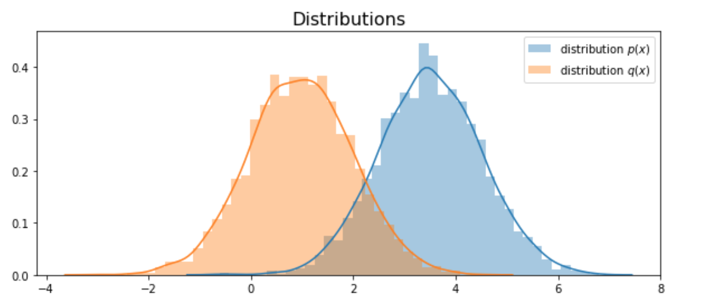
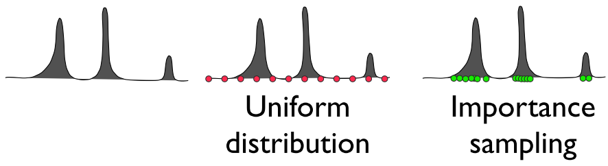
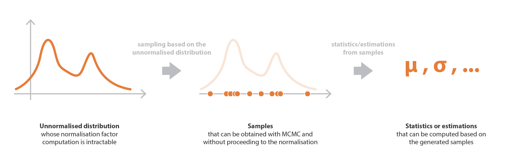
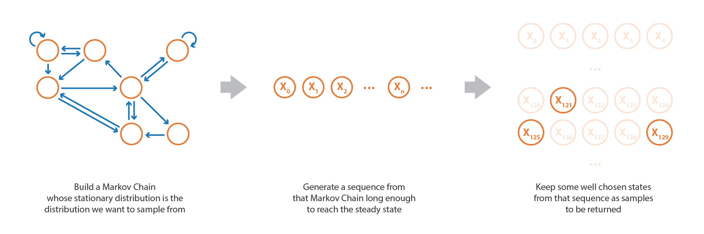
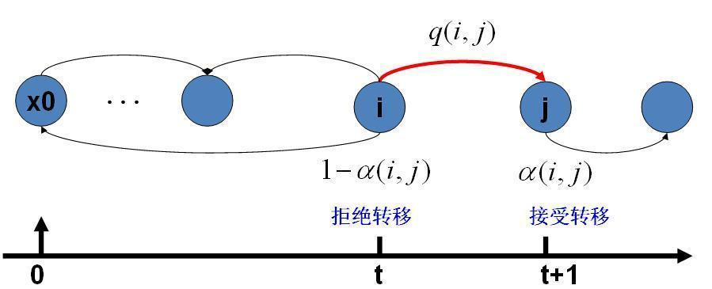

# Sampling Ⅰ: Monte-Carlo Sampling, Importance Sampling and MCMC

# 引言

还记得我们之前学过的贝叶斯推断吗？贝叶斯推断要解决的不是如何估计参数，而是用来估计新测量数据出现的概率，对于新出现的数据 $\tilde x$ ：
$$
P(\tilde{x} | X)=\int_{\Theta} P(\tilde{x} | \theta) P(\theta | X) d \theta=\int_{\Theta} P(\tilde{x} | \theta) \frac{P(X | \theta) P(\theta)}{P(X)} d \theta
$$

**那么实际项目中，我们如何计算贝叶斯估计里这个积分呢？**

- 基于**采样**的**马尔可夫链蒙特卡罗**(Markov Chain Monte Carlo，简称MCMC)方法
- 基于**近似**的**变分推断**(Variational Inference，简称VI)方法

本文主要介绍MCMC方法，其余的会在后续文章出现。

# 采样 —— 一种近似技术

当我们需要以较小的代价近似许多项的和或某个积分时，**采样**是一种很灵活且明智的选择。**所以这不只是贝叶斯推断特有的方法，是一种普适性的积分近似技术。**对于近似一个分布来说，从其中按概率分布采样来实现是一个非常自然的想法。

## 蒙特卡洛采样基础

> **简述Monto Carlo：**
>
> 1. 蒙特卡洛方法`Monte Carlo` 可以通过采用随机投点法来求解不规则图形的面积。求解结果并不是一个精确值，而是一个近似值。当投点的数量越来越大时，该近似值也越接近真实值。
> 2. 蒙特卡洛方法也可以用于根据概率分布来随机采样的任务。


**思路**

除了投点法求积分外，还可以用**期望法求积分**。把和或者积分视作某分布下的期望，然后通过估计对应的平均值来近似这个期望
$$
s=\sum_{x} p(\boldsymbol{x}) f(\boldsymbol{x})=E_{p}[f(\mathbf{x})]
$$
或
$$
s=\int p(\boldsymbol{x}) f(\boldsymbol{x}) d \boldsymbol{x}=E_{p}[f(\mathbf{x})]
$$
这种思路就是**加权求和**，其权重为随机变量 x 的概率分布（求和时）或者概率密度函数（求积分时）。概率越高的地方，该变量被采样的几率越大，对应函数值的权重越大，故通过采样数据的经验平均可以近似整体的和或积分。

**开始采样**

我们根据 $p(x)$ 抽取 n 个样本 $\boldsymbol{x}^{(1)}, \ldots, \boldsymbol{x}^{(n)}$ 计算期望从而得到 s 的近似：
$$
\hat{s}_{n}=\frac{1}{n} \sum_{i=1}^{n} f\left(x^{(i)}\right)
$$
**理论保障**

1. 上述经验平均值是 **无偏** 的，$\mathbb{E}\left[\hat{s}_{n}\right]=\frac{1}{n} \sum_{i=1}^{n} \mathbb{E}\left[f\left(x^{(i)}\right)\right]=\frac{1}{n} \sum_{i=1}^{n} s=s$；
2. 根据 **大数定律**，若样本 $x^{(i)}$ 是独立同分布的，其平均值几乎必然收敛到期望值，$\lim _{n \rightarrow \infty} \hat{s}_{n}=s$；
3. 根据 **中心极限定理**，$\hat s_n$ 的分布会收敛到以 $s$ 为均值、$\frac{Var[f(x)]}{n}$为方差的正态分布（只要 $Var[f(x)]$有界，那么方差 $\frac{Var[f(x)]}{n}$ 必然会趋于0。同时我们可以利用正态分布的累计函数来估计 $\hat s_n$ 的置信区间。

**问题**

这种方法过于理想，所有结论依赖于我们可以从基准分布 $p(x)$ 中轻易地采样，因为大部分时候 $p(x)$ 都是未知的或者是形状诡异的分布 。一个直观的改进方法是：**能不能通过某种变换，将概率分布函数转化成我们熟知的一些简单分布，这样我们从标准分布中采样即可得到 p(x) 中采样一样的结果。**

## 重要性采样 Importance Sampling  (IS)

在上一节我们理所当然的把 $p(x)$ 当成概率分布，$f(x)$ 视为被积函数。 $p(x)f(x)$当然不是唯一的分解方式啦，当从 $p(x)$ 中采样不可行时，我们也可以**构造**一个分解：
$$
p(x)f(x)=q(x)\dfrac{p(x)f(x)}{q(x)}
$$
这样我们就可以把更便于采样的 $q(x)$ 视作采样概率，然后估计 $\frac{pf}{q}$ 在此分布下的期望。相当于在新的采样函数下，函数值 f(x) 被乘上了一个采样权重或likelihood ratio  $p/q$。



学RL的同学应该很熟悉重要性采样，在off-policy的算法中用来处理产生动作的策略和学习策略不一致的问题。通过一个简单的可预测的分布去估计一个服从另一个分布的随机变量的均值。

在实际应用off-policy时，迭代过程通常会有两个策略：

- Behavior policy，用于生成学习过程所需要选择的动作，这一个简单的，探索性非常强的关于动作选择的分布；

- Target policy，这是我们最终希望得到的最优动作选择分布。


应用Importance Sampling可以通过Behavior policy估计Target policy可能反馈回来的收益的均值，即用一个简单分布去估计服从另一个分布的随机变量的均值。

#### Implementation

```python
# 定义一个函数 f(x)
def f_x(x):
    return 1/(1 + np.exp(-x))

# 定义两个分布 p(x), q(x)
def distribution(mu=0, sigma=1):
    # return probability given a value
    distribution = stats.norm(mu, sigma)
    return distribution
    
# 采样点数
n = 1000 

mu_target = 3.5
sigma_target = 1
mu_appro = 3
sigma_appro = 1

p_x = distribution(mu_target, sigma_target)
q_x = distribution(mu_appro, sigma_appro)
```


```python
# 从 p(x) 采样，这里为了图方便p(x)也设定成了正态分布，所以看起来采样很容易，对于非高斯还是很麻烦的
s = 0
for i in range(n):
    # draw a sample
    x_i = np.random.normal(mu_target, sigma_target)
    s += f_x(x_i)
print("simulate value", s/n) # 0.954

# 从 q(x) 进行重要性采样
value_list = []
for i in range(n):
    # sample from different distribution
    x_i = np.random.normal(mu_appro, sigma_appro)
    value = f_x(x_i)*(p_x.pdf(x_i) / q_x.pdf(x_i))
    
    value_list.append(value)
# mean: 0.949, variance: 0.304
```

从构造出的近似分布采样得到的均值很接近原分布的采样期望，验证了重要性采样的理论。

**这个q(x)难道就可以随意设定吗？我们试验一下，当两个分布dissimilar的时候：**

```python
# 采样点数
n = 5000

mu_target = 3.5
sigma_target = 1
mu_appro = 1
sigma_appro = 1

p_x = distribution(mu_target, sigma_target)
q_x = distribution(mu_appro, sigma_appro)
```




通过 q(x) 得到的均值为 0.995，方差为83.86。

方差过大的原因是，当两个分布过于不同时，`p(x)/q(x)` 的值会有巨大的差异，从而增加了方差。正如PRML中所述:

> Hence a major drawback of the importance sampling method is the potential to **produce results that are arbitrarily in error and with no diagnostic indication**. This also highlights a key requirement for the sampling distribution $q(x)$ , namely that it should not be small or zero in regions where $p(x)$ may be significant.

*即，approximate distribution的大体趋势应该和desired distribution保持一致，不能出现差别很大的分布特性。*

一个好的 q 分布的选择可以显著地提高蒙特卡罗估计的效率，而一个糟糕的 q 分布选择则会使效率更糟糕。一般的经验是 `q(x)` 定义在 `p(x)|f(x)|` 较大的地方，由此我们引出了最优采样函数的概念。


#### 最优采样函数——方差最小

我们可以推导出最优的采样函数 $q^*$，对于任意蒙特卡洛采样：
$$
\hat{s}_{p}=\frac{1}{n} \sum_{i=1, x^{(i)} \sim p}^{n} f\left(x^{(i)}\right)
$$
可以转化为重要性采样：
$$
\hat{s}_{q}=\frac{1}{n} \sum_{i=1, x^{(i)} \sim q}^{n} \frac{p\left(x^{(i)}\right) f\left(x^{(i)}\right)}{q\left(x^{(i)}\right)}
$$
显然，估计的期望和采样分布 q 的选择无关，$\mathbb{E}_{q}\left[\hat{s}_{q}\right]=\mathbb{E}_{p}\left[\hat{s}_{p}\right]=s$。但是方差却有关：
$$
\operatorname{Var}\left[\hat{s}_{q}\right]=\operatorname{Var}\left[\frac{p(\mathbf{x}) f(\mathbf{x})}{q(\mathbf{x})}\right] / n
$$
方差想要最小，q 就应该满足：
$$
q^{*}(\boldsymbol{x})=\frac{p(\boldsymbol{x})|f(\boldsymbol{x})|}{Z}
$$
Z 为归一化常数，选择适当的 Z 使得 $q^∗(x)$ 之和或者积分为 1。

一个好的采样函数，应该把更多的权重放在被积函数较大的地方。

观察上式，如果 f(x) 的符号一致，$Var[\hat s_{q^*}]=0$，这意味着采样一个样本就足以得到原来的积分或和的值了。理论上确实是很美好，但这也意味着计算 $q^*$ 和计算之前的 p(x)f(x) 没区别，这并没有什么实际意义。

#### 有偏重要性采样

最优采样函数并不一定是适合采样的那个，只是方差最小的一个而已，其他能降低方差的 q 其实都可以。这种方法有一个优势，即不需要归一化的 p 或 q 分布。在处理离散变量时，有偏重要采样估计可以表示为
$$
\begin{aligned}
\hat{s}_{\mathrm{BIS}} &=\frac{\sum_{i=1}^{n} \frac{p\left(x^{(i)}\right)}{q\left(x^{(i)}\right)} f\left(x^{(i)}\right)}{\sum_{i=1}^{n} \frac{p\left(x^{(i)}\right)}{q\left(x^{(i)}\right)}} \\
&=\frac{\sum_{i=1}^{n} \frac{p\left(x^{(i)}\right)}{\tilde{q}\left(x^{(i)}\right)} f\left(x^{(i)}\right)}{\sum_{i=1}^{n} \frac{p\left(x^{(i)}\right)}{\tilde{q}\left(x^{(i)}\right)}} \\
&=\frac{\sum_{i=1}^{n} \frac{\tilde{p}\left(x^{(i)}\right)}{\tilde{q}\left(x^{(i)}\right)} f\left(x^{(i)}\right)}{\sum_{i=1}^{n} \frac{\tilde{p}\left(x^{(i)}\right)}{\tilde{q}\left(x^{(i)}\right)}}
\end{aligned}
$$


有偏是指 $\mathbb{E}\left[\hat{s}_{\mathrm{BIS}}\right] \neq s$，只有当 $n \rightarrow \infty$ 且上式分母收敛到 1 时，等式才渐进成立。故也称为渐进无偏。

实际中，我们会**倾向于将采样函数构造成常用的分布形式——高斯分布**等，以方便采样。故有偏重要性采样更为常见。


#### 延伸阅读

[Importance Sampling for Keras](https://www.idiap.ch/~katharas/importance-sampling/) 标准库

在神经网络训练中，通过重要性采样来取代之前的uniform data sampling，从而加速训练收敛。



1. [Not All Samples Are Created Equal: Deep Learning with Importance Sampling (2018)](https://arxiv.org/abs/1803.00942)
2. [Biased Importance Sampling for Deep Neural Network Training (2017)](https://arxiv.org/abs/1706.00043)


[Importance Sampling & Sequential Importance Sampling - Berkeley](https://people.eecs.berkeley.edu/~jordan/courses/260-spring10/readings/samsi_lec2.pdf)

### Reference 

1. [Importance Sampling - Stanford](https://statweb.stanford.edu/~owen/mc/Ch-var-is.pdf)
2. [Importance Sampling Introduction - Medium](https://towardsdatascience.com/importance-sampling-introduction-e76b2c32e744)
3. [蒙特卡洛方法与 MCMC 采样]([http://www.huaxiaozhuan.com/%E6%95%B0%E5%AD%A6%E5%9F%BA%E7%A1%80/chapters/4_monte_carlo.html](http://www.huaxiaozhuan.com/数学基础/chapters/4_monte_carlo.html))


## 马尔可夫链蒙特卡洛 MCMC

[Paper](http://appliedmaths.sun.ac.za/~htouchette/markovcourse/1970_monte%20carlo%20sampling%20methods%20using0.pdf) | 1970

在许多实例中，我们希望采用蒙特卡罗方法，然而往往又不存在一种简单的方法可以直接从目标分布 $p_{model}(x)$ 中精确采样或者一个好的（方差较小的）重要采样分布 q(x)。

在这种情况下，为了从分布 $p_{model}(x)$ 中近似采样，我们引入了一种称为**马尔可夫链（Markov Chain）**的数学工具。



为了避免处理棘手的后验分布计算，我们从分布中采样，并用这些样本来计算分布的统计参数。

### 马尔科夫链

Markov Chain最重要的两个特性：

1. **无后效性**，$P\left(X_{t+1} \mid X_{t}, X_{t-1}, \cdots, X_{1}\right)=P\left(X_{t+1} \mid X_{t}\right)$；

2. **平稳性**，详见 [马尔可夫链](http://www.huaxiaozhuan.com/%E6%95%B0%E5%AD%A6%E5%9F%BA%E7%A1%80/chapters/4_monte_carlo.html)，作者给出了一个关于**社会阶层**的很好例子。简要来说，不论初始概率分布如何，转移矩阵相同的情况下，最终状态的概率分布都会趋于同一个稳定的概率分布。即**马尔科夫链模型的状态转移矩阵收敛到的稳定概率分布与初始状态概率分布无关。**

   > 如果非周期（状态转化不是循环的，否则永远不收敛）马尔可夫链的转移矩阵 $\boldsymbol P$ 和某个分布 $\vec{\pi}$ 满足：
   > $$
   > \pi(i) P_{i, j}=\pi(j) P_{j, i}
   > $$
   > 则 $\vec{\pi}$ 是马尔可夫链的平稳分布。
   > 这被称作马尔可夫链的细致平稳条件`detailed balance condition` ，其证明如下：
   > $$
   > \pi(i) P_{i, j}=\pi(j) P_{j, i} \rightarrow \sum_{i=1}^{\infty} \pi(i) P_{i, j}=\sum_{i=1}^{\infty} \pi(j) P_{j, i}=\pi(j) \sum_{i=1}^{\infty} P_{j, i}=\pi(j) \rightarrow \vec{\pi} \mathbf{P}
   > $$

#### **基于马尔科夫链采样**

马尔科夫链的平稳性意味着：

**如果可以得到了一个稳定概率分布对应的马尔科夫链模型的状态转移矩阵，则我们可以用任意的概率分布样本开始，带入马尔科夫链模型的状态转移矩阵，这样经过一些序列的转换，最终就可以得到符合对应稳定概率分布的样本。**

假设我们任意初始的概率分布是 $\pi_0(x)$ , 经过第 1 轮马尔科夫链状态转移后的概率分布是 $\pi_1(x)$ ，...... 第 i 轮的概率分布是  $\pi_i(x)$ 。假设经过 n 轮后马尔科夫链收敛到我们的平稳分布 $\pi(x)$ ，即：
$$
\pi_{n}(x)=\pi_{n+1}(x)=\pi_{n+2}(x)=\ldots=\pi(x)
$$
对于每个分布   $\pi_i(x)$  ，我们有：
$$
\pi_{i}(x)=\pi_{i-1}(x) P=\pi_{i-2}(x) P^{2}=\pi_{0}(x) P^{i}
$$
**采样步骤：**

1. 从任意简单概率分布（比如高斯）$\pi_0(x)$ 开始采样得到状态值 $x_0$；
2. 基于条件概率分布$P(x|x_0)$采样状态值 $x_1$，一直进行下去，直至第 n 次 产生平稳分布；
3. 此时的采样集 $\left(x_{n}, x_{n+1}, x_{n+2}, \ldots\right)$ 符合目标的平稳分布，可以用来做蒙特卡洛模拟求和了。

### 那么MCMC到底是什么思路呢？

1. 建立一个马尔科夫链，使其收敛到平稳分布恰好为 p(x)；
2. 从马尔可夫链中模拟随机的状态序列，该序列足够长，能够（几乎）达到稳态；
3. 保留生成的一些状态作为样本



> 好像和刚刚没什么区别。是不是还是一脸懵，别急，慢慢来，我们一步步分析。
>

我们已知在有状态转移矩阵转移矩阵的前提下，可以得到对应平稳分布的采样，但是**问题是怎么得到状态转移矩阵啊**？？

根据马尔可夫链的细致平稳条件，只要我们找到了可以使概率分布 $\pi(x)$ 满足  $\pi(i) P(i, j)=\pi(j) P(j, i)$ 的矩阵 $P$ 即可。但这往往不容易。

#### MCMC采样

一般情况下，矩阵 Q 不满足细致平稳条件：
$$
\pi(i) Q(i, j) \neq \pi(j) Q(j, i)
$$
对上式进行改造，使其等式成立：
$$
\pi(i) Q(i, j) \alpha(i, j)=\pi(j) Q(j, i) \alpha(j, i)
$$
**这个 $\alpha(i,j)$ 又该怎么得到**？？其实满足下两式即可：
$$
\begin{array}{l}
\alpha(i, j)=\pi(j) Q(j, i) \\
\alpha(j, i)=\pi(i) Q(i, j)
\end{array}
$$
即可得到分布 $\pi(x)$ 对应的马尔科夫链状态转移矩阵 $P$:
$$
P(i, j)=Q(i, j) \alpha(i, j)
$$
这就很像上一章重要性采样的思想，其中 $\alpha$ 可以视为权重/接受率。

**MCMC采样过程：**

1. 选定任意的马尔科夫链状态转移矩阵 Q，平稳分布 $π(x)$，设定状态转移次数阈值$n_1$，需要的样本个数 $n_2$；
2. 从任意简单概率分布开始，采样得到初始状态 $x_0$；
3. for $t=0$ to $n_{1}+n_{2}-1$:
   - 从条件概率分布 $Q(x|x_t)$ 中采样得到样本$x_∗$
   - 从均匀分布采样u∼uniform[0,1]
   - 如果 $u<\alpha\left(x_{t}, x_{*}\right)=\pi\left(x_{*}\right) Q\left(x_{*}, x_{t}\right)$, 则接受转移 $x_{t} \rightarrow x_{*}$，即  $x_{t+1}=x_*$
   - 否则不接受转移，即 $x_{t+1}=x_t$

样本集 $\left(x_{n_{1}}, x_{n_{1}+1}, \dots, x_{n_{1}+n_{2}-1}\right)$ 即为我们需要的平稳分布对应的样本集。



### Implementation

还是我们在 [Machine Learning is ALL YOU NEED](https://github.com/Skylark0924/Machine-Learning-is-ALL-You-Need) 中的作风，实现形式包括纯python from scratch 的 self-implement 形式 + 常用标准库形式。

**首先是 From scratch，自己复现对原理的理解会更加透彻：**

```python
todo
```


**概率机器学习标准库 GPflow：**

[GP regression](https://gpflow.readthedocs.io/en/master/notebooks/advanced/mcmc.html#Example-1:-GP-regression)

我们想从以 $\theta$ 为参数的后验分布采样:
$$
p(\theta \mid \mathbf{y}) \propto p(\mathbf{y} \mid \theta) p(\theta)
$$


```python
num_burnin_steps = ci_niter(300)  # n_1
num_samples = ci_niter(500)		  # n_2

# Note that here we need model.trainable_parameters, not trainable_variables - only parameters can have priors!
hmc_helper = gpflow.optimizers.SamplingHelper(
    model.log_posterior_density, model.trainable_parameters
)

hmc = tfp.mcmc.HamiltonianMonteCarlo(
    target_log_prob_fn=hmc_helper.target_log_prob_fn, num_leapfrog_steps=10, step_size=0.01
)
adaptive_hmc = tfp.mcmc.SimpleStepSizeAdaptation(
    hmc, num_adaptation_steps=10, target_accept_prob=f64(0.75), adaptation_rate=0.1
)


@tf.function
def run_chain_fn():
    return tfp.mcmc.sample_chain(
        num_results=num_samples,
        num_burnin_steps=num_burnin_steps,
        current_state=hmc_helper.current_state,
        kernel=adaptive_hmc,
        trace_fn=lambda _, pkr: pkr.inner_results.is_accepted,
    )


samples, traces = run_chain_fn()
parameter_samples = hmc_helper.convert_to_constrained_values(samples)

param_to_name = {param: name for name, param in gpflow.utilities.parameter_dict(model).items()}
```


**贝叶斯推断标准库 PyMC3：**

[PyMC3 官方手册](https://docs.pymc.io/notebooks/getting_started.html)

[Bayesian Regression in PYMC3 using MCMC & Variational Inference](https://alexioannides.com/2018/11/07/bayesian-regression-in-pymc3-using-mcmc-variational-inference/)

```python
import pymc3 as pm

with pm.Model() as basic_model:
    alpha_prior = pm.HalfNormal('alpha', sd=2, shape=2)
    beta_prior = pm.Normal('beta', mu=0, sd=2, shape=2)
    sigma_prior = pm.HalfNormal('sigma', sd=2, shape=1)
    mu_likelihood = alpha_prior[cat_tensor] + beta_prior[cat_tensor] * x_tensor
    y_likelihood = pm.Normal('y', mu=mu_likelihood, sd=sigma_prior, observed=y_tensor)
    # HMC: Hamiltonian Monte Carlo, default MCMC method in PYMC3
    hmc_trace = pm.sample(draws=5000, tune=1000, cores=2)
    
    # 画图 + 输出
    pm.traceplot(hmc_trace)
	pm.summary(hmc_trace)
```


## Reference

1. [Bayesian inference problem, MCMC and variational inference](https://towardsdatascience.com/bayesian-inference-problem-mcmc-and-variational-inference-25a8aa9bce29)
2. [采样方法(Sampling Method)](https://zhuanlan.zhihu.com/p/62730810)
3. [MCMC sampling for dummies](https://twiecki.io/blog/2015/11/10/mcmc-sampling/)
4. [MCMC(一)蒙特卡罗方法](https://www.cnblogs.com/pinard/p/6625739.html)
5. [MCMC(二)马尔科夫链](https://www.cnblogs.com/pinard/p/6632399.html)
6. [MCMC(三)MCMC采样和M-H采样](https://www.cnblogs.com/pinard/p/6638955.html)

