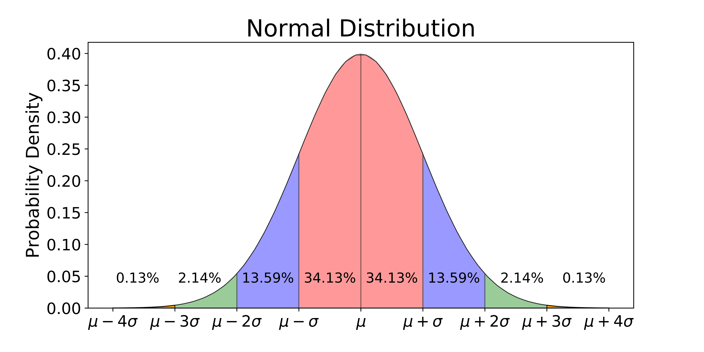
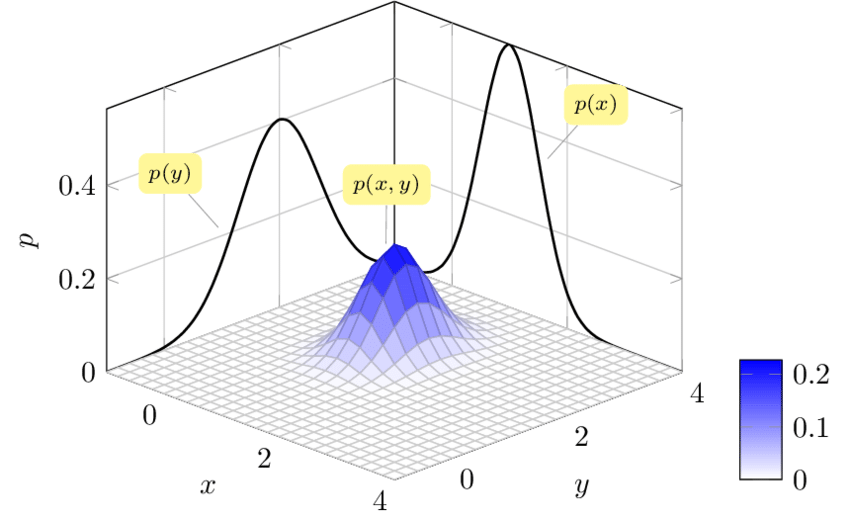
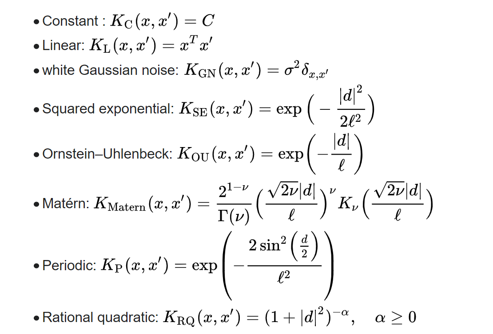
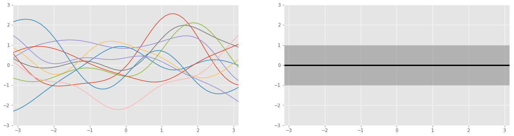
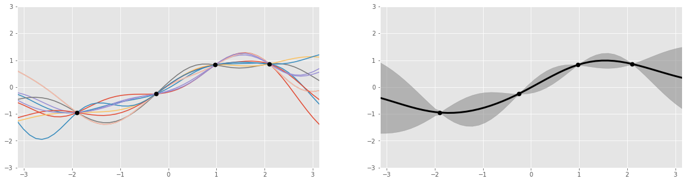

## Gaussian Process & GP Regression

使用**高斯过程**进行**贝叶斯推断**可以作为一种很强大的machine learning方法，既可用于回归又可用于分类。

**<font color=#FF8C00>本章学习路线：高斯分布 $\rightarrow$ 高斯过程 $\rightarrow$ 高斯过程回归 $\rightarrow$ 贝叶斯优化</font>**

### 高斯分布

#### 一元高斯分布

若随机变量X服从均值为 $\mu$ 和方差为 $\sigma$ 的概率分布，也叫做正态分布：
$$
X \sim N\left(\mu, \sigma^{2}\right)
$$
概率密度函数为：
$$
p(x)=\frac{1}{\sigma \sqrt{2 \pi}} \exp \left(-\frac{(x-\mu)^{2}}{2 \sigma^{2}}\right)
$$
图像就是我们熟知的那样：



#### 二元高斯分布

若两个随机变量 X, Y 分别服从均值为 $\boldsymbol{\mu}=(\mu_X, \mu_Y)^T$，方差为 $\boldsymbol{\sigma}=(\sigma_X,\sigma_Y)^T$的联合概率分布
$$
(X,Y)\sim \mathcal{N}(\boldsymbol{\mu}, \boldsymbol{\sigma})
$$
概率密度函数为：
$$
p(x, y)=\dfrac{1}{2 \pi \sigma_{X} \sigma_{Y} \sqrt{1-\rho^{2}}} \exp \left[-\frac{1}{2\left(1-\rho^{2}\right)}\left(\frac{\left(x-\mu_{X}\right)^{2}}{\sigma_{X}^{2}}+\frac{\left(y-\mu_{Y}\right)^{2}}{\sigma_{Y}^{2}}-\frac{2 \rho\left(x-\mu_{X}\right)\left(y-\mu_{X}\right)}{\sigma_{X} \sigma_{Y}}\right)\right]
$$
参数突然变多有没有，$\rho$是X, Y之间的相关系数，二者的协方差矩阵为：
$$
\boldsymbol{\Sigma}=\left(\begin{array}{cc}
\sigma_{X}^{2} & \rho \sigma_{X} \sigma_{Y} \\
\rho \sigma_{X} \sigma_{Y} & \sigma_{Y}^{2}
\end{array}\right)
$$
图像如下：



#### 多元高斯分布

从二元高斯延伸到多元（多变量）

N维随机变量 $\mathbf X=\left[X_{1}, \ldots, X_{N}\right]^{T}$，均值为 $\boldsymbol \mu=[\mu_1, \dots,\mu_N]^T$，协方差矩阵为 $\boldsymbol \Sigma$：
$$
\mathbf X\sim\mathcal{N}(\boldsymbol \mu, \boldsymbol \Sigma)
$$
概率密度函数为：
$$
f_{\mathbf{x}}\left(x_{1}, \ldots, x_{k}\right)=\frac{1}{\sqrt{(2 \pi)^{k}|\mathbf{\Sigma}|}} \exp \left(-\frac{1}{2}(\mathbf{x}-\boldsymbol{\mu})^{\mathrm{T}} \mathbf{\Sigma}^{-1}(\mathbf{x}-\boldsymbol{\mu})\right)
$$

> 自己试着反推一下二元高斯分布公式，是不是一样的？

至于多元高斯分布的图像，作为**低等的三维人**，我们画不出，只能看看二元的图像畅想一下。


### 高斯过程

> 在[概率论](https://zh.wikipedia.org/wiki/概率论)和[统计学](https://zh.wikipedia.org/wiki/统计学)中，**高斯过程**（英语：**Gaussian process**）是[观测值](https://zh.wikipedia.org/wiki/随机变量)出现在一个连续域（例如时间或空间）的[随机过程](https://zh.wikipedia.org/wiki/随机过程)。在高斯过程中，连续输入空间中每个点都是与一个[正态分布](https://zh.wikipedia.org/wiki/正态分布)的[随机变量](https://zh.wikipedia.org/wiki/随机变量)相关联。
>
> 这些随机变量的每个有限集合都有一个[多元正态分布](https://zh.wikipedia.org/wiki/多元正态分布)，换句话说他们的任意有限[线性组合](https://zh.wikipedia.org/wiki/线性组合)是一个正态分布。高斯过程的分布是所有那些（无限多个）随机变量的联合分布，正因如此，它是连续域（例如时间或空间）上[函数](https://zh.wikipedia.org/wiki/函数)的分布。

#### 时间空间连续域？这都是些啥？高斯分布和高斯过程什么关系？

看到这个文章的例子写的很好 [什么是Gaussian process? —— 说说高斯过程与高斯分布的关系](https://zhuanlan.zhihu.com/p/27555501)

> 将高斯过程类比为**人生**，人生的每一时刻每一事件都可看作一个**随机变量**，每一个这样的随机变量都有其可能性，我们假设其符合**高斯分布**。既有很多确定的东西，确定的是mean和kernel，如你的人生中你起点决定的你人生的大致范围，又有极大地不确定性，本质还是随机变量的整体，就像你可以凭借自身的努力改变很多东西。这就构成了人生之旅（高斯过程）。

我们也可以从时空的角度来看：

从**一元高斯分布**到**多元高斯分布**只是相当于空间维度的增加，从**高斯分布**到**高斯过程**是量变到质变的过程，相当于引入了时间维度。

从机器学习的角度来看：

**多元高斯分布**是多个特征，**高斯过程**是样本序列。

#### 我们数学一点：

定义 $\mathbf X=\{\mathbf X_t\}_{t\in T}$ 为高斯过程，其中每一个子集都是一个多元正态分布：
$$
\mathbf X_t\sim\mathcal{N}(\boldsymbol \mu_t, \boldsymbol \Sigma_t)
$$

$$
\begin{aligned}
&\mu_t=\mathrm{E}\left(\mathbf X_t\right), \quad t \in T\\
&\Sigma_{\left(t_{1}, t_{2}\right)}=\kappa\left(X_{t_{1}}, X_{t_{2}}\right), \quad t_{1}, t_{2} \in T
\end{aligned}
$$

整体的高斯过程可以写作：
$$
\mathbf X\sim\mathcal{GP}(\boldsymbol \mu, \boldsymbol \Sigma)
$$

协方差矩阵 $\boldsymbol\Sigma$ 用于衡量**特征之间**的关系，这种关系可以使用**核函数kernel**来模拟。

#### 核函数

Kernel是描述点和点之间关系的，



SE核(Squared exponential)就是常用的**高斯核**(径向基函数)。

```python
import numpy as np

def gaussian_kernel(x1, x2, l=1.0, sigma_f=1.0):
    """Easy to understand but inefficient."""
    m, n = x1.shape[0], x2.shape[0]
    dist_matrix = np.zeros((m, n), dtype=float)
    for i in range(m):
        for j in range(n):
            dist_matrix[i][j] = np.sum((x1[i] - x2[j]) ** 2)
    return sigma_f ** 2 * np.exp(- 0.5 / l ** 2 * dist_matrix)

def gaussian_kernel_vectorization(x1, x2, l=1.0, sigma_f=1.0):
    """More efficient approach."""
    dist_matrix = np.sum(x1**2, 1).reshape(-1, 1) + np.sum(x2**2, 1) - 2 * np.dot(x1, x2.T)
    return sigma_f ** 2 * np.exp(-0.5 / l ** 2 * dist_matrix)

x = np.array([700, 800, 1029]).reshape(-1, 1)
print(gaussian_kernel_vectorization(x, x, l=500, sigma=10))
```

图像和差异见 [高斯回归过程核函数（RBF，Matern，RationalQuadratic，ExpSineSquared，DotProduct）](https://blog.csdn.net/emdsh/article/details/103574386) 以及 [scikit 官方文档](https://scikit-learn.org/stable/auto_examples/gaussian_process/plot_gpr_prior_posterior.html)


### 高斯过程回归

给定单变量的**训练数据**(training data)，回归问题旨在找到x(特征)与y(目标值)之间的**函数关系**，或者也可以叫做曲线拟合。


回想一下，**线性回归**是怎么做的？


**高斯过程回归**有什么不同呢？如第一章介绍的，为什么要用概率方法对机器人进行建模？因为要将uncertainty包含在模型中。


1. 像之前的**贝叶斯推断**一样，我们先有**先验**：

   

   - 左图黑线为高斯过程的均值(此处是零均值先验)，灰色区域为置信区间(两个标准差，这个后面讲)。
   - 右图五彩斑斓的线每一条代表一个**根据当前均值、协方差**的**函数采样**。

2. 再引入**训练数据**。

3. 根据贝叶斯推断，即可得到后验分布。



#### 我们数学一点：

1. 高斯过程的先验：
   $$
   f(\boldsymbol{x}) \sim \mathcal{N}\left(\boldsymbol{\mu}_{f}, K_{f f}\right)
   $$
   $\boldsymbol \mu_f$ 作为高斯过程的均值，$K_{ff}$ 作为协方差kernel

2. 观测到一些数据 $(\boldsymbol x^*, \boldsymbol y^*)$，并且假设 $\boldsymbol y^*$ 与 $f(\boldsymbol{x})$ 服从联合高斯分布：
   $$
   \left[\begin{array}{c}
   f(\boldsymbol{x}) \\
   \boldsymbol{y}^{*}
   \end{array}\right] \sim \mathcal{N}\left(\left[\begin{array}{c}
   \boldsymbol{\mu}_{\boldsymbol{f}} \\
   \boldsymbol{\mu}_{\boldsymbol{y}}
   \end{array}\right],\left[\begin{array}{cc}
   K_{f f} & K_{f y} \\
   K_{f y}^{T} & K_{y y}
   \end{array}\right]\right)
   $$
   其中 $K_{f f}=\kappa(\boldsymbol{x}, \boldsymbol{x}), \quad K_{f y}=\kappa\left(\boldsymbol{x}, \boldsymbol{x}^{*}\right), \quad K_{y y}=\kappa\left(\boldsymbol{x}^{*}, \boldsymbol{x}^{*}\right)$

3. 最后给出后验分布：
   $$
   f \sim \mathcal{N}\left(K_{f y}^{T} K_{f f}^{-1} \boldsymbol{y}+\boldsymbol{\mu}_{f}, K_{y y}-K_{f y}^{T} K_{f f}^{-1} K_{f y}\right)
   $$


#### Implement

```python
from scipy.optimize import minimize


class GPR:

    def __init__(self, optimize=True):
        self.is_fit = False
        self.train_X, self.train_y = None, None
        self.params = {"l": 0.5, "sigma_f": 0.2}
        self.optimize = optimize

    def fit(self, X, y):
        # store train data
        self.train_X = np.asarray(X)
        self.train_y = np.asarray(y)
        self.is_fit = True

    def predict(self, X):
        if not self.is_fit:
            print("GPR Model not fit yet.")
            return

        X = np.asarray(X)
        Kff = self.kernel(self.train_X, self.train_X)  # (N, N)
        Kyy = self.kernel(X, X)  # (k, k)
        Kfy = self.kernel(self.train_X, X)  # (N, k)
        Kff_inv = np.linalg.inv(Kff + 1e-8 * np.eye(len(self.train_X)))  # (N, N)
        
        mu = Kfy.T.dot(Kff_inv).dot(self.train_y)
        cov = Kyy - Kfy.T.dot(Kff_inv).dot(Kfy)
        return mu, cov

    def kernel(self, x1, x2):
        dist_matrix = np.sum(x1**2, 1).reshape(-1, 1) + np.sum(x2**2, 1) - 2 * np.dot(x1, x2.T)
        return self.params["sigma_f"] ** 2 * np.exp(-0.5 / self.params["l"] ** 2 * dist_matrix)
def y(x, noise_sigma=0.0):
    x = np.asarray(x)
    y = np.cos(x) + np.random.normal(0, noise_sigma, size=x.shape)
    return y.tolist()

train_X = np.array([3, 1, 4, 5, 9]).reshape(-1, 1)
train_y = y(train_X, noise_sigma=1e-4)
test_X = np.arange(0, 10, 0.1).reshape(-1, 1)

gpr = GPR()
gpr.fit(train_X, train_y)
mu, cov = gpr.predict(test_X)
test_y = mu.ravel()
uncertainty = 1.96 * np.sqrt(np.diag(cov))
plt.figure()
plt.title("l=%.2f sigma_f=%.2f" % (gpr.params["l"], gpr.params["sigma_f"]))
plt.fill_between(test_X.ravel(), test_y + uncertainty, test_y - uncertainty, alpha=0.1)
plt.plot(test_X, test_y, label="predict")
plt.scatter(train_X, train_y, label="train", c="red", marker="x")
plt.legend()
```


## Reference

1. [什么是Gaussian process? —— 说说高斯过程与高斯分布的关系](https://zhuanlan.zhihu.com/p/27555501)
2. [透彻理解高斯过程Gaussian Process (GP)](https://blog.csdn.net/paulfeng20171114/article/details/80276061)
3. [高斯过程 Gaussian Processes 原理、可视化及代码实现](https://zhuanlan.zhihu.com/p/75589452)