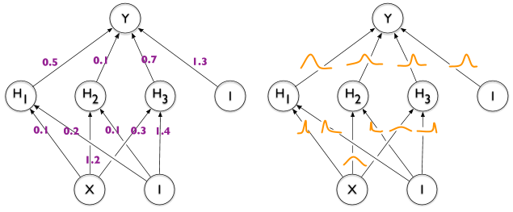
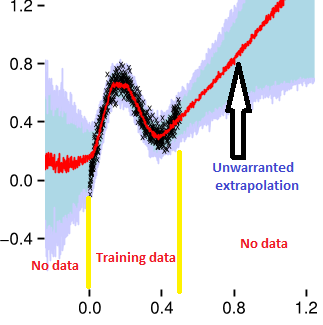

## PR Ⅳ Bayesian Neural Network

Probabilistic in Robotics Ⅳ: Bayesian Neural Network

贝叶斯方法后来也搭上了Deep learning的顺风车，摇身一变成了Bayesian Neural Network(BNN)。

> 注意：这叫做贝叶斯神经网络，不是贝叶斯图网络

之前一直在介绍贝叶斯方法的思想，但是没有介绍怎么求解。在第二章Bayesian Inference已经写过主要的求解方式有两种：

- 基于**采样**的**马尔可夫链蒙特卡罗**(Markov Chain Monte Carlo，简称MCMC)方法
- 基于**近似**的**变分推断**(Variational Inference，简称VI)方法

这两个还是放在后面，链接之后会放出。先介绍变分推断的特例，贝叶斯神经网络。

### 结构

左图是普通的全连接(deterministic)神经网络，右图是贝叶斯(probabilistic)神经网络。

#### 普通的全连接神经网络有什么缺点？

NN倾向于过度拟合它所看到的数据，但在训练集范围外的部分，就无能为力了。这个时候如果能对NN的预测有一个置信度的评价会很有帮助。

#### BNN怎么做？

贝叶斯推断和MAP的不同在于，贝叶斯推断求出参数 $\boldsymbol \omega$ 的分布，而MAP是求argmax。

**所以，直接把NN的网络权重改成分布** $\omega^{(i)} \sim \mathcal{N}\left(\mu_{\theta}, \sigma_{\theta}\right)$ ！

由于我们求得的是分布，基于 $\boldsymbol \omega$ 由输入 $\hat{\mathbf{x}}$ 预测 $\hat{\mathbf{y}}$ 的概率模型就变成了：
$$
P(\hat{\mathbf{y}} | \hat{\mathbf{x}})=\mathbb{E}_{P(\boldsymbol \omega | \mathcal{D})}[P(\hat{\mathbf{y}} | \hat{\mathbf{x}}, \boldsymbol \omega)]
$$
本来后验分布 $P(\boldsymbol \omega | \mathcal{D})$ 就很难解(intractable)了，再加上还要对每一个预测值求期望，所以不如使用神经网络来近似。定义一个概率分布 $q_\theta (\omega|\mathcal{D})$ 由此转化为优化问题：
$$
\theta^{*}=\arg \min _{\theta} K L\left[q_{\theta}(w | \mathcal{D}) \| p(w | \mathcal{D})\right]
$$
这里使用信息论中的KL散度来度量目标分布和预测分布之间的差异。

将式中的真实后验概率根据贝叶斯公式展开：
$$
\begin{aligned}
K L\left[q_{\theta}(w | \mathcal{D}) \| p(w | \mathcal{D})\right]&=\int q_{\theta}(w | \mathcal{D}) \frac{q_{\theta}(w | \mathcal{D})}{p(w | \mathcal{D})} d \theta\\&=\int q_{\theta}(w | \mathcal{D}) \frac{q_{\theta}(w | \mathcal{D}) p(\mathcal{D})}{p(w, \mathcal{D})} d \theta \\
&=\int q_{\theta}(w | \mathcal{D}) \log q_{\theta}(w | \mathcal{D}) d \theta+\int q_{\theta}(w | \mathcal{D}) \log p(\mathcal{D}) d \theta-\int q_{\theta}(w | \mathcal{D}) \log p(w, \mathcal{D}) d \theta\\
&=\int q_{\theta}(w | \mathcal{D}) \log q_{\theta}(w | \mathcal{D}) d \theta+\log p(\mathcal{D})-\int q_{\theta}(w | \mathcal{D}) \log \frac{p(w, \mathcal{D})}{q_{\theta}(w | \mathcal{D})} d \theta-\int q_{\theta}(w | \mathcal{D}) \log p(w, \mathcal{D}) d \theta
\end{aligned}
$$
**得到两个结论：**

- 由于 $KL>0$，因此 $\log p(\mathcal{D}) \geq \int q_{\theta}(w | \mathcal{D}) \log \frac{p(w, \mathcal{D})}{q_{\theta}(w | \mathcal{D})} d \theta$。前面是数据的似然，被称为Evidence. 因此后面的项被称为 Evidence lower bound (ELBO)。

- 设 Evidence 不变，**最小化KL等价于最大化 ELBO**：
  $$
  \theta^{o p t}=\arg \min _{\theta} K L=\arg \max _{\theta} E L B O
  $$
  其中：

$$
\begin{aligned}
E L B O&=\int q_{\theta}(w | \mathcal{D}) \log \frac{p(w, \mathcal{D})}{q_{\theta}(w | \mathcal{D})} d \theta\\
&=\int q_{\theta}(w | \mathcal{D}) \log \frac{p(\mathcal{D} | w) p(w)}{q_{\theta}(w | \mathcal{D})} d \theta \\
&=\int q_{\theta}(w | \mathcal{D}) \log p(\mathcal{D} | w) d \theta+\int q_{\theta}(w | \mathcal{D}) \log \frac{p(w)}{q_{\theta}(w | \mathcal{D})} d \theta \\
&=\mathbb{E}_{q_{\theta}(w | \mathcal{D})} \log p(\mathcal{D} | w)-K L\left[q_{\theta}(w | \mathcal{D}) \| p(w)\right]
\end{aligned}
$$

最终式子可解释为：最大化 ELBO = 最大化数据的极大似然 + 最小化 q 和先验 p 的距离。

上述式子需要通过采样MC来估计，**损失函数**写作：
$$
\begin{aligned}
\mathcal{F}(\mathcal{D}, \theta)&=KL[q_\theta(\omega|\mathcal{D})||p(\omega)]-E_{q(\omega|\mathcal{D})}logp(\mathcal{D}|\omega)\\
&=
\sum_{i=1}^{n}\log q_{\theta}\left(w^{(i)} | \mathcal{D}\right)-\log p\left(w^{(i)}\right)-\log p\left(\mathcal{D} | w^{(i)}\right)
\end{aligned}
$$

未完待续。。。

## Reference

1. [A Short Introduction to Bayesian Neural Networks](https://davidstutz.de/a-short-introduction-to-bayesian-neural-networks/)
2. [The very Basics of Bayesian Neural Networks](https://sanjaykthakur.com/2018/12/05/the-very-basics-of-bayesian-neural-networks/)
3. [Bayesian neural network introduction](https://zhuanlan.zhihu.com/p/79715409)
4. [Bayesian Neural Networks（贝叶斯神经网络）](https://zhuanlan.zhihu.com/p/106889896)

