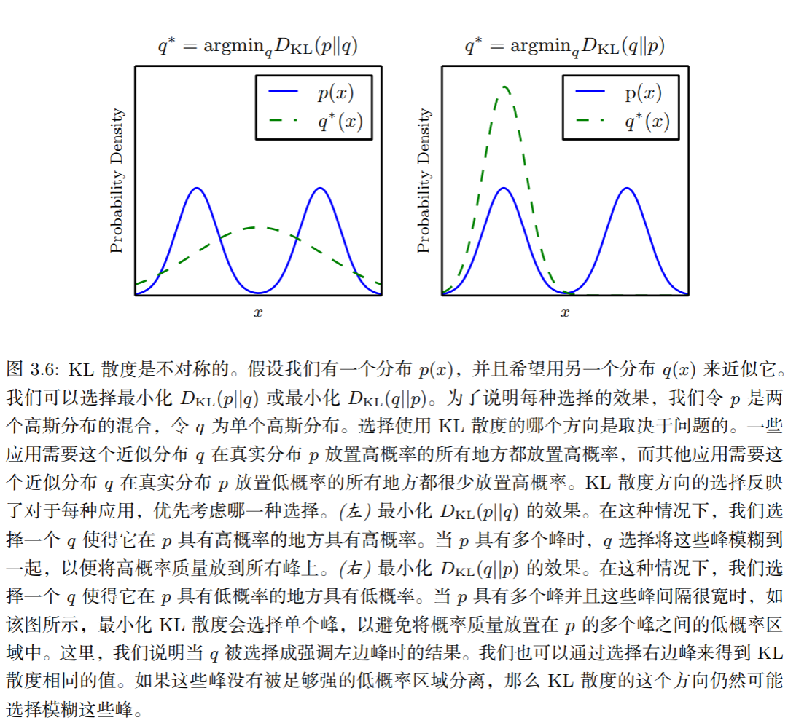

## 信息论 Ⅰ：熵、KL散度、交叉熵、JS散度及python实现

首先以离散分布为主开启这个系列的文章，因此文中的概率符号是离散分布所使用的**大写的概率质量函数**。

### 1 信息量

我们吃瓜的时候经常会感叹信息量很大，这说明肯定是越不寻常的事情信息量越大，如果只是“太阳东起西落”肯定不会引起吃瓜群众的关注。

花书中给出了信息**量化**的准则如下：


那么，一个事件 $\text{x}=x$ (注意区分这两个x)的**自信息**为：
$$
I(x)=-\log P(x)
$$

log 一般指自然对数，底数为e。很明显，事件发生的概率越大，越习以为常，负对数的自信息越小。这复合我们吃瓜时的心态。

### 2 熵 Entropy

熵在信息论里是对信息量的度量，在物理学与热力学中是对混乱度的度量，二者并不矛盾。

香农熵给出了**事件所属的整个分布的不确定性总量**量化：
$$
H(\text{x})=\mathbb E_{\text{x}\sim P}[I(x)]=-\mathbb E_{\text{x}\sim P}[\log P(x)]=\sum_x P(x)\log P(x)
$$

意味着**遵循这个分布的事件**，所产生的**期望信息总量**。通常这也意味着对此概率分布进行编码所需的最小比特（bit, 使用2为底的对数）或奈特数（nats, 使用e为底的对数）。

**特性：**

- 接近均匀分布的概率分布具有较高的熵
- 接近确定性的分布 (输出几 乎可以确定) 具有较低的熵

### 3 相对熵 (KL散度)

对于同一个随机变量 x，我们有两个分布 p(x), q(x)，可以使用KL散度来度量两个分布之间的差异（注意：这里是Q相对于P的分布）：
$$
\begin{aligned}
D_{KL}(P||Q)&=H(P,Q)-H(P)\\
&=\mathbb E_{\text{x}\sim P}[\log P(x)-\log Q(x)]\\
&=\sum_x P(x)\times (\log P(x)-\log Q(x))
\end{aligned}
$$

**特性：**

- 非负性：$D_{KL}=0$，当且仅当两个分布相同
- 不对称性：$D_{\mathrm{KL}}(P \| Q) \neq D_{\mathrm{KL}}(Q \| P)$



#### 3.1 离散分布的KL散度python实现

```python
import numpy as np
import scipy.stats

def KL_divergence(p,q):
    return scipy.stats.entropy(p, q)

p=np.asarray([0.65,0.25,0.07,0.03])
q=np.array([0.6,0.25,0.1,0.05])
print(KL_divergence(p, q)) # 0.011735745199107783
print(KL_divergence(q, p)) # 0.013183150978050884
print(KL_divergence(p, p)) # 0
```


#### 3.2 连续KL散度

#### 3.2.1 一元连续高斯分布的KL散度公式推导

从单变量/一元高斯分布的KL散度开始：

Let $p(x)=\mathcal{N}(\mu_1, \sigma_1), q(x)=\mathcal{N}(\mu_2, \sigma_2)$
$$
\begin{aligned}
K L(p, q) &=-\int p(x) \log q(x) d x+\int p(x) \log p(x) d x \\
&=-\int p(x) \log \frac{1}{\left(2 \pi \sigma_{2}^{2}\right)^{(1 / 2)}} e^{-\frac{\left(x-\mu_{2}\right)^{2}}{2 \sigma_{2}^{2}}} d x-\frac{1}{2}\left(1+\log 2 \pi \sigma_{1}^{2}\right)\\
&=\frac{1}{2} \log \left(2 \pi \sigma_{2}^{2}\right)-\int p(x) \log e^{-\frac{\left(x-\mu_{2}\right)^{2}}{2 \sigma_{2}^{2}}} d x-\frac{1}{2}\left(1+\log 2 \pi \sigma_{1}^{2}\right)\\
&=\frac{1}{2} \log \left(2 \pi \sigma_{2}^{2}\right)+\frac{\int p(x) x^{2} d x-\int p(x) 2 x \mu_{2} d x+\int p(x) \mu_{2}^{2} d x}{2 \sigma_{2}^{2}}-\frac{1}{2}\left(1+\log 2 \pi \sigma_{1}^{2}\right)\\
&=\frac{1}{2} \log \left(2 \pi \sigma_{2}^{2}\right)+\frac{\left\langle x^{2}\right\rangle-2\langle x\rangle \mu_{2}+\mu_{2}^{2}}{2 \sigma_{2}^{2}} -\frac{1}{2}\left(1+\log 2 \pi \sigma_{1}^{2}\right)\\
&=\frac{1}{2} \log \left(2 \pi \sigma_{2}^{2}\right)+\frac{\sigma_{1}^{2}+\left(\mu_{1}-\mu_{2}\right)^{2}}{2 \sigma_{2}^{2}}-\frac{1}{2}\left(1+\log 2 \pi \sigma_{1}^{2}\right) \\
&=\log \frac{\sigma_{2}}{\sigma_{1}}+\frac{\sigma_{1}^{2}+\left(\mu_{1}-\mu_{2}\right)^{2}}{2 \sigma_{2}^{2}}-\frac{1}{2}
\end{aligned}
$$
其中 $\langle \rangle$ 代表 p 分布下的期望，且 $var(x)=\langle x^2 \rangle - \langle x \rangle^2$
$$
\left\langle x^{2}\right\rangle=\sigma_{1}^{2}+\mu_{1}^{2}
$$
也可以参见 PRML 1.30

#### 3.2.2 一元连续高斯分布的KL散度python实现

```python
import numpy as np

def univar_continue_KL_divergence(p, q):
    return np.log(q[1] / p[1]) + (p[1] ** 2 + (p[0] - q[0]) ** 2) / (2 * q[1] ** 2) - 0.5

p = (mu1, sigma1) = 0.2, 0.1
q = (mu2, sigma2) = 3, 0.5
print(univar_continue_KL_divergence(p, q))  # 16.8094379124341
print(univar_continue_KL_divergence(q, p))  # 402.3905620875658
print(univar_continue_KL_divergence(p, p))  # 0.0
```


#### 3.2.3 多元连续高斯分布的KL散度公式推导

Let $p(x)=\mathcal{N}(\boldsymbol\mu_1, \boldsymbol\Sigma_1), q(x)=\mathcal{N}(\boldsymbol\mu_2, \boldsymbol\Sigma_2)$

提示一下，多元高斯长这样：
$$
N(x | u, \Sigma)=\frac{1}{(2 \pi)^{n / 2}|\Sigma|^{1 / 2}} \exp \left\{-\frac{1}{2}(x-u)^{T} \Sigma^{-1}(x-u)\right\}
$$
先写点基础知识，以下来自 [多变量高斯分布之间的KL散度（KL Divergence）](https://blog.csdn.net/wangpeng138375/article/details/78060753)

**矩阵的迹的性质：**

- $tr(αA+βB)=αtr(A)+βtr(B))$
- $tr(A) = tr({A^T})  $
- $tr(AB) = tr(BA)$
- $tr(ABC) = tr(CAB) = tr(BCA)$

**在推导公式过程中，使用到的一个重要的 trick 如下：**

对于列向量 $\lambda$ ，公式 ${\lambda ^T}A\lambda$ 的结果是一个标量，所以：  
$$
\lambda = tr({\lambda ^T}A\lambda ) = tr(A\lambda {\lambda ^T})
$$
**多变量分布中期望 E 与协方差 $\Sigma$ 的性质：**

- $E\left[ {x{x^T}} \right] = \Sigma + u{u^T}$  

证明：
$$
\begin{array}{l}
\Sigma &=E\left[(x-u)(x-u)^{T}\right] \\
&=E\left[x x^{T}-x u^{T}-u x^{T}+u u^{T}\right] \\
&=E\left[x x^{T}\right]-u u^{T}-u u^{T}+u u^{T} \\
&=E\left[x x^{T}\right]-u u^{T}
\end{array}
$$

- $E\left(x^{T} A x\right)=\operatorname{tr}(A \Sigma)+u^{T} A u$

证明：因为 $x^TAx$ 的结果是一个标量，利用前面提到的**trick**，可得：
$$
\begin{array}{l}
E\left(x^{T} A x\right) &=E\left[\operatorname{tr}\left(x^{T} A x\right)\right] \\
&=E\left[\operatorname{tr}\left(A x x^{T}\right)\right] \\
&=\operatorname{tr}\left[E\left(A x x^{T}\right)\right] \\
&=\operatorname{tr}\left[A E\left(x x^{T}\right)\right] \\
&=\operatorname{tr}\left[A\left(\Sigma+u u^{T}\right)\right] \\
&=\operatorname{tr}(A \Sigma)+\operatorname{tr}\left(A u u^{T}\right) \\
&=\operatorname{tr}(A \Sigma)+\operatorname{tr}\left(u^{T} A u\right) \\
&=\operatorname{tr}(A \Sigma)+u^{T} A u
\end{array}
$$

下面开始推导：

$$
\begin{array}{l}
D_{K L}\left(p \| q\right) 
&=E_{p}\left[\log p-\log q\right] \\
&=\frac{1}{2} E_{p}\left[-\log \left|\Sigma_{1}\right|-\left(x-u_{1}\right)^{T} \Sigma_{1}^{-1}\left(x-u_{1}\right)+\log \left|\Sigma_{2}\right|+\left(x-u_{2}\right)^{T} \Sigma_{2}^{-1}\left(x-u_{2}\right)\right] \\
&=\frac{1}{2} \log \frac{\left|\Sigma_{2}\right|}{\left|\Sigma_{1}\right|}+\frac{1}{2} E_{p}\left[-\left(x-u_{1}\right)^{T} \Sigma_{1}^{-1}\left(x-u_{1}\right)+\left(x-u_{2}\right)^{T} \Sigma_{2}^{-1}\left(x-u_{2}\right)\right] \\
&=\frac{1}{2} \log \frac{\left|\Sigma_{2}\right|}{\left|\Sigma_{1}\right|}+\frac{1}{2} E_{p}\left\{-t r\left[\Sigma_{1}^{-1}\left(x-u_{1}\right)\left(x-u_{1}\right)^{T}\right]+t r\left[\Sigma_{2}^{-1}\left(x-u_{2}\right)\left(x-u_{2}\right)^{T}\right]\right\} \\
&=\frac{1}{2} \log \frac{\left|\Sigma_{2}\right|}{\left|\Sigma_{1}\right|}+\frac{1}{2} E_{p}\left\{-\operatorname{tr}\left[\Sigma_{1}^{-1}\left(x-u_{1}\right)\left(x-u_{1}\right)^{T}\right]\right\}+\frac{1}{2} E_{p}\left\{t r\left[\Sigma_{2}^{-1}\left(x-u_{2}\right)\left(x-u_{2}\right)^{T}\right]\right\} \\
&=\frac{1}{2} \log \frac{\left|\Sigma_{2}\right|}{\left|\Sigma_{1}\right|}-\frac{1}{2} \operatorname{tr}\left\{E_{p}\left[\Sigma_{1}^{-1}\left(x-u_{1}\right)\left(x-u_{1}\right)^{T}\right]\right\}+\frac{1}{2} \operatorname{tr}\left\{E_{p}\left[\Sigma_{2}^{-1}\left(x-u_{2}\right)\left(x-u_{2}\right)^{T}\right]\right\} \\
&=\frac{1}{2} \log \frac{\left|\Sigma_{2}\right|}{\left|\Sigma_{1}\right|}-\frac{1}{2} \operatorname{tr}\left\{\Sigma_{1}^{-1} E_{p}\left[\left(x-u_{1}\right)\left(x-u_{1}\right)^{T}\right]\right\}+\frac{1}{2} \operatorname{tr}\left\{E_{p}\left[\Sigma_{2}^{-1}\left(x x^{T}-u_{2} x^{T}-x u_{2}^{T}+u_{2} u_{2}^{T}\right)\right]\right\} \\
&=\frac{1}{2} \log \frac{\left|\Sigma_{2}\right|}{\left|\Sigma_{1}\right|}-\frac{1}{2} \operatorname{tr}\left\{\Sigma_{1}^{-1} \Sigma_{1}\right\}+\frac{1}{2} \operatorname{tr}\left\{\Sigma_{2}^{-1} E_{p}\left(x x^{T}-u_{2} x^{T}-x u_{2}^{T}+u_{2} u_{2}^{T}\right)\right\} \\
&=\frac{1}{2} \log \frac{\left|\Sigma_{2}\right|}{\left|\Sigma_{1}\right|}-\frac{1}{2} n+\frac{1}{2} \operatorname{tr}\left\{\Sigma_{2}^{-1}\left(\Sigma_{1}+u_{1} u_{1}^{T}-u_{2} u_{1}^{T}-u_{1} u_{2}^{T}+u_{2} u_{2}^{T}\right)\right\}--\text { 这里利用了 } E\left[x x^{T}\right]=\Sigma+u u^{T} \\
&=\frac{1}{2}\left\{\log \frac{\left|\Sigma_{2}\right|}{\left|\Sigma_{1}\right|}-n+\operatorname{tr}\left(\Sigma_{2}^{-1} \Sigma_{1}\right)+\operatorname{tr}\left\{\Sigma_{2}^{-1}\left(u_{1} u_{1}^{T}-u_{2} u_{1}^{T}-u_{1} u_{2}^{T}+u_{2} u_{2}^{T}\right)\right\}\right\} \\
&=\frac{1}{2}\left\{\log \frac{\left|\Sigma_{2}\right|}{\left|\Sigma_{1}\right|}-n+\operatorname{tr}\left(\Sigma_{2}^{-1} \Sigma_{1}\right)+\operatorname{tr}\left\{\Sigma_{2}^{-1} u_{1} u_{1}^{T}-\Sigma_{2}^{-1} u_{2} u_{1}^{T}-\Sigma_{2}^{-1} u_{1} u_{2}^{T}+\Sigma_{2}^{-1} u_{2} u_{2}^{T}\right\}\right\} \\
&=\frac{1}{2}\left\{\log \frac{\left|\Sigma_{2}\right|}{\left|\Sigma_{1}\right|}-n+\operatorname{tr}\left(\Sigma_{2}^{-1} \Sigma_{1}\right)+u_{1}^{T} \Sigma_{2}^{-1} u_{1}-2 u_{1}^{T} \Sigma_{2}^{-1} u_{2}+u_{2}^{T} \Sigma_{2}^{-1} u_{2}\right\} --\text { 这里利用了 } \lambda = tr({\lambda ^T}A\lambda ) = tr(A\lambda {\lambda ^T})\\
&=\frac{1}{2}\left\{\log \frac{\left|\Sigma_{2}\right|}{\left|\Sigma_{1}\right|}-n+\operatorname{tr}\left(\Sigma_{2}^{-1} \Sigma_{1}\right)+\left(u_{2}-u_{1}\right)^{T} \Sigma_{2}^{-1}\left(u_{2}-u_{1}\right)\right\}
\end{array}
$$

其中 $n=tr(I_d)$ 即矩阵阶数、高斯分布的维度

也可以参见 PRML 2.13


#### 3.2.4 多元连续高斯分布的KL散度python实现

```python
import numpy as np
from scipy.linalg import logm

def multivar_continue_KL_divergence(p, q):
    a = logm(q[1]) - logm(p[1])
    b = np.trace(np.dot(np.linalg.inv(q[1]), p[1]))
    c = np.transpose(q[0] - p[0]) * np.linalg.inv(q[1]) * (q[0] - p[0])
    n = p[1].shape[0]
    return 0.5 * (a - n + b + c)

p = (mu1, sigma1) = np.array([0.2, 0.1, 0.5, 0.4]), np.diag([0.14, 0.52, 0.2, 0.4])
q = (mu2, sigma2) = np.array([0.3, 0.6, -0.5, -0.8]), np.diag([0.24, 0.02, 0.31, 0.51])
print(multivar_continue_KL_divergence(p, q))
'''
[[12.29673576 12.00640417 12.00640417 12.00640417]
 [12.00640417 16.62735591 12.00640417 12.00640417]
 [12.00640417 12.00640417 13.83843487 12.00640417]
 [12.00640417 12.00640417 12.00640417 13.53964197]]
'''
print(multivar_continue_KL_divergence(q, p))
'''
[[0.05508966 0.28887363 0.28887363 0.28887363]
 [0.28887363 2.15830651 0.28887363 0.28887363]
 [0.28887363 0.28887363 2.56974616 0.28887363]
 [0.28887363 0.28887363 0.28887363 1.96740054]]
'''
print(multivar_continue_KL_divergence(p, p))
'''
[[0. 0. 0. 0.]
 [0. 0. 0. 0.]
 [0. 0. 0. 0.]
 [0. 0. 0. 0.]]
 '''
```


### 4 交叉熵

$$
\begin{aligned}
H(P,Q)&=H(P)+D_{KL}(P||Q)\\
&=-\mathbb E_{\text{x}\sim P}\log Q(x)\\
&=-\sum_x P(x)\log Q(x)
\end{aligned}
$$

由于 $H(P)$ 与 Q 无关，所以最小化Q与P之间的交叉熵，就等价于最小化KL散度。

#### 4.1 离散分布的交叉熵python实现

```python
import numpy as np
 
def cross_entropy(Y, P):
    Y = np.float_(Y)
    P = np.float_(P)
    return -np.sum(Y * np.log(P) + (1 - Y) * np.log(1 - P))

p = np.asarray([0.65, 0.25, 0.07, 0.03])
q = np.array([0.6, 0.25, 0.1, 0.05])
print(cross_entropy(p, q))  # 1.6138662560565618
print(cross_entropy(q, p))  # 1.7762375132948538
```


#### 5  JS散度

与KL类似，JS散度也是度量两个分布的相似性，越相似，JS散度越小。
$$
D_{JS}\left(p \| q\right)=\frac{1}{2} D_{KL}\left(p \| \frac{p+q}{2}\right)+\frac{1}{2} D_{KL}\left(q \| \frac{p+q}{2}\right)
$$
**特性：**

- JS散度的取值在0-1之间，完全相同为0
- JS散度是对称的

#### 5.1 离散分布的JS散度python实现

```python
import numpy as np
import scipy.stats
def JS_divergence(p,q):
    M=(p+q)/2
    return 0.5*scipy.stats.entropy(p,M)+0.5*scipy.stats.entropy(q, M)

p=np.asarray([0.65,0.25,0.07,0.03])
q=np.array([0.6,0.25,0.1,0.05])
q2=np.array([0.1,0.2,0.3,0.4])

print(JS_divergence(p, q))  # 0.003093977084273652
print(JS_divergence(p, q2)) # 0.24719159952098618
print(JS_divergence(p, p)) # 0.0
```


### Reference

1. [KL divergence between two univariate Gaussians](https://stats.stackexchange.com/questions/7440/kl-divergence-between-two-univariate-gaussians)