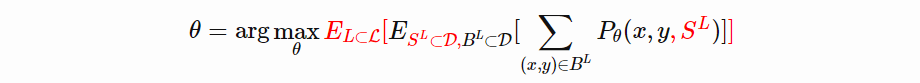
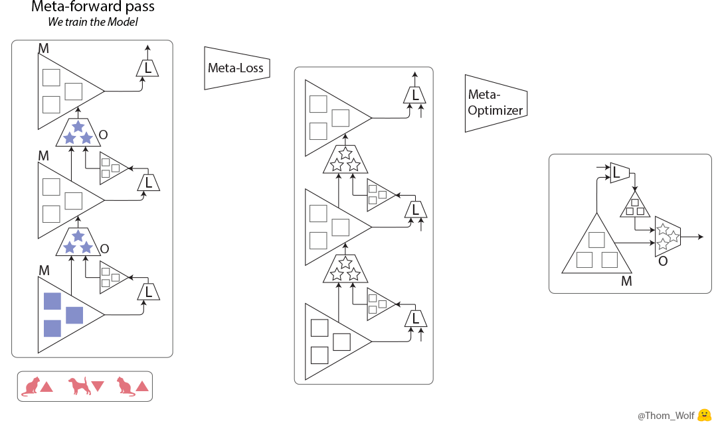
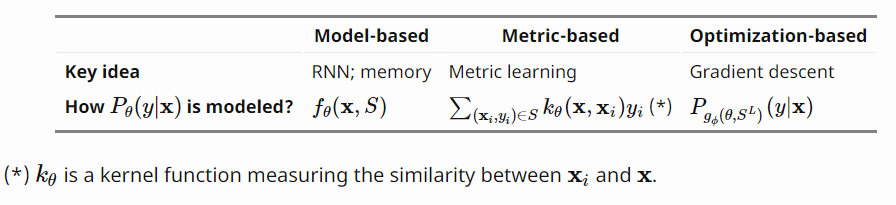
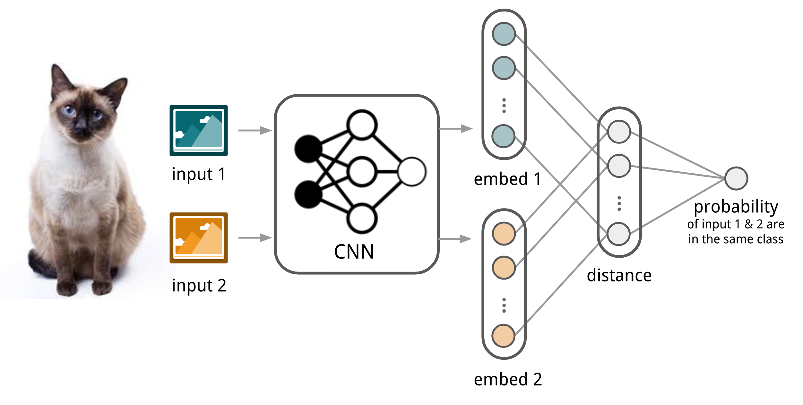
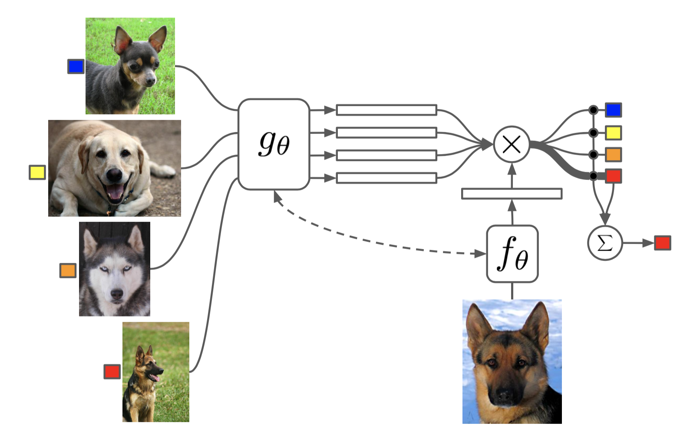
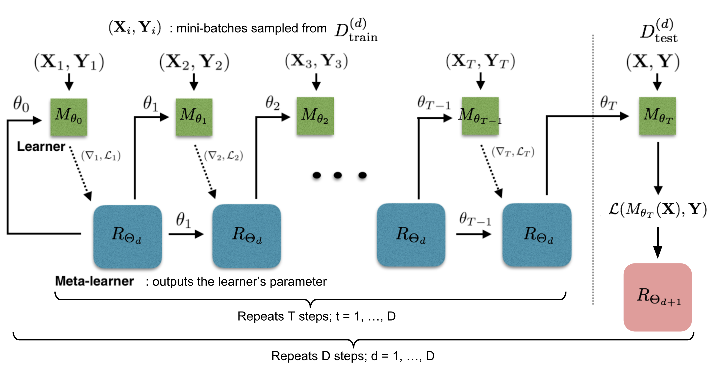
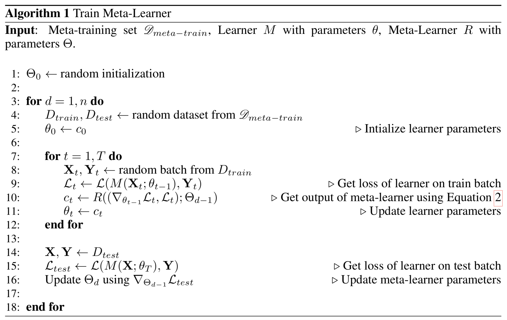

# Meta Learning: An Introduction 

> Meta-learning, also known as “learning to learn”, intends to design models that can learn new skills or adapt to new environments rapidly with a few training examples. There are three common approaches: 
>
> 1) learn an efficient distance metric (metric-based); 
>
> 2) use (recurrent) network with external or internal memory (model-based); 
>
> 3) optimize the model parameters explicitly for fast learning (optimization-based).

Meta learning的思想源于人类对自身学习过程的理解。传统机器学习算法在训练过程中需要feed大量的样本，并且当任务发生改变时，模型需要重新训练。然而对于人类来说，我们可以很快的理解新知识，例如会骑自行车的人可以很快上手摩托车，甚至不需要示范。Meta learning要解决的就是**学习一个可以快速学习的模型**，这就是所谓的'**learning to learn**'。

传统机器学习无外乎学会分类、回归等，是**学会执行任务**（输入到输出的映射），可以视作**low-level**的学习。而 Meta learning 则设想能够**掌握学习方法**，使各种任务都能融会贯通，这就是**high-level**的学习了。

因此，Meta learning 并不局限于哪一种机器学习方法，也不局限于任务，而是一种high-level learning的思想，因此可以用到supervised learning, reinforcement learning等中：

- 即使仅在没有猫的图片数据集中学习，也可以在观察了少数的猫之后学会识别图中的猫
- 游戏AI可以很快的学会玩新游戏
- 即使仅在平坦的环境中进行训练，微型机器人也可以在测试过程中在上坡表面完成所需的任务。

In this post, I focus on the case when each desired task is a supervised learning problem like image classification. And I will another post for meta-reinforcement learning and its applications in robotics. 

## Definition

### Task as sample

Meta learning之所以如此强大，得益于其核心思想是将一个数据集作为一个样本，即将task作为sample。在一个task数据集 $\mathcal{D}=\{(\mathbb{x}_i,y_i)\}$ 中，数据又划分为两部分: support set $S$ 和 prediction set/query set $B$，$\mathcal{D}=\langle S,B\rangle$。

以图像分类为例，对于一个 *K-shot N-class classification* task 来说，$S$ 包含N个类别的K个数据。

那么该怎么训练这个模型呢？

1. 在标签集 $\mathcal{L}$ 中取子集 $L$, 将对应的数据分为 $S^L, B^L$，这两部分构成 $\mathcal{D}$
2. $S^L$ 作为 part of model input
3. 用 mini-batch 的 $B^L$ 计算 loss and update the model parameters through backpropagation

上式中，黑色部分是supervised learning的基本公式，红色部分就是 Meta learning 的特点。与传统的pre-trained方法不同的是，pre-trained是要在子任务中进行fine-tuning，而 meta learning 是要胜任大部分的任务。

### Learner and Meta-Learner

In addition, another popular view of meta learning decomposes the model update into two stages:

1. 一个被称作'learner'的传统classifier $f_\theta$ 学习一个给定的task
2. 同时，一个optimizer $g_\phi$ 学习如何更新如何通过 $S$ 更新 learner 的参数

在更新过程中，需要同时更新 $\theta, \phi$.

关于这方面的 meta learning，在 [Ref.2](https://medium.com/huggingface/from-zero-to-research-an-introduction-to-meta-learning-8e16e677f78a) 中有很详细的解释，并且作者很用心的绘制了精美的动图。

### Common Approaches

不同的 meta learning 实现方式主要区别在如何对 $P_{\theta}(y|\mathbb{x})$ 进行建模

## Metric-Based

类似于最近邻算法（kNN分类和k-means聚类）以及 [kernel density estimation](https://en.wikipedia.org/wiki/Kernel_density_estimation). The predicted probability over a set of known labels $y$ is a weighted sum of labels of support set samples. The weight is generated by a kernel function $k_\theta$, measuring the similarity between two data samples.
$$
P_{\theta}(y | \mathbf{x}, S)=\sum_{\left(\mathbf{x}_{i}, y_{i}\right) \in S} k_{\theta}\left(\mathbf{x}, \mathbf{x}_{i}\right) y_{i}
$$
因此，这种方法的关键在于学习一个好的**核函数来度量样本之间的关系**。

下面介绍几种**核函数的设计方法**。

### Convolutional Siamese Neural Network

 [Siamese neural network](http://www.cs.toronto.edu/~rsalakhu/papers/oneshot1.pdf) 将两个 input 分别进行 embed (比较好奇这里为什么要使用了两个twin embed NN)，再汇总到一个度量映射网络 to judge whether they are in the same class.

1. 学习 embedding function $f_\theta$
2. 两个 embedding 的L1距离（也可以是其他的度量） $L_1=\left|f_{\theta}\left(\mathbf{x}_{i}\right)-f_{\theta}\left(\mathbf{x}_{j}\right)\right|$ 
3. 通过一个NN将距离映射到两个属于同一class的概率 $p\left(\mathbf{x}_{i}, \mathbf{x}_{j}\right)=\sigma\left(\mathbf{W}\left|f_{\theta}\left(\mathbf{x}_{i}\right)-f_{\theta}\left(\mathbf{x}_{j}\right)\right|\right)$
4. 由于label是二元的，因此loss采用交叉熵 $\mathcal{L}(B)=\sum_{\left(\mathbf{x}_{i}, \mathbf{x}_{i}, y_{i}, y_{j}\right) \in B} \mathbf{1}_{y_{i}=y_{j}} \log p\left(\mathbf{x}_{i}, \mathbf{x}_{j}\right)+\left(1-\mathbf{1}_{y_{i}=y_{j}}\right) \log \left(1-p\left(\mathbf{x}_{i}, \mathbf{x}_{j}\right)\right)$
5. 对给定的 support set $S$ 和测试图 $\mathbb{x}$ (也就是prediction set), 预测结果为：$\hat{c}_{S}(\mathbf{x})=c\left(\arg \max _{\mathbf{x}_{i} \in S} P\left(\mathbf{x}, \mathbf{x}_{i}\right)\right)$，即将与其度量最近的support set中的数据的类别作为测试图的类别

这种方法是不是听起来和最近邻也没什么区别？其实关键在于学习得到的embedding，我们期望它可以泛化到**未知**的类别中，这就是它比pre-trained的优势所在。

### Matching Networks

Matching Networks最早由 [Vinyals et al., 2016](http://papers.nips.cc/paper/6385-matching-networks-for-one-shot-learning.pdf) 提出

$$
c_{S}(\mathbf{x})=P(y | \mathbf{x}, S)=\sum_{i=1}^{k} a\left(\mathbf{x}, \mathbf{x}_{i}\right) y_{i}, \text { where } S=\left\{\left(\mathbf{x}_{i}, y_{i}\right)\right\}_{i=1}^{k}
$$
与Siamese Neural Network不同，Matching Networks中的核函数 $a(\mathbb{x}, \mathbb{x}_i)$ 采用了Attention Mechanism形式: 
$$
a\left(\mathbf{x}, \mathbf{x}_{i}\right)=\frac{\exp \left(\operatorname{cosine}\left(f(\mathbf{x}), g\left(\mathbf{x}_{i}\right)\right)\right.}{\sum_{j=1}^{k} \exp \left(\operatorname{cosine}\left(f(\mathbf{x}), g\left(\mathbf{x}_{j}\right)\right)\right.}
$$

- cosine 表示两个特征的cosine距离
- $f,g$ 为图中的 $f_\theta, g_\theta$ 特征提取器，这是matching networks的**核心部分**

#### Support set特征提取器 $g_\theta(\mathbb{x}_i, S)$

**核心思想：**support set 中 $\mathbb{x}$ 的特征不止与其本身有关，还应该与support set中其他的数据有关

因此，作者将无序的集合看成有序的，利用**双向LSTM**对 $g_\theta(\mathbb{x}_i, S)$ 进行建模
$$
\begin{aligned}
&\vec{h}_{i}, \vec{c}_{i}=\operatorname{LSTM}\left(g^{\prime}\left(x_{i}\right), \vec{h}_{i-1}, \vec{c}_{i-1}\right)\\
&\overleftarrow{h}_{i}, \overleftarrow{c}_{i}=\operatorname{LSTM}\left(g^{\prime}\left(x_{i}\right), \overleftarrow{h}_{i+1}, \overleftarrow{c}_{i+1}\right)\\
&g\left(x_{i}\right)=\vec{h}_{i}+\overleftarrow{h}_{i}+g^{\prime}\left(x_{i}\right), i=1,2 \ldots k
\end{aligned}
$$

> 其中`g'(x)`, `h(i-1)`, `c(i-1)`, `h(i+1)`, `c(i+1) `分别表示原始状态，上一时刻的隐含状态，上一时刻的记忆状态，下一时刻的隐含状态，下一时刻的记忆状态；

#### Prediction set特征提取器 $f_\theta(\mathbb{x}, S)$

通过**注意力LSTM**获取Prediction set的特征
$$
\begin{aligned}
\hat{h}_{k}, c_{k} &=\operatorname{LSTM}\left(f^{\prime}(\hat{x}),\left[h_{k-1}, r_{k-1}\right], c_{k-1}\right) \\
h_{k} &=\hat{h}_{k}+f^{\prime}(\hat{x}) \\
r_{k-1} &=\sum_{i=1}^{|S|} a\left(h_{k-1}, g\left(x_{i}\right)\right) g\left(x_{i}\right) \\
a\left(h_{k-1}, g\left(x_{i}\right)\right) &=e^{h_{k-1}^{T} g\left(x_{i}\right)} / \sum_{j=1}^{|S|} e^{h_{k-1}^{T} g\left(x_{j}\right)}
\end{aligned}
$$

1. Prediction set先经过一个basic NN (such as CNN)，获取基本特征 $f'(\mathbb{x})$
2. 将Support set的read attention vector $r_{k-1}$ 作为一部分隐变量进入LSTM训练
3. 经过K步后，$f_\theta(\mathbb{x},S)=h_K$

这种方法叫做'Full Contextual Embeddings (FCE)'。有趣的是，它在复杂任务中表现的比简单任务要好。

Matching Networks进一步完善了训练和测试的条件应该匹配的思想，训练过程被设计成能够模拟测试过程的推理。

### Relation Network

**Relation Network (RN)** ([Sung et al., 2018](http://openaccess.thecvf.com/content_cvpr_2018/papers_backup/Sung_Learning_to_Compare_CVPR_2018_paper.pdf))类似于Siamese Neural Network，主要有以下几点不同：

1. 使用CNN训练的classifier $g_\phi$ 代替L1距离，$r_{ij}=g_\phi([\mathbb{x}_i,\mathbb{x}_j]), [.,.]$代表concatention
2. Loss function使用了MSE取代交叉熵，这是因为RN更注重样本之间的relationship，更类似于回归问题，而不是Siamese Neural Network那样的分类问题

### Prototypical Networks

**Prototypical Networks** ([Snell, Swersky & Zemel, 2017](http://papers.nips.cc/paper/6996-prototypical-networks-for-few-shot-learning.pdf)) 使用了**聚类**的思想，将每一个input编码成M维特征向量。对于同一类别中的所有特征向量，求出一个 *prototype feature* (也就是mean vector)

Prediction set的属于哪一个类别的概率就是根据其与各个class之间距离的倒数来定义的
$$
P(y=c | \mathbf{x})=\operatorname{softmax}\left(-d_{\varphi}\left(f_{\theta}(\mathbf{x}), \mathbf{v}_{c}\right)\right)=\frac{\exp \left(-d_{\varphi}\left(f_{\theta}(\mathbf{x}), \mathbf{v}_{c}\right)\right)}{\sum_{c^{\prime} \in \mathcal{C}} \exp \left(-d_{\varphi}\left(f_{\theta}(\mathbf{x}), \mathbf{v}_{c^{\prime}}\right)\right)}
$$
至于距离的度量方法可以自己选取，文中选取的是欧氏距离。

Loss function采用 negative log-likelihood: $\mathcal{L}(\theta)=-\log P_{\theta}(y=c | \mathbf{x})$

## Model-Based

Model-Based与Metric-Based方法的区别在于不对 $P_\theta(y|\mathbb{x})$ 的形式做假设，而是依靠一个可以快速学习的model。model能够快速更新参数，得益于其内部结构，或由另一个元学习器模型来控制。也就是说，Model-Based方法是在寻找最优架构。

### Memory-Augmented Neural Networks(MANN)

## Optimization-Based 

我们知道传统的深度学习网络参数的更新，都是通过gradient backpropagation实现的。但是这种方式并不适用于少样本的情况（样本少，梯度方向无法表征总体梯度方向，易发散）。因此若想在少样本的情况下依然能够很好的学习，就需要在optimization方式上进行改变。这就是Optimization-Based meta-learning(就是上文所说的Learner and Meta-Learner)的思路。

### LSTM Meta-Learner

- Pytorch Code: https://github.com/markdtw/meta-learning-lstm-pytorch

不同于传统的公式化更新，Optimization 也可以作为Model进行精细化建模，[Ravi & Larochelle (2017)](https://openreview.net/pdf?id=rJY0-Kcll)将optimization model命名为 'Meta-learner'，而原来的model叫做 'Learner'。

Let’s denote the learner model as $M_\theta$ parameterized by $\theta$, the meta-learner as $R_\Theta$ with parameters $\Theta$, and the loss function $\mathcal{L}$.

#### 为什么是LSTM？

1. 作者发现LSTM的更新规则和一般的梯度下降算法更新规则非常类似
2. 知道梯度的历史有利于梯度的更新，就像动量一样

#### 算法思路

**gradient decent**对Learner的更新规则如下：
$$
\theta_{t}=\theta_{t-1}-\alpha_{t} \nabla_{\theta_{t-1}} \mathcal{L}_{t}
$$
**LSTM中单元状态（cell state）**的更新规则如下：
$$
\begin{equation}\label{6}
c_{t}=f_{t} \odot c_{t-1}+i_{t} \odot \tilde{c}_{t}
\end{equation}
$$
如果LSTM中的遗忘门 $f_t=1$，输入门 $i_t=\alpha_t$，cell state $c_t=\theta_t$，new cell state $\tilde{c}_{t}=-\nabla_{\theta_{t-1}} \mathcal{L}_{t}$. 那么 Equation $\ref{6}$ 就可以**转变为梯度更新形式**：
$$
\begin{aligned}
c_{t} &=f_{t} \odot c_{t-1}+i_{t} \odot \tilde{c}_{t} \\
&=\theta_{t-1}-\alpha_{t} \nabla_{\theta_{t-1}} \mathcal{L}_{t}
\end{aligned}
$$
是不是感觉idea的产生就是如此的简单！

当然，有了idea还需要完善。直接让遗忘门和输入门取定值会让LSTM失去了很多威力，因此作者进行了refine:
$$
\begin{aligned}
&f_{t}=\sigma\left(\mathbf{W}_{f} \cdot\left[\nabla_{\theta_{t-1}} \mathcal{L}_{t}, \mathcal{L}_{t}, \theta_{t-1}, f_{t-1}\right]+\mathbf{b}_{f}\right) \\ &\qquad\text {  how much to forget the old value of parameters   } \theta_{t-1}\\
&i_{t}=\sigma\left(\mathbf{W}_{i} \cdot\left[\nabla_{\theta_{t}, 1} \mathcal{L}_{t}, \mathcal{L}_{t}, \theta_{t-1}, i_{t-1}\right]+\mathbf{b}_{i}\right) \\ &\qquad\text {  corresponding to the learning rate at time step t. }\\
&\tilde{\theta}_{t}=-\nabla_{\theta_{t-1}} \mathcal{L}_{t}\\
&\theta_{t}=f_{t} \odot \theta_{t-1}+i_{t} \odot \tilde{\theta}_{t}
\end{aligned}
$$

#### 模型建立

与之前介绍的Matching Networks一样，LSTM Meta-Learner也在训练过程中模拟测试环节。

1. Sample a training dataset $\mathcal{D}=\left(\mathcal{D}_{\text {support}}, \mathcal{D}_{\text {pred}}\right) \in \hat{\mathcal{D}}_{\text {meta-train }}$
2. 用 $\mathcal{D}_{\text {support }}$更新T轮 Learner 参数 $\theta$ 
3. 最后一个cell state，也就是 $\theta_T$ 被用来在 $\mathcal{D}_{\text {pred}}$ 上训练 Meta-Learner $ \Theta$

#### Tricks

由于LSTM一般是用于深度网络的，参数众多。为避免参数爆炸，作者做了**参数共享**。具体思路是 sharing parameters across coordinates，详见 [Learning to learn by gradient descent by gradient descent](https://arxiv.org/abs/1606.04474)。**简而言之，对于同一层中的参数 $\theta_i$，他们的更新规则相同，即权重和偏差 $W,b$ 相同。** 

### Model-Agnostic Meta-Learning(MAML)

- Pytorch Code：[dragen1860/MAML-Pytorch](https://link.zhihu.com/?target=https%3A//github.com/dragen1860/MAML-Pytorch) 或 [katerakelly/pytorch-maml](https://link.zhihu.com/?target=https%3A//github.com/katerakelly/pytorch-maml)
- Tensorflow Code：[cbfinn/maml](https://link.zhihu.com/?target=https%3A//github.com/cbfinn/maml)

Berkeley的 Finn 在meta-learning领域创造了很多开创性的成果，尤其是在meta-reinforcement learning in robotics方面，以后会详细讲解这方面的成果。

**Model-Agnostic Meta-Learning** ([Finn, et al. 2017](https://arxiv.org/abs/1703.03400)) 是一个非常通用的optimization algorithm，它可以附加在任何传统的基于梯度的神经网络模型上，所以叫做**model-agnostic**即**模型无关**。

#### 算法思路

假设model为 $f_\theta$，给定task $\tau_i$ 以及数据集 $(\mathcal{D}_{support}^{(i)}, \mathcal{D}_{pred}^{(i)})$，我们以往的更新方式是：
$$
\begin{equation}\label{7}
\theta_{i}^{\prime}=\theta-\alpha \nabla_{\theta} \mathcal{L}_{\tau_{i}}^{(0)}\left(f_{\theta}\right)
\end{equation}
$$
这里 $\mathcal{L}^{(0)}$ 代表id为0的mini data batch上的loss。

但是 Equation $\ref{7}$ 仅代表一个task上的优化，要想模型能够在不同的tasks上具有泛化性，我们需要找到最佳的 $\theta^*$。我们继续sample一个新的data batch id(1)，它的loss就是 $\mathcal{L}^{(1)}$，那么最优的 $\theta^* $ 就是：
$$
\begin{aligned}
\theta^{*} &=\arg \min _{\theta} \sum_{\tau_{i} \sim p(\tau)} \mathcal{L}_{\tau_{i}}^{(1)}\left(f_{\theta_{i}^{\prime}}\right)=\arg \min _{\theta} \sum_{\tau_{i} \sim p(\tau)} \mathcal{L}_{\tau_{i}}^{(1)}\left(f_{\theta-\alpha \nabla_{\theta} \mathcal{L}_{\tau_i}^{(0)}\left(f_{\theta}\right)}\right) \\
\theta & \leftarrow \theta-\beta \nabla_{\theta} \sum_{\tau_{i} \sim p(\tau)} \mathcal{L}_{\tau_{i}}^{(1)}\left(f_{\theta-\alpha \nabla_{\theta} \mathcal{L}_{\tau_{i}}^{(0)}\left(f_{\theta}\right)}\right)
\end{aligned}
$$

**解释一下：** 

1. $\mathcal{L}_{\tau_i}^{(j)}$ 下标是任务 $\tau_i\sim p(\tau)$, 上标是指在任务 $\tau_i $ 下sample的data batch id(j)。
2. $\theta_i'$ 代表在task $\tau_i$ 下利用 $\mathcal{D}_{support}$ 进行**第一次梯度更新**得到的**参数中间结果**，并**不直接作用**于model $f_\theta $的更新。
3. 在得到各个task的参数中间结果之后，在中间结果的基础上利用 $\mathcal{D}_{pred}$ 再进行**第二次梯度更新**，这次**直接作用**于model参数的更新。可以将这次梯度更新的方向理解为各个task**综合博弈的最优方向**。

下图展示的就是在三个任务上的**梯度子方向**，大的黑色箭头就是博弈后的**梯度主方向**，以上都是model **pre-trained**过程。当我们需要对某个task **fine-tuning**的时候，如图中的虚线，在pre-trained的参数基础上，经过few-shot就可以达到相应的最优参数。

#### Tricks

由于MAML的计算用到了**二次梯度**，为避免提高计算复杂度，诞生了MAML的修改版：**First-Order MAML (FOMAML)**。

假设我们在第一次梯度更新进行 k 步，从初始参数 $\theta_{meta}$ 开始：
$$
\begin{aligned}
\theta_{0}&=\theta_{\text {meta }}\\
\theta_{1}&=\theta_{0}-\alpha \nabla_{\theta} \mathcal{L}^{(0)}\left(\theta_{0}\right)\\
\theta_{2}&=\theta_{1}-\alpha \nabla_{\theta} \mathcal{L}^{(0)}\left(\theta_{1}\right)\\
&...\\
\theta_{k}&=\theta_{k-1}-\alpha \nabla_{\theta} \mathcal{L}^{(0)}\left(\theta_{k-1}\right)
\end{aligned}
$$
在第二次更新的时候就是：
$$
\theta_{\mathrm{meta}} \leftarrow \theta_{\mathrm{meta}}-\beta g_{\mathrm{MAML}}
$$
其中
$$
\begin{aligned}
g_{\mathrm{MAML}} &=\nabla_{\theta} \mathcal{L}^{(1)}\left(\theta_{k}\right) \\
&=\nabla_{\theta_{k}} \mathcal{L}^{(1)}\left(\theta_{k}\right) \cdot\left(\nabla_{\theta_{k-1}} \theta_{k}\right) \ldots\left(\nabla_{\theta_{0}} \theta_{1}\right) \cdot\left(\nabla_{\theta} \theta_{0}\right) \\
&=\nabla_{\theta_{k}} \mathcal{L}^{(1)}\left(\theta_{k}\right) \cdot \prod_{i=1}^{k} \nabla_{\theta_{-1}} \theta_{i} \\
&=\nabla_{\theta_{k}} \mathcal{L}^{(1)}\left(\theta_{k}\right) \cdot \prod_{i=1}^{k} \nabla_{\theta_{-1}}\left(\theta_{i-1}-\alpha \nabla_{\theta} \mathcal{L}^{(0)}\left(\theta_{i-1}\right)\right) \\
&=\nabla_{\theta_{k}} \mathcal{L}^{(1)}\left(\theta_{k}\right) \cdot \prod_{i=1}^{k}\left(I-\alpha \nabla_{\theta_{i-1}}\left(\nabla_{\theta} \mathcal{L}^{(0)}\left(\theta_{i-1}\right)\right)\right)
\end{aligned}
$$
MAML的更新就是上式：
$$
\begin{equation}\label{9}
g_{\mathrm{MAML}}=\nabla_{\theta_{k}} \mathcal{L}^{(1)}\left(\theta_{k}\right) \cdot \prod_{i=1}^{k}\left(I-\alpha \nabla_{\theta_{i-1}}\left(\nabla_{\theta} \mathcal{L}^{(0)}\left(\theta_{i-1}\right)\right)\right)
\end{equation}
$$
FOMAML直接忽略了 Equation $\ref{9}$ 中的二次梯度：
$$
g_{\mathrm{FOMAML}}=\nabla_{\theta_{k}} \mathcal{L}^{(1)}\left(\theta_{k}\right)
$$
对，就是这么简单粗暴，难算的我们就不要了...

### Reptile

- Tensorflow Code: https://github.com/openai/supervised-reptile

**Reptile** ([Nichol, Achiam & Schulman, 2018](https://arxiv.org/abs/1803.02999)) 是一种非常简单的optimization algorithm。它和MAML一样是基于梯度的并且也是model-agnostic。这是OpenAI的一项工作，可以读一下[OpenAI blog](https://openai.com/blog/reptile/)

#### 算法思路

由于MAML具有二次梯度，Reptile设法在**第二次梯度更新**时抛弃梯度的计算，而是使用一种更soft的方式得到**综合博弈方向**：
$$
\theta \leftarrow \theta+\alpha \frac{1}{n} \sum_{i=1}^{n}\left(W_{i}-\theta\right)
$$

#### Tricks

Reptile乍一看和普通的SGD没什么区别。当SGD的梯度更新step k=1时，reptile其实就是相当于在**全集**上进行梯度更新，但是这样的 'joint training' 可能会导致某些特定的task得不到关注。例如在zero-shot问题中，这样做就收效甚微。因此需要 k>1，使其包含二阶或更高阶微分项。

更多的理论分析详见 [Ref. 9](https://www.cnblogs.com/veagau/p/11816163.html) 和 [Ref. 1]([Ref. 9])

#### Reptile vs FOMAML

假设**第一次梯度更新**进行两步，即 k=2，像MAML里一样，它们的损失为 $\mathcal{L}^{(0)}, \mathcal{L}^{(1)}$

设 $g_{j}^{(i)}=\nabla_{\theta} \mathcal{L}^{(i)}\left(\theta_{j}\right)$, $H_{j}^{(i)}=\nabla_{\theta}^{2} \mathcal{L}^{(i)}\left(\theta_{j}\right)$
$$
\begin{equation}
\begin{aligned}
&\theta_{0}=\theta_{\text {meta }}\\
&\theta_{1}=\theta_{0}-\alpha \nabla_{\theta} \mathcal{L}^{(0)}\left(\theta_{0}\right)=\theta_{0}-\alpha g_{0}^{(0)}\\
&\theta_{2}=\theta_{1}-\alpha \nabla_{\theta} \mathcal{L}^{(1)}\left(\theta_{1}\right)=\theta_{0}-\alpha g_{0}^{(0)}-\alpha g_{1}^{(1)}
\end{aligned}
\end{equation}\label{12}
$$
那么MAML, FOMAML, Reptile的**第二次更新**可以写作：
$$
\begin{equation}
\begin{aligned}
g_{\mathrm{FOMAML}} &=\nabla_{\theta_{1}} \mathcal{L}^{(1)}\left(\theta_{1}\right)=g_{1}^{(1)} \\
g_{\mathrm{MAML}} &=\nabla_{\theta_{1}} \mathcal{L}^{(1)}\left(\theta_{1}\right) \cdot\left(I-\alpha \nabla_{\theta}^{2} \mathcal{L}^{(0)}\left(\theta_{0}\right)\right)=g_{1}^{(1)}-\alpha H_{0}^{(0)} g_{1}^{(1)}\\
g_{\text {Reptile }}&=\left(\theta_{0}-\theta_{2}\right) / \alpha=g_{0}^{(0)}+g_{1}^{(1)}
\end{aligned}
\end{equation}\label{13}
$$

将 Equation $\ref{13}$ 进行泰勒展开，由于 $\theta_{1}-\theta_{0}=-\alpha g_{0}^{(0)}$
$$
\begin{aligned}
g_{1}^{(1)} &=\nabla_{\theta} \mathcal{L}^{(1)}\left(\theta_{1}\right) \\
&=\nabla_{\theta} \mathcal{L}^{(1)}\left(\theta_{0}\right)+\nabla_{\theta}^{2} \mathcal{L}^{(1)}\left(\theta_{0}\right)\left(\theta_{1}-\theta_{0}\right)+\frac{1}{2} \nabla_{\theta}^{3} \mathcal{L}^{(1)}\left(\theta_{0}\right)\left(\theta_{1}-\theta_{0}\right)^{2}+\ldots \\
&=g_{0}^{(1)}-\alpha H_{0}^{(1)} g_{0}^{(0)}+\frac{\alpha^{2}}{2} \nabla_{\theta}^{3} \mathcal{L}^{(1)}\left(\theta_{0}\right)\left(g_{0}^{(0)}\right)^{2}+\ldots \\
&=g_{0}^{(1)}-\alpha H_{0}^{(1)} g_{0}^{(0)}+O\left(\alpha^{2}\right)
\end{aligned}
$$
因此Equation $\ref{13}$可以写作：
$$
\begin{aligned}
g_{\mathrm{FOMAML}} &=g_{0}^{(1)}-\alpha H_{0}^{(1)} g_{0}^{(0)}+O\left(\alpha^{2}\right) \\
g_{\mathrm{MAML}}&=g_{0}^{(1)}-\alpha H_{0}^{(1)} g_{0}^{(0)}-\alpha H_{0}^{(0)} g_{0}^{(1)}+O\left(\alpha^{2}\right)\\
g_{\text {Reptile }} &=g_{0}^{(0)}+g_{0}^{(1)}-\alpha H_{0}^{(1)} g_{0}^{(0)}+O\left(\alpha^{2}\right)
\end{aligned}
$$

- $A=\mathbb{E}_{\tau, 0,1}\left[g_{0}^{(0)}\right]=\mathbb{E}_{\tau, 0,1}\left[g_{0}^{(1)}\right]$ 代表各个tasks loss的平均梯度。A用于**提高task层次的性能**，又可称作 AvgGrad；
- $B=\mathbb{E}_{\tau, 0,1}\left[H_{0}^{(1)} g_{0}^{(0)}\right]=\frac{1}{2} \mathbb{E}_{\tau, 0,1}\left[H_{0}^{(1)} g_{0}^{(0)}+H_{0}^{(0)} g_{0}^{(1)}\right]=\frac{1}{2} \mathbb{E}_{\tau, 0,1}\left[\nabla_{\theta}\left(g_{0}^{(0)} g_{0}^{(1)}\right)\right]$ 代表每一个task内两个mini-batch的梯度方向的内积。B用于**提高data层次的性能**，又可称作 AvgGradInner。

$$
\begin{array}{l}
{\mathbb{E}_{\tau, 1,2}\left[g_{\text {FOMAML }}\right]=A-\alpha B+O\left(\alpha^{2}\right)} \\
{\mathbb{E}_{\tau, 1,2}\left[g_{\text {MAML }}\right]=A-2 \alpha B+O\left(\alpha^{2}\right)} \\
{\mathbb{E}_{\tau, 1,2}[{g_{ \text {Reptili} }}]=2 A-\alpha B+O\left(\alpha^{2}\right)}
\end{array}
$$

这样看三种方法的侧重点就很明显了。可以看到三者AvgGradInner与AvgGrad之间的系数比的关系是：**MAML > FOMAML > Reptile**。

## Reference

1. [Meta-Learning: Learning to Learn Fast](https://lilianweng.github.io/lil-log/2018/11/30/meta-learning.html)
2. [🐣 From zero to research — An introduction to Meta-learning](https://medium.com/huggingface/from-zero-to-research-an-introduction-to-meta-learning-8e16e677f78a)
3. [最前沿：百家争鸣的Meta Learning/Learning to learn](https://zhuanlan.zhihu.com/p/28639662)
4. [论文 | matching net 《Matching Networks for One Shot Learning》](https://www.jianshu.com/p/a87be4be6080)
5. [LSTM-based Meta-Learning 随笔](https://zhuanlan.zhihu.com/p/40522081)
6. [Meta Learning单排小教学](https://zhuanlan.zhihu.com/p/46059552)
7. [Model-Agnostic Meta-Learning （MAML）模型介绍及算法详解](https://zhuanlan.zhihu.com/p/57864886)
8. [Reptile: A Scalable Meta-Learning Algorithm](https://openai.com/blog/reptile/)
9. [Reptile-一阶元学习算法](https://www.cnblogs.com/veagau/p/11816163.html)

*Originally published at* [*https://github.com/Skylark0924/Reinforcement-Learning-in-Robotics/*](https://github.com/Skylark0924/Reinforcement-Learning-in-Robotics/blob/master/Related Works/Overcoming Exploration in Reinforcement Learning with Demonstrations.md)*.*